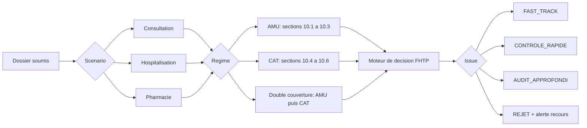

# FHTP-ARC-001 -- Architecture Technique
## FITTER Health Trust Platform

**Version 0.5**  
**Date :** 6 juillet 2026  
**Statut :** Brouillon pour validation par Dr Amadou  
**Documents de reference :** FHTP-KNO-001 v0.16, FHTP-PRD-001 v1.4, FHTP-PRD-002 v1.4, FHTP-PRD-003 v1.3, FHTP-REF-001 v1.2

---

## Preambule

Ce document decrit l'architecture technique de la FITTER Health Trust Platform (FHTP).
Il ne contient aucune regle metier propre a un scenario particulier -- ces regles vivent dans les PRDs.
Ce document decrit **comment** le systeme fonctionne, pas **quelles** regles il applique.

Deux principes architecturaux fondateurs gouvernent l'ensemble de l'architecture :

1. **FHTP Core est independant de tout payeur.** L'INAM, la CNSS et les assureurs CAT sont des connecteurs interchangeables. Aucune logique propre a l'un d'eux ne penetre dans le coeur du systeme.

2. **FHTP s'integre au terrain existant.** Les logiciels de pharmacie et SIH deja en place sont des connecteurs terrain, pas des systemes a remplacer. Pour les prestataires sans logiciel, FHTP fournit un portail de saisie minimale.

---

## 1. Vue d'ensemble -- Architecture en trois blocs

```
+---------------------------------------------------------------------+
|                         FHTP CORE                                   |
|                                                                     |
|  +--------------+  +-------------------+  +----------------------+ |
|  | Moteur de    |  | Gestionnaire de   |  | Journal de           | |
|  | Regles (6    |  | Dossiers          |  | Conformite           | |
|  | Piliers)     |  | (orchestration)   |  | (audit immuable)     | |
|  +--------------+  +-------------------+  +----------------------+ |
|                                                                     |
|  +--------------+  +-------------------+  +----------------------+ |
|  | Referentiel  |  | Gestionnaire de   |  | Moteur de decision   | |
|  | Medicaments  |  | PEC / Ententes    |  | (Fast-Track, Audit,  | |
|  | & Actes      |  | Prealables        |  | Rejet)               | |
|  +--------------+  +-------------------+  +----------------------+ |
+-----------------------------+---------------------------------------+
                              | Contrat generique des connecteurs
         +--------------------+-----------------------+
         |                    |                       |
         v                    v                       v
+-----------------+  +---------------------+  +---------------------+
| CONNECTEURS     |  | CONNECTEURS         |  | CONNECTEURS         |
| PAYEURS         |  | TERRAIN             |  | AUTRES PAYS (futur) |
|                 |  |                     |  |                     |
| - INAM Conn.    |  | - Connecteur SIH    |  | - Connecteur Niger  |
| - CNSS Conn.    |  | - Connecteur        |  | - Conn. Burkina F.  |
| - CAT Conn.     |  |   Officine          |  | - Conn. Benin...    |
| - (futurs)      |  | - Module de saisie  |  |                     |
|                 |  |   minimale          |  |                     |
+-----------------+  +---------------------+  +---------------------+
```

---

## 2. FHTP Core

FHTP Core est le coeur du systeme. Il ne connait aucun payeur specifique, aucun logiciel terrain specifique. Il raisonne uniquement en termes de contrats d'interfaces abstraits.

### 2.1 Moteur de Regles (Rules Engine)

Le moteur de regles evalue chaque dossier soumis en appliquant sequentiellement les six piliers de confiance. Les regles sont **parametrables et versionnees** : elles sont stockees dans un referentiel de regles (et non codees en dur dans le code applicatif), ce qui permet de mettre a jour la reglementation sans refactoring.

#### Structure d'une Regle

```json
{
  "id": "R-TG-017",
  "version": "1.0",
  "pilier": "COHERENCE_DOCUMENTAIRE",
  "circuit": ["AMU_INAM", "AMU_CNSS", "CAT", "DIRECT"],
  "scenario": ["CONSULTATION", "HOSPITALISATION", "PHARMACIE"],
  "description": "Le code CIM-10 R68 est interdit au remboursement.",
  "condition": "dossier.diagnostic_cim10 == 'R68'",
  "action_si_vrai": "REJET",
  "message": "Code R68 proscrit par l'INAM. Dossier rejete d'office.",
  "source": "Note Circulaire INAM 2023 / FHTP-REF-001 par.4.1"
}
```

#### Les Six Piliers de Confiance

| # | Pilier | Portee |
|---|---|---|
| 1 | **Completude administrative** | Presence de toutes les pieces obligatoires (codes, dates, signatures, recu ticket moderateur, PEC). |
| 2 | **Coherence de regime** | Circuit de remboursement correct (majoration AMU interdite, oral clinique privee, AMU Scolaire). |
| 3 | **Coherence tarifaire** | Tarifs conformes (Presta+, bareme AMU Scolaire, lettre-cle CAT). |
| 4 | **Coherence documentaire** | Diagnostic CIM-10 valide (hors R68), cloture ///, correspondance actes/rapport. |
| 5 | **Coherence prescripteur/acte** | Habilitation du prescripteur, restrictions paramedicals, rattachement a l'etablissement. |
| 6 | **Coherence graphique** | *(Backlog)* Analyse de signatures manuscrites. |

#### Logique de Decision

```
POUR chaque pilier (dans l'ordre 1 -> 6) :
    EVALUER toutes les regles du pilier applicables au circuit et au scenario

    SI une regle retourne REJET         -> statut_pilier = ANOMALIE (fail-fast)
    SINON SI regle retourne ATTENTION   -> statut_pilier = A_VERIFIER
    SINON SI aucune regle active        -> statut_pilier = NON_EVALUE (neutre)
    SINON                               -> statut_pilier = CONFORME

DECISION FINALE :
    Tous les piliers CONFORME ou neutres -> FAST_TRACK (paiement automatique)
    Au moins un A_VERIFIER             -> CONTROLE_RAPIDE (verification documentaire)
    Au moins un ANOMALIE               -> AUDIT_APPROFONDI (convocation ou visite)
    Attestation papier transitoire     -> CONTROLE_RENFORCE (systematique)
```

### 2.2 Gestionnaire de Dossiers

Orchestre le cycle de vie complet d'un dossier, de sa creation a son archivage :

```
SOUMIS -> EN_VALIDATION -> [FAST_TRACK | CONTROLE_RAPIDE | AUDIT_APPROFONDI]
                                |               |                  |
                              PAYE     REGULARISE/REJETE      REJETE/PAYE
                                |               |
                             ARCHIVE         ARCHIVE
```

Chaque transition d'etat est horodatee et enregistree dans le Journal de Conformite.
Tout rejet declenche la generation automatique d'une notification de rejet motivee par ecrit (obligation reglementaire INAM Art. 32 et CAT Art. 15.1), ainsi qu'une **alerte recours**. Cette alerte ne fige pas un delai unique : elle attire l'attention du prestataire sur la necessite d'examiner rapidement les voies de recours ou de regularisation, en tenant compte du regime concerne (AMU, CAT, double couverture) et de la flexibilite observee sur le terrain.

### 2.3 Gestionnaire de PEC / Ententes Prealables

- **Creation :** Le prestataire soumet une demande de PEC (motif, actes envisages, montants, dates).
- **Suivi :** Le systeme enregistre le delai de reponse du payeur (INAM : 48h ouvrables, Art. 22-23).
- **Silence vaut accord :** Pour les prolongations d'hospitalisation, l'absence de reponse INAM dans le delai vaut accord implicite de 2 jours (Convention INAM Art. 19).
- **Urgence :** Les demandes de regularisation d'urgence sont marquees avec un delai de grace de 24h.

### 2.4 Journal de Conformite (Audit Log Immuable)

Tout evenement significatif est enregistre en mode append-only (immuable) :

```json
{
  "timestamp": "2026-07-06T14:32:00Z",
  "dossier_id": "DOS-2026-001234",
  "event_type": "REGLE_APPLIQUEE",
  "regle_id": "R-TG-017",
  "pilier": "COHERENCE_DOCUMENTAIRE",
  "resultat": "ANOMALIE",
  "payload_hash": "sha256:a1b2c3...",
  "operateur_id": "OP-CHR-DAPAONG-01"
}
```

**Propriete de non-repudiation :** Chaque requete vers un payeur et chaque reponse recue est enregistree avec timestamp, identifiant operateur, et hash du payload. Cette tracabilite est indispensable en cas de litige sur un remboursement.

### 2.5 Referentiel Medicaments et Actes

Base de donnees locale versionnee contenant les referentiels de tarification :

| Referentiel | Source | Mode de mise a jour |
|---|---|---|
| Medicaments AMU (Presta+) | Fichiers Excel INAM | Import manuel periodique (Phase 0) |
| Medicaments CAT | Prix public officiel | Import manuel periodique |
| Actes AMU (nomenclature) | Fichiers Excel INAM | Import manuel periodique |
| Actes CAT (lettre-cle + valeur du point) | Convention CAT 2019 + mises a jour | Import manuel periodique |
| AMU Scolaire | Fichiers Excel INAM Scolaire 2024 | Import manuel periodique |

**Regle de versionnage :** Chaque import est versionne avec sa date d'effectivite. La regle INAM Art. 6 s'applique : la derniere liste en possession du prestataire fait foi en cas de defaut de notification par l'INAM.

---

## 3. Contrat generique des Connecteurs

L'interface que tout connecteur (payeur ou terrain) doit implementer est definie une seule fois dans FHTP Core. Aucun composant du Core ne connait les details d'implementation d'un connecteur.

### 3.1 Interface Connecteur Payeur (IConnecteurPayeur)

```
verifier_eligibilite(identifiant_beneficiaire: str, date_soins: date)
    -> StatutEligibilite: ACTIF | SUSPENDU | DROITS_FERMES | INCONNU
       + taux_couverture (ex: 1.0 pour AMU Scolaire, 0.8 pour standard)
       + ticket_moderateur_pct (ex: 0.2)
    Independant de: format de carte, mode de verification (API, portail, base locale)

obtenir_base_remboursement(code_acte_ou_dci: str, date_soins: date)
    -> BaseRemboursement: montant_base, taux, statut (R | E | TPC | NON_COUVERT)
    Independant de: nomenclature propre (R/E/TPC pour AMU, lettre-cle/coeff pour CAT)

    Anticipation retenue (Dr Amadou, 6 juillet 2026) : deux modes de calcul doivent
    etre supportes des la conception, pas seulement le mode a l'acte utilise
    aujourd'hui au Togo :
      - MODE_ACTE : tarif calcule ligne par ligne (nomenclature, lettre-cle/coeff).
        Utilise par les pays francophones (Togo, Senegal, Burkina Faso).
      - MODE_FORFAIT_DIAGNOSTIC : tarif forfaitaire unique par sejour/episode,
        determine par le diagnostic CIM-10 (logique proche du DRG). Utilise par
        les pays anglophones (Ghana). Un basculement futur de pays francophones
        vers ce mode n'est pas exclu (FHTP-KNO-001 section 3.6).
    Chaque connecteur payeur declare son mode ; FHTP Core adapte l'evaluation du
    pilier "coherence tarifaire" en consequence, sans que la logique d'un mode
    ne penetre dans le Core.

soumettre_facture(dossier: DossierFacturation)
    -> ResultatSoumission: statut (ACCEPTE | REJETE | EN_ATTENTE), motifs si rejet
    Independant de: canal de transmission (portail web, API REST, import fichier)
```

### 3.2 Interface Connecteur Terrain (IConnecteurTerrain)

```
obtenir_actes_du_jour(formation_id: str, date: date)
    -> list[ActeRealise]
    Utilise pour le recoupement avec la facture soumise.

envoyer_statut_validation(dossier_id: str, statut: StatutValidation, motifs: list[str])
    -> None
    Notifie le logiciel terrain du resultat de validation FHTP.
```

---

## 4. Connecteurs Payeurs

### 4.1 Connecteur INAM

Implemente IConnecteurPayeur pour le guichet AMU-INAM (fonctionnaires et eleves).

#### Trois niveaux d'integration progressifs

| Niveau | Mode | Statut | Description |
|---|---|---|---|
| **Phase 0** | Import Excel | **Confirme** | Import periodique des fichiers Excel INAM. Base locale mise a jour manuellement. Deployable sans accord INAM. |
| **Phase 1** | Portail en ligne | **Confirme** | Verification des droits via portail web INAM (matricule ou scan code-barre). Resultat saisi manuellement dans FHTP. Requiert internet. |
| **Phase 2** | API directe | **Hypothese plausible** | REST/JSON ou SOAP/XML pour l'eligibilite et la teletransmission. Sous reserve de contact avec la DSI INAM. |

**Regle de resilience :** Si l'API est indisponible, le systeme bascule en Mode Degrade (voir section 7). Les transactions sont validees localement puis marquees A_SYNCHRONISER.

**Regles metier propres au Connecteur INAM** (isolees ici, jamais dans le Core) :
- Codes : R (Remboursable), E (Entente Prealable obligatoire), TPC (Traitement Chronique).
- Taux AMU : variable acte par acte selon le referentiel Presta+ importe (pas de taux fixe unique). Confirme par Dr Amadou a partir de ses propres fichiers Presta+ telecharges.
- Taux AMU Scolaire : 100% INAM / 0% patient.
- Delai de reponse PEC : 48 heures ouvrables.
- Delai de reglement des factures : 30 jours a compter d'un dossier complet.

### 4.2 Connecteur CNSS

Meme logique de couverture que l'INAM (AMU unifiee a deux guichets). Differences :
- Beneficiaires : salaries du secteur prive (pas les fonctionnaires ni les eleves).
- Institution receptrice : CNSS, avec ses propres coordonnees et delais de traitement.

Le Connecteur CNSS est une variation du Connecteur INAM partageant la meme base tarifaire Presta+ mais transmettant les factures a un endpoint different.

### 4.3 Connecteur CAT (Assureurs Prives)

Regles propres isolees dans ce connecteur :
- **Tarification :** Lettre-cle x coefficient (C=8 000 F tarif ONMT / 7 000 F bareme CAT, CS=10 000 F / 8 500 F, K variable -- valeurs exactes verifiees dans FHTP-REF-001 Partie 2.4, convention CAT 2019). Le bareme varie en outre d'un contrat a l'autre ; certains contrats sont en "Frais Reel" (base de remboursement = montant facture, sans tarif de reference).
- **Medicaments :** Prix public officiel comme base de remboursement (pas Presta+).
- **Majorations :** Nuit, dimanche, specialite autorisees (contrairement a l'AMU).
- **Coordination :** Active seulement apres confirmation du remboursement primaire AMU. Recoit en entree le decompte AMU pour calculer le solde a rembourser.

---

## 5. Connecteurs Terrain

### 5.1 Connecteur SIH (Systeme d'Information Hospitalier)

Interfacage avec les SIH existants dans les cliniques et hopitaux :
- **Donnees entrantes (SIH -> FHTP) :** actes realises, medicaments administres, duree de sejour, medecins intervenants.
- **Donnees sortantes (FHTP -> SIH) :** resultat de validation, motifs de rejet, numeros de reference des PEC validees.
- **Formats d'echange :** JSON (REST) ou XML (SOAP) selon les capacites du SIH. Le connecteur assure la traduction vers le modele de donnees FHTP.

### 5.2 Connecteur Officine

Interfacage avec les logiciels de vente pharmaceutique :
- **Donnees entrantes :** medicaments delivres (DCI, nom commercial, quantite, prix), numero PEC si TPC, code pharmacien.
- **Donnees sortantes :** resultat (delivrance autorisee ou bloquee), motif si blocage (ordonnance expiree, molecule proscrite, substitution non conforme).
- **Point de realite terrain :** Presta+ dans les logiciels d'officine est une base locale mise a jour manuellement, pas un flux en temps reel. FHTP s'appuie sur cette realite et ne tente pas de la contourner.

### 5.3 Module de Saisie Minimale

Pour les cabinets medicaux sans logiciel (facturation sur Excel ou a la main) :
- Interface web legere, accessible depuis n'importe quel navigateur (y compris mobile en connexion bas debit).
- Formulaires couvrant les donnees strictement necessaires a la production d'un dossier de facturation valide.
- **Ce module n'est pas un logiciel de gestion.** Il ne gere pas les stocks, la caisse, ni les rendez-vous. Il comble uniquement le vide laisse par l'absence de logiciel.

---

## 6. Modele de donnees consolide

Ce modele est le seul que connait FHTP Core. Les connecteurs payeurs et terrain traduisent leurs donnees proprietaires vers ce modele.

```
Beneficiaire
  id_beneficiaire
  numero_carte_AMU (nullable)
  type_regime: [INAM_STANDARD | INAM_SCOLAIRE | CNSS | PRIVE_SEUL | DIRECT]
  guichet_AMU: [INAM | CNSS | AUCUN]
  numero_assurance_privee (nullable)
  parent_assure_id (nullable -- pour les ayants droit)
  date_affiliation

Prescripteur
  id_prescripteur
  numero_ordre
  code_prescripteur_AMU
  type_prescripteur: [MEDECIN | PARAMEDICAL | DENTISTE | PHARMACIEN]
  specialite_declaree (nullable)
  structures_rattachement: [id_formation_sanitaire...]
  statut: [ACTIF | SUSPENDU | RADIE]

Formation_Sanitaire
  id_formation
  code_formation_sanitaire_AMU
  numero_autorisation_ministere_sante
  type: [USP_I | USP_II | HD | CHR | CLINIQUE_PRIVEE | OFFICINE | CABINET]
  secteur: [PUBLIC | PRIVE]
  date_conventionnement

Dossier
  id_dossier
  type_scenario: [CONSULTATION | HOSPITALISATION | PHARMACIE | ...]
  id_beneficiaire (FK)
  id_formation (FK)
  id_contrat_payeur (FK -- determine le mode de calcul tarifaire applique)
  circuit_remboursement: [AMU_SEUL | AMU_PLUS_PRIVE | PRIVE_SEUL | DIRECT]
  date_soins
  date_soumission
  statut: [SOUMIS | EN_VALIDATION | FAST_TRACK | CONTROLE_RAPIDE | AUDIT | PAYE | REJETE]
  evaluation_piliers: {PILIER_1: CONFORME, PILIER_2: CONFORME, ...}
  decision_finale: [FAST_TRACK | CONTROLE_RAPIDE | AUDIT_APPROFONDI]
  motifs_rejet: [RegleId...]
  alerte_recours: {active: bool, regime: [AMU | CAT | MIXTE], delai_indicatif, action_recommandee}
  origine_creation: [EN_LIGNE | MODE_DEGRADE]
  -- Cf. section 7 : un dossier cree en MODE_DEGRADE ne peut jamais recevoir
  -- le statut FAST_TRACK avant sa reverification en ligne post-synchronisation.

Acte_Realise
  id_acte
  id_dossier (FK)
  id_prescripteur (FK)
  code_acte (nomenclature AMU ou lettre-cle CAT)
  diagnostic_cim10
  date_realisation
  montant_facture
  base_remboursement
  taux_payeur
  part_patient
  pec_id (nullable -- si acte sous entente prealable)
  statut_validation: [CONFORME | A_VERIFIER | ANOMALIE]

Medicament_Prescrit
  id_prescription
  id_dossier (FK)
  dci
  nom_commercial
  voie_administration: [ORALE | PARENTERALE | TOPIQUE | ...]
  dosage
  duree_traitement_jours
  quantite
  prix_unitaire_facture
  prix_reference_presta_plus (nullable)
  enrole_presta_plus: bool
  pec_id (nullable -- si TPC ou duree > 15 jours)
  substituant_dci (nullable -- si substitution generique)
  statut_validation: [CONFORME | A_VERIFIER | ANOMALIE]

PEC_Entente_Prealable
  id_pec
  id_dossier (FK)
  id_payeur_connecteur
  type: [STANDARD | URGENCE | CHRONIQUE_TPC]
  motif
  date_demande
  date_reponse (nullable)
  statut: [EN_ATTENTE | ACCORDE | REFUSE | EXPIRE | SILENCE_VAUT_ACCORD]
  numero_reference_payeur (nullable)

Log_Audit  [append-only, immuable]
  id_log
  timestamp
  id_dossier (FK)
  event_type: [SOUMISSION | REGLE_APPLIQUEE | PEC_DEMANDEE | DECISION | PAIEMENT | REJET | SYNC]
  regle_id (nullable)
  resultat
  payload_hash
  operateur_id

Contrat_Payeur
  id_contrat
  id_payeur_connecteur (FK)
  type_tarification: [MODE_ACTE | MODE_FORFAIT_DIAGNOSTIC]
  type_base_remboursement: [TARIF_FIXE | FRAIS_REEL]
  reference_bareme (nullable -- inapplicable si FRAIS_REEL, cf. R-TG-024)
  date_debut_validite
  date_fin_validite (nullable)
  -- Rattache chaque dossier a un contrat precis plutot que de supposer
  -- un bareme unique par payeur : deux assures du meme payeur CAT peuvent
  -- relever de contrats differents (l'un a bareme fixe, l'autre Frais Reel).

Consentement_Patient
  id_consentement
  id_beneficiaire (FK)
  type: [AFFILIATION_LARGE | NOTIFICATION_ACTE]
  date_signature
  canal_notification: [SMS | EMAIL | AUCUN]
  statut: [ACTIF | REVOQUE]
  -- Cf. FHTP-KNO-001 section 3.3. Un dossier ne peut etre soumis a un
  -- payeur sans consentement ACTIF de type AFFILIATION_LARGE au minimum.

Contestation_Recours
  id_contestation
  id_dossier (FK)
  partie_demandeuse: [BENEFICIAIRE | PRESTATAIRE]
  motif
  date_demande
  expert_designe (nullable)
  decision_initiale_id (FK -- vers l'entree Log_Audit de la decision contestee)
  statut: [EN_ATTENTE | CONTRE_EXPERTISE_EN_COURS | TRANCHEE]
  partie_perdante (nullable): [BENEFICIAIRE | PRESTATAIRE]
  -- Cf. Decret n(deg)2023-100/PR, art. 11 : frais d'expertise a la charge
  -- de la partie perdante. Applicable uniquement aux dossiers relevant
  -- d'un connecteur AMU (INAM/CNSS) ; le mecanisme CAT (charte du
  -- medecin-conseil, FHTP-REF-001 Partie 2.9) suit un circuit distinct
  -- a modeliser separement si necessaire.
```

---

## 7. Mode Degrade (Offline First)

Le terrain togolais peut presenter des coupures d'internet (notamment a Dapaong, Sokode). FHTP ne doit jamais bloquer l'activite d'une structure de soins en cas de panne reseau. Mais le mode degrade ouvre une fenetre de risque specifique qui doit etre traitee explicitement, pas seulement la continuite de service.

### 7.1 Fonctionnement de base

```
Reseau disponible   -> Mode Normal  : toutes verifications temps reel actives.

Reseau indisponible -> Mode Degrade :
  1. Eligibilite evaluee sur la derniere donnee locale en cache.
  2. Tarifs calcules depuis le referentiel local (import Excel).
  3. Dossier cree localement, origine_creation = MODE_DEGRADE,
     statut = A_SYNCHRONISER.
  4. A la reconnexion, une Sync Queue soumet les dossiers dans l'ordre
     chronologique de creation (FIFO), jamais par lot desordonne.
  5. Chaque dossier synchronise est systematiquement reevalue en ligne
     avant toute decision finale (voir 7.2).
```

### 7.2 Regle de securite : aucun paiement automatique avant reverification en ligne

**Faille identifiee dans une version anterieure de ce document :** rien n'empechait explicitement qu'un dossier cree hors-ligne recoive directement le statut FAST_TRACK des sa creation locale, avant meme sa synchronisation. Un operateur malveillant ou complice pourrait alors provoquer volontairement une coupure locale (ou en exploiter une reelle) pour faire passer des dossiers fabriques en paiement automatique, sachant que la verification reelle n'interviendrait qu'apres coup.

**Correction retenue :** un dossier avec `origine_creation = MODE_DEGRADE` ne peut **jamais** recevoir le statut `FAST_TRACK` avant d'avoir ete synchronise et reevalue en ligne. Son statut local maximal est `EN_VALIDATION_LOCALE`, un etat distinct qui n'autorise aucun paiement. La decision finale (FAST_TRACK, CONTROLE_RAPIDE, ou AUDIT) n'est prise qu'apres la reconnexion, sur la base des donnees a jour (carte toujours active, PEC toujours valide, etc.). Si la reevaluation en ligne invalide un dossier deja localement juge conforme, il bascule automatiquement en CONTROLE_RAPIDE.

### 7.3 Confidentialite et integrite du cache local

- Le cache local (referentiels, dossiers en attente de synchronisation, PEC) est **chiffre au repos** sur l'appareil (ex. chiffrement de base de donnees locale, pas uniquement le chiffrement natif de l'OS). Un poste ou telephone perdu ou vole ne doit pas exposer de donnees en clair.
- Le referentiel local (import Excel INAM, tarifs CAT) porte une **date de derniere mise a jour visible** ; au-dela d'un seuil a definir avec Dr Amadou (ex. 30 jours sans synchronisation), FHTP affiche un avertissement de fraicheur des donnees et peut restreindre le mode degrade au strict enregistrement, sans validation automatique meme locale.
- Chaque acces au mode degrade requiert une **reauthentification locale de l'operateur** (code PIN ou biometrie selon l'appareil), pas seulement une session ouverte : un appareil partage entre plusieurs caissiers ne doit jamais permettre de soumettre un dossier sous l'identite d'un autre operateur sans reauthentification.

### 7.4 Gestion des conflits de synchronisation

- Si deux operateurs du meme centre ont cree des dossiers hors-ligne concurremment (ex. deux caissiers sur deux postes), la Sync Queue les traite dans l'ordre chronologique de creation, avec detection de doublons potentiels (meme beneficiaire, meme acte, memes dates) signales pour verification manuelle plutot que fusionnes automatiquement.
- Une synchronisation partielle (coupure pendant l'envoi) doit etre reprise de maniere idempotente : renvoyer un dossier deja recu par le serveur ne doit jamais creer de doublon de paiement.

---

## 8. Securite et Confidentialite

Cette section liste les failles identifiees a la relecture, pas seulement les mesures prevues. Chaque vulnerabilite est nommee avant sa mitigation, pour que rien ne reste implicite.

### 8.1 Privacy by Design

- FHTP ne stocke jamais le contenu medical brut (texte des rapports, diagnostics detailles).
- Il enregistre uniquement les metadonnees de facturation et les hash d'integrite des documents.
- Le contenu medical original reste dans le SIH de l'etablissement ou dans l'archive physique.
- Lors d'un controle medical, la demande passe par le canal medecin-conseil -> etablissement. FHTP enregistre la demande, le delai de reponse et le statut, jamais le contenu.
- **Benefice securite direct de ce principe, dans le contexte togolais :** puisque FHTP ne detient jamais le contenu clinique, une compromission de FHTP (piratage, ou pression institutionnelle pour un acces elargi dans un environnement politise, cf. FHTP-PRD-001 section 9.1) n'expose jamais le dossier medical du patient. Le perimetre de ce qui peut fuiter ou etre exige de force est structurellement limite aux metadonnees de facturation.

### 8.2 Table des failles identifiees et mitigations retenues

| # | Faille identifiee | Impact si non traitee | Mitigation retenue |
|---|---|---|---|
| F1 | Le hash d'integrite (8.4) est calcule et stocke par le meme acteur qui detient le document. Un prestataire de mauvaise foi pourrait modifier un document ET recalculer/reenregistrer un nouveau hash, rendant la verification inutile. | Un document falsifie passe pour authentique. | Le hash doit etre calcule et horodate **au moment de la premiere soumission a FHTP Core** (cote serveur, ou via un service d'horodatage tiers), jamais uniquement recalcule localement cote prestataire. Toute recomputation ulterieure est comparee a cette valeur d'ancrage initiale, jamais l'inverse. |
| F2 | Le Log_Audit est decrit comme "immuable" mais rien ne l'empeche techniquement d'etre modifie par un administrateur de base de donnees disposant d'un acces privilegie. | Un incident (fraude, rejet abusif) pourrait etre maquille a posteriori par un initie. | Chainage cryptographique des entrees du Log_Audit (chaque entree contient le hash de la precedente, façon registre en chaine), avec ancrage periodique externe (ex. publication reguliere d'un hash recapitulatif hors du systeme). Une modification retroactive casse la chaine et devient detectable. |
| F3 (cf. section 7.2) | Un dossier cree en mode degrade pouvait recevoir FAST_TRACK avant reverification en ligne, ouvrant une fenetre d'exploitation lors des coupures reseau. | Fraude facilitee par exploitation ou provocation de coupures reseau. | Regle desormais explicite : aucun FAST_TRACK avant synchronisation et reevaluation en ligne (section 7.2). |
| F4 | Absence de controle d'acces par role explicite dans la version precedente : rien ne precisait qui peut consulter quoi. Un caissier ne devrait pas avoir les memes droits qu'un medecin-conseil. | Acces excessif d'un profil a des donnees ou fonctions hors de son role (ex. un operateur de saisie consultant des dossiers d'autres beneficiaires que les siens). | Controle d'acces base sur les roles (RBAC), aligne sur les roles reels du terrain : Operateur_Saisie (creation de dossier, son propre centre uniquement), Prescripteur (creation + signature), Medecin_Conseil (acces en lecture large + declenchement de controle, conformement au Decret n(deg)2023-100/PR art. 6), Administrateur_Centre (gestion des comptes de son centre uniquement, pas des autres centres). |
| F5 | Aucune politique de gestion des secrets (jetons OAuth, cles API des connecteurs) n'etait mentionnee. Des identifiants d'acces stockes en dur dans une application cliente sont extractibles. | Vol de jetons d'acces permettant d'usurper un connecteur entier (ex. se faire passer pour un centre conventionne aupres de l'INAM). | Secrets geres via un coffre-fort dedie (vault), jamais stockes en dur dans le code client. Rotation reguliere des jetons. Chaque credential de connecteur est scope au strict necessaire (un centre ne peut interroger que ses propres dossiers). |
| F6 | Absence de limitation de frequence (rate limiting) sur les appels aux connecteurs externes (INAM, CNSS, CAT). | Un bug ou un abus pourrait saturer les webservices d'un partenaire, avec un risque concret de suspension d'acces pour tout FHTP, pas seulement pour l'auteur du probleme. | Limitation de frequence et disjoncteur (circuit breaker) par connecteur, avec file d'attente plutot que ré-essais en boucle. |
| F7 | Un numero de PEC/entente prealable pourrait etre invente ou reutilise si sa seule verification est un controle de format (cf. l'incident reel du CHR Dapaong ou le document papier manquait). | Facturation validee sur la base d'un numero de PEC plausible mais non reellement accorde. | La validite d'une PEC est **toujours verifiee par requete au connecteur payeur concerne** (existence reelle, statut ACCORDE, non-expiree), jamais par la seule presence d'un numero au bon format. C'est la correction technique directe de l'incident du CHR Dapaong (FHTP-KNO-001 section 6.1). |

### 8.3 Authentification et chiffrement

- **Authentification API :** OAuth 2.0 avec Bearer Token temporaire (hypothese plausible, a confirmer avec DSI INAM).
- **Transport :** HTTPS/TLS obligatoire. VPN IPsec si l'INAM l'exige pour les flux de production.
- **Utilisateurs :** chaque operateur dispose d'un identifiant unique trace dans le Log d'Audit, avec un role explicite (RBAC, voir F4) plutot qu'un acces generique.
- **Postes et appareils :** verrouillage automatique apres inactivite ; reauthentification locale obligatoire en mode degrade (section 7.3).

### 8.4 Integrite des documents

Chaque document numerise (ordonnance, feuille de soins, PEC) est hashe **au moment de sa premiere soumission a FHTP Core** (SHA-256), pas seulement localement chez le prestataire (correction F1). En cas de controle, le hash du document presente est recalcule et compare a cette valeur d'ancrage pour detecter toute modification survenue apres coup.

### 8.5 Decisions retenues (7 juillet 2026)

**Fraicheur du referentiel local (section 7.3) :** seuil differencie selon l'enjeu de l'acte plutot qu'un seuil unique, pour coller a la realite observee (mise a jour manuelle "de temps en temps", pas a date fixe).
- Actes courants (consultation simple, ex. sans PEC) : tolerance de 30 a 45 jours sans synchronisation avant avertissement. Le modele a six piliers rattrape les erreurs grossieres residuelles.
- Actes a enjeu eleve (entente prealable, hospitalisation, TPC chronique) : tolerance courte de 7 a 15 jours, au-dela de laquelle une confirmation en ligne est exigee avant toute validation automatique, meme locale.

**Integrite du Log_Audit (F2) :** chainage cryptographique interne (obligatoire, cout nul) **complete par un ancrage externe periodique via un service de preuve d'existence public et gratuit (type OpenTimestamps)**. Ce choix est retenu specifiquement parce qu'il offre une preuve d'anteriorite verifiable par un tiers exterieur au systeme, sans necessiter d'infrastructure dediee ni de cout recurrent -- un point important pour un projet a ce stade de financement, tout en repondant au risque de pression institutionnelle sur un environnement politise (FHTP-PRD-001 section 9.1).

**Reste a definir techniquement lors du developpement :** frequence exacte de l'ancrage externe (ex. quotidien ou hebdomadaire) et modalites precises de rotation des secrets de connecteurs, une fois les partenariats INAM/CNSS/CAT formalises.

---

## 9. Roadmap d'integration INAM

| Phase | Description | Prerequis |
|---|---|---|
| **Phase 0 -- Autonome** | FHTP fonctionne entierement en local. Tarifs charges depuis fichiers Excel INAM importes manuellement. Verification des droits manuelle (caissier -> portail INAM en parallele). | Aucun accord INAM requis. Deployable immediatement. |
| **Phase 1 -- Portail** | FHTP guide l'operateur vers le portail en ligne de l'INAM. Resultat saisi manuellement dans FHTP. | Acces internet a la structure. |
| **Phase 2 -- API** | Connexion directe aux webservices INAM pour la verification des droits en temps reel et la teletransmission des factures. | Contact DSI INAM -> Sandbox -> Recette -> Agrement. |
| **Phase 3 -- Temps reel** | Synchronisation automatique des referentiels Presta+ et des droits assures. Zero import manuel. | Phase 2 + API stable de l'INAM. |

---


---

## 10. Flux de Validation -- Circuits Complets

Cette section decrit les circuits de validation de bout en bout pour les trois scenarios principaux (Consultation, Hospitalisation, Pharmacie) sous les deux regimes (AMU et CAT). Ces diagrammes constituent la reference de conception pour le Moteur de Regles et le Gestionnaire de Dossiers.

**Legende commune :**
```
[ETAPE]      : Etape de traitement interne FHTP
<DECISION>   : Point de branchement (condition)
(ACTEUR)     : Acteur externe (Prestataire, Payeur, Patient)
==> FINAL    : Etat terminal du dossier
```

### 10.0 Matrice de couverture des flux

| Regime | Consultation | Hospitalisation | Pharmacie | Particularite |
|---|---|---|---|---|
| **AMU (INAM/CNSS)** | 10.1 | 10.2 | 10.3 | Presta+, PEC INAM, AMU Scolaire, interdiction des majorations |
| **CAT (assureurs prives)** | 10.4 | 10.5 | 10.6 | Police, garanties, plafonds, lettre-cle, prix public officiel |
| **AMU + CAT** | 10.4 via 10.1 | 10.5 via 10.2 | 10.6 via 10.3 | AMU traite en premier, CAT intervient sur le solde ou selon police |



**Principe recours :** FHTP travaille en amont pour eviter les rejets. Lorsqu'un rejet survient malgre les controles preventifs, le systeme declenche une alerte recours avec le motif, le regime concerne, les pieces a regulariser et un delai indicatif. Les delais de recours restent contextualises, car les regimes AMU et CAT se chevauchent et la pratique terrain garde une flexibilite au cas par cas.

---

### 10.1 AMU -- Circuit Consultation en Cabinet Liberal

**Acteurs :** Prestataire (cabinet conventionné AMU), FHTP Core, Connecteur INAM/CNSS, Patient

```
(Prestataire)
    |
    | Soumet dossier de consultation
    v
[FHTP -- RECEPTION DOSSIER]
    | Creation du dossier, horodatage, hash des pieces jointes
    v
[PILIER 1 -- COMPLETUDE ADMINISTRATIVE]
    | Verifier : code formation sanitaire AMU present?
    |            code prescripteur AMU present?
    |            date de soins presente?
    |            montant facture present?
    |            recu du ticket moderateur joint?
    |            feuille de soins signee?
    |
    <Toutes pieces presentes?>
    |  Non --> statut = ANOMALIE --> ==> REJET ADMINISTRATIF
    |           (motif : R-CA-001 a R-CA-006 selon piece manquante)
    | Oui
    v
[PILIER 2 -- COHERENCE DE REGIME]
    | Verifier : structure est-elle une clinique privee?
    |            -> si oui : consultation orale uniquement autorisee (pas d'hospit depassant 24h)
    | Verifier : majoration nuit/dimanche/specialite appliquee?
    |            -> si oui : statut = ANOMALIE (majorations interdites en AMU)
    | Verifier : acte sous entente prealable (code E) sans PEC jointe?
    |            -> si oui : statut = ANOMALIE
    | Verifier : patient AMU Scolaire?
    |            -> si oui : taux = 100% (ticket moderateur = 0)
    |
    <Coherence regime OK?>
    |  Non --> statut = ANOMALIE --> ==> REJET
    | Oui
    v
[CONNECTEUR INAM/CNSS -- VERIFICATION ELIGIBILITE]
    | verifier_eligibilite(numero_carte, date_soins)
    |
    <Statut eligibilite?>
    |  INCONNU (Mode Degrade) --> marquer A_VERIFIER, continuer avec cache
    |  SUSPENDU / DROITS_FERMES --> statut = ANOMALIE --> ==> REJET
    |  ACTIF --> continuer
    v
[PILIER 3 -- COHERENCE TARIFAIRE]
    | Pour chaque acte facture :
    |   obtenir_base_remboursement(code_acte, date_soins)
    |   -> comparer montant facture vs base Presta+
    |   -> si montant facture > base : statut = A_VERIFIER (surfacturation probable)
    |   -> si code acte absent de Presta+ : statut = ANOMALIE (acte non couvert)
    | Verifier : ticket moderateur facture conforme au taux de l'acte (variable, cf. Presta+) (ou 0% si Scolaire)?
    |
    <Coherence tarifaire?>
    |  ANOMALIE --> ==> REJET (acte non couvert ou hors nomenclature)
    |  A_VERIFIER --> noter, continuer
    | CONFORME --> continuer
    v
[PILIER 4 -- COHERENCE DOCUMENTAIRE]
    | Verifier : code CIM-10 present et valide?
    | Verifier : diagnostic == R68? --> si oui : ANOMALIE --> ==> REJET IMMEDIAT
    | Verifier : ordonnance medicale close par /// ?
    |            -> si medicaments prescrits sans ///  : A_VERIFIER
    | Verifier : correspondance entre actes factures et diagnostic CIM-10 plausible?
    |
    <Coherence documentaire?>
    |  R68 detecte --> ==> REJET IMMEDIAT (non regularisable sauf erreur de saisie/document)
    |  Autre ANOMALIE --> ==> REJET
    |  A_VERIFIER --> noter, continuer
    | CONFORME --> continuer
    v
[PILIER 5 -- COHERENCE PRESCRIPTEUR / ACTE]
    | Verifier : code prescripteur inscrit dans referentiel INAM?
    | Verifier : actes realises par paramedicaux?
    |            -> si medicaments prescrits par infirmier/sage-femme : ANOMALIE
    |            -> si actes d'imagerie sans prescription medicale : ANOMALIE
    | Verifier : prescripteur rattache a la formation sanitaire du dossier?
    |            -> si non : A_VERIFIER
    |
    <Coherence prescripteur?>
    |  ANOMALIE --> ==> REJET
    |  A_VERIFIER --> noter, continuer
    | CONFORME --> continuer
    v
[PILIER 6 -- COHERENCE GRAPHIQUE (BACKLOG)]
    | Si module active : comparer signature/cachet aux references connues
    | Sinon : statut = NON_EVALUE, sans blocage automatique
    v
[MOTEUR DE DECISION]
    | Evaluer l'ensemble des statuts des piliers 1 a 6
    |
    <Decision finale?>
    |
    +-- Tous CONFORME
    |       --> ==> FAST_TRACK
    |           (dossier accepte pour paiement automatique)
    |           Connecteur INAM : soumettre_facture(dossier)
    |           Delai paiement : 30 jours
    |
    +-- Au moins un A_VERIFIER
    |       --> ==> CONTROLE_RAPIDE
    |           (notification prestataire : documents complementaires sous 5 jours)
    |           Si regularise : retour a FAST_TRACK
    |           Si non regularise dans delai : REJET avec motif ecrit
    |
    +-- Au moins un ANOMALIE
    |       --> ==> AUDIT_APPROFONDI
    |           (convocation prestataire OU visite centre INAM)
    |           Motif de rejet notifie par ecrit (obligation Art. 32)
    |           Alerte recours : verifier regime, motif, pieces et delai indicatif
    |
    +-- Attestation papier transitoire detectee
            --> ==> CONTROLE_RENFORCE (systematique, quel que soit resultat piliers)
```

---

### 10.2 AMU -- Circuit Hospitalisation en Clinique Privee

**Acteurs :** Prestataire (clinique privee conventionnee), FHTP Core, Connecteur INAM/CNSS, Medecin-Conseil (pour PEC)

```
(Prestataire)
    |
    | Admission du patient
    v
<Cas d'urgence?>
    |
    +-- OUI (urgence vitale)
    |       |
    |       | Admission immediate sans PEC prealable
    |       | [NOTIFICATION URGENCE dans 24h]
    |       | Soumission dossier de regularisation dans 72h
    |       | -> Si delai depasse : A_VERIFIER automatique
    |       |
    +-- NON (hospitalisation programmee)
            |
            | [DEMANDE DE PEC PREALABLE]
            | Soumettre : motif, actes envisages, duree prevue, montants
            |
            <Reponse INAM dans 48h ouvrables (Art. 22-23)?>
            |  NON : silence = refus (PEC non accordee d'office)
            |  OUI REFUS : ==> HOSPITALISATION A LA CHARGE DU PATIENT
            |  OUI ACCORD : PEC accordee, numero reference enregistre
            v
[PILIER 1 -- COMPLETUDE ADMINISTRATIVE]
    | Verifier : numero PEC present et reference valide?
    | Verifier : code formation sanitaire AMU?
    | Verifier : bordereau d'entree / bon de prise en charge signe?
    | Verifier : recu ticket moderateur joint pour chaque journee?
    | Verifier : rapport medical de sortie joint?
    |
    <Completude?>
    |  Non --> ANOMALIE --> ==> REJET ADMINISTRATIF
    | Oui
    v
[PILIER 2 -- COHERENCE DE REGIME]
    | Verifier : clinique est-elle autorisee pour hospitalisation AMU?
    |            (conventionnement ministeriel requis)
    | Verifier : type clinique (USP I ou USP II)?
    |            -> tarif journee selon categorie applicable
    | Verifier : majorations nuit/dimanche appliquees?
    |            -> si oui : ANOMALIE (interdites en AMU hospit)
    |
    <Coherence regime?>
    |  Non --> ANOMALIE --> ==> REJET
    | Oui
    v
[CONNECTEUR INAM/CNSS -- VERIFICATION ELIGIBILITE]
    | verifier_eligibilite(numero_carte, date_admission)
    |
    <Statut?>
    |  SUSPENDU / DROITS_FERMES --> ANOMALIE --> ==> REJET
    |  ACTIF --> continuer
    v
[PILIER 3 -- COHERENCE TARIFAIRE]
    | Verifier tarif journee d'hospitalisation :
    |   -> Calcul : nombre_jours = date_sortie - date_admission (jour sortie non facture)
    |   -> Tarif/jour vs bareme AMU selon categorie USP
    | Verifier medicaments injectables :
    |   -> Duree injectable <= 3 jours? (sinon PEC obligatoire)
    |   -> Prix injectable conforme Presta+?
    | Verifier honoraires chirurgicaux/actes :
    |   -> Tarif conforme nomenclature AMU?
    |
    <Coherence tarifaire?>
    |  ANOMALIE --> ==> REJET
    |  A_VERIFIER --> noter, continuer
    | CONFORME --> continuer
    v
[PILIER 4 -- COHERENCE DOCUMENTAIRE]
    | Verifier : diagnostic CIM-10 principal et diagnostics associes valides?
    | Verifier : diagnostic == R68? --> REJET IMMEDIAT
    | Verifier : correspondance rapport medical / actes factures?
    | Verifier : duree de sejour justifiee medicalement dans le rapport?
    |
    <Coherence documentaire?>
    |  R68 --> ==> REJET IMMEDIAT
    |  ANOMALIE --> ==> REJET
    |  A_VERIFIER --> noter, continuer
    | CONFORME --> continuer
    v
[VERIFICATION PEC EN COURS DE SEJOUR]
    <Sejour depasse duree PEC initiale?>
    |  OUI --> [DEMANDE DE PROLONGATION]
    |           INAM doit repondre dans 48h
    |           <Reponse?>
    |             NON dans 48h --> SILENCE VAUT ACCORD de 2 jours supplementaires (Art. 19)
    |             OUI ACCORD --> continuer
    |             OUI REFUS --> patient informe, reste a sa charge
    | NON --> continuer
    v
[PILIER 5 -- COHERENCE PRESCRIPTEUR]
    | Verifier : chirurgien/medecin responsable inscrit INAM et rattache clinique?
    | Verifier : interventions paramedicals autorisees dans ce contexte?
    |
    <Coherence prescripteur?>
    |  ANOMALIE --> ==> REJET
    |  A_VERIFIER --> noter, continuer
    | CONFORME --> continuer
    v
[PILIER 6 -- COHERENCE GRAPHIQUE (BACKLOG)]
    | Si module active : comparer signatures, cachets et mentions manuscrites
    | Sinon : statut = NON_EVALUE, sans blocage automatique
    v
[MOTEUR DE DECISION]
    <Decision finale?>
    |
    +-- Tous CONFORME       --> ==> FAST_TRACK
    +-- Au moins A_VERIFIER --> ==> CONTROLE_RAPIDE
    +-- Au moins ANOMALIE   --> ==> AUDIT_APPROFONDI + alerte recours
    +-- Papier transitoire  --> ==> CONTROLE_RENFORCE
```

---

### 10.3 AMU -- Circuit Delivrance en Officine

**Acteurs :** Patient (apporte ordonnance), Pharmacien, FHTP Core, Connecteur INAM/CNSS

```
(Patient apporte ordonnance au comptoir)
    |
    v
[PILIER 1 -- COMPLETUDE ADMINISTRATIVE]
    | Verifier : code pharmacien AMU present sur feuille de delivrance?
    | Verifier : code prescripteur AMU present sur ordonnance?
    | Verifier : date ordonnance presente?
    | Verifier : signature medecin presente sur ordonnance?
    | Verifier : carte AMU presentee?
    |
    <Completude?>
    |  Non --> ANOMALIE --> ==> REJET (delivrance non remboursee)
    | Oui
    v
[PILIER 2 -- COHERENCE DE REGIME]
    | Verifier : patient est-il AMU Scolaire?
    |            -> si oui : taux = 100%, pas de ticket moderateur
    | Verifier : ordonnance emanant d'un paramedicale (infirmier, SF)?
    |            -> si medications prescrites : verifier liste autorisee
    |            -> si medicament hors liste paramedical : ANOMALIE
    |
    <Coherence regime?>
    |  ANOMALIE --> ==> REJET (ordonnance non conforme)
    | OK --> continuer
    v
[PILIER 3 -- COHERENCE TARIFAIRE ET VALIDITE ORDONNANCE]
    |
    <Ordonnance dans les 7 jours suivant la prescription? (Art. 18)>
    |  NON --> ANOMALIE --> ==> REJET (ordonnance perimee)
    | OUI
    v
    | Pour chaque medicament de l'ordonnance :
    |   obtenir_base_remboursement(dci, date_soins)
    |   <Medicament inscrit dans Presta+?>
    |     NON --> statut_medicament = NON_COUVERT (patient paye integralement)
    |     OUI --> verifier prix facture vs prix Presta+
    |             -> si prix facture > prix Presta+ : A_VERIFIER (surfacturation)
    |             -> si prix conforme : CONFORME
    |
    | Verifier duree de traitement :
    |   <Duree > 15 jours?>
    |     OUI --> <PEC (TPC) jointe?>
    |               NON --> ANOMALIE (traitement long sans accord prealable)
    |               OUI --> CONFORME (TPC valide)
    |     NON --> CONFORME
    |
    v
[PILIER 4 -- COHERENCE DOCUMENTAIRE]
    | Verifier : ordonnance close par /// ?
    |            -> si non et si plusieurs medicaments : A_VERIFIER
    | Verifier : diagnostic CIM-10 sur feuille de delivrance (si exige)?
    | Verifier : aucun medicament de la liste des proscrits INAM 2024?
    |            -> si molecule proscrite : ANOMALIE --> REJET IMMEDIAT
    |
    <Coherence documentaire?>
    |  Molecule proscrite --> ==> REJET IMMEDIAT (non remboursable)
    |  ANOMALIE --> ==> REJET
    |  A_VERIFIER --> noter, continuer
    | CONFORME --> continuer
    v
[PILIER 5 -- COHERENCE PRESCRIPTEUR]
    | Verifier : prescripteur inscrit au referentiel INAM?
    | <Type prescripteur?>
    |   PARAMEDICALE --> verifier liste medicaments autorises
    |                    -> molecule hors liste : ANOMALIE
    |   MEDECIN --> OK
    |
    <Coherence prescripteur?>
    |  ANOMALIE --> ==> REJET
    | CONFORME ou A_VERIFIER --> continuer
    v
[SUBSTITUTION GENERIQUE (optionnel)]
    <Pharmacien propose substitut generique?>
    |  OUI --> <Patient accepte?>
    |            OUI --> enregistrer substituant_dci, prix generique applique
    |            NON --> molecule originale delivree au prix Presta+
    | NON --> molecule originale delivree
    v
[PILIER 6 -- COHERENCE GRAPHIQUE (BACKLOG)]
    | Si module active : detecter discordance signature/cachet sur ordonnance
    | Sinon : statut = NON_EVALUE, sans blocage automatique
    v
[MOTEUR DE DECISION]
    <Decision finale?>
    |
    +-- Tous CONFORME       --> ==> FAST_TRACK
    |                           Part INAM versee au pharmacien (taux variable selon l'acte, ou 100% si Scolaire)
    |                           Patient paye ticket moderateur au comptoir
    |
    +-- Au moins A_VERIFIER --> ==> CONTROLE_RAPIDE
    |                           Delivrance effectuee (patient ne doit pas attendre)
    |                           Pharmacien notifie de regulariser sous 5 jours
    |
    +-- Molecule proscrite   --> ==> REJET IMMEDIAT
    |                           Delivrance bloquee sur ce medicament
    |                           Reste de l'ordonnance traite normalement
    |
    +-- Au moins ANOMALIE   --> ==> REJET + alerte recours
                                Delivrance non remboursee
```

---

### 10.4 CAT -- Circuit Consultation (Assurance Privee)

**Acteurs :** Assure (apporte carte assurance), Prestataire, FHTP Core, Connecteur CAT, Connecteur INAM (coordination si double regime)

> **Principe de coordination :** Si l'assure est egalement beneficiaire AMU (fonctionnaire ou salarie), l'AMU rembourse en premier. Le Connecteur CAT n'est active qu'apres connaissance du decompte AMU. Si l'assure est PRIVE_SEUL (pas d'AMU), le CAT traite directement.

```
(Prestataire soumet dossier consultation)
    |
    v
[FHTP -- DETERMINATION DU CIRCUIT]
    | Lire circuit_remboursement du Beneficiaire
    |
    <Circuit?>
    |
    +-- AMU_PLUS_PRIVE (double regime)
    |       |
    |       | [ETAPE 1 : Traitement AMU en premier]
    |       | --> Executer flux AMU Consultation (voir 10.1)
    |       | --> Obtenir decompte AMU : montant_rembourse_AMU, part_patient_residuelle
    |       |
    |       <AMU accepte?>
    |         NON (rejet AMU) --> Soumettre le motif au Connecteur CAT
    |                             <CAT couvre-t-il malgre rejet AMU?>
    |                               generalement NON (CAT exige remboursement AMU en premier)
    |                               --> ==> REJET TOTAL ou REMBOURSEMENT CAT PARTIEL selon police
    |         OUI --> continuer avec decompte AMU
    |       |
    +-- PRIVE_SEUL (assurance privee uniquement)
            |
            | (pas de verification AMU, pas de Presta+)
            |
    v
[PILIER 1 -- COMPLETUDE ADMINISTRATIVE CAT]
    | Verifier : numero de police ou carte assurance valide?
    | Verifier : code prescripteur present?
    | Verifier : feuille de soins CAT remplie (formulaire propre a l'assureur)?
    | Verifier : recu paiement patient (ticket moderateur ou avance) joint?
    |
    <Completude?>
    |  Non --> ANOMALIE --> ==> REJET ADMINISTRATIF
    | Oui
    v
[CONNECTEUR CAT -- VERIFICATION ELIGIBILITE]
    | verifier_eligibilite(numero_police, date_soins)
    |
    <Statut police?>
    |  EXPIREE / SUSPENDUE --> ANOMALIE --> ==> REJET
    |  ACTIVE --> continuer
    v
[PILIER 2 -- COHERENCE DE REGIME CAT]
    | Verifier : acte couvert par la police?
    |            (garanties souscrites : medecine generale, specialiste, etc.)
    | Verifier : plafond annuel de remboursement non depasse?
    | Verifier : delai de carence respecte? (soins anterieurs a la souscription)
    |
    <Coherence regime CAT?>
    |  Non --> ANOMALIE --> ==> REJET
    | Oui
    v
[PILIER 3 -- COHERENCE TARIFAIRE CAT]
    | Pour chaque acte facture :
    |   obtenir_base_remboursement(code_acte, date_soins)
    |   -> Base CAT = lettre-cle x coefficient x valeur_du_point
    |   -> Valeurs de reference : C=8 000 F / 7 000 F, CS=10 000 F / 8 500 F, K variable (FHTP-REF-001 Partie 2.4) ; base = montant facture si contrat "Frais Reel"
    |   -> Comparer montant facture vs base CAT
    |   -> si montant facture > base CAT : A_VERIFIER (depassement d'honoraires)
    | Verifier majorations :
    |   -> Majoration nuit (20h-8h) : AUTORISEE en CAT (contrairement AMU)
    |   -> Majoration dimanche/ferie : AUTORISEE en CAT
    |   -> Majoration specialiste : AUTORISEE si garantie souscrite
    |
    | Si circuit AMU_PLUS_PRIVE :
    |   -> Base_remboursement_CAT = part_patient_residuelle_apres_AMU
    |   -> CAT rembourse selon son taux sur le solde residuel
    |
    <Coherence tarifaire CAT?>
    |  ANOMALIE --> ==> REJET
    |  A_VERIFIER --> noter, continuer
    | CONFORME --> continuer
    v
[PILIER 4 -- COHERENCE DOCUMENTAIRE CAT]
    | Verifier : diagnostic CIM-10 valide?
    | Verifier : exclusions de la police (maladies pre-existantes, actes exclus)?
    |            -> si acte exclu par police : ANOMALIE
    | Verifier : rapport medical si requis par assureur pour actes couteux?
    |
    <Coherence documentaire?>
    |  ANOMALIE --> ==> REJET
    |  A_VERIFIER --> noter, continuer
    | CONFORME --> continuer
    v
[PILIER 5 -- COHERENCE PRESCRIPTEUR CAT]
    | Verifier : prescripteur habilite (ordre professionnel)?
    | Verifier : specialiste = referencement au generalist si requis par police?
    |
    <Coherence prescripteur?>
    |  ANOMALIE --> ==> REJET
    | OK --> continuer
    v
[PILIER 6 -- COHERENCE GRAPHIQUE (BACKLOG)]
    | Si module active : comparer signature/cachet aux references prestataire
    | Sinon : statut = NON_EVALUE, sans blocage automatique
    v
[MOTEUR DE DECISION CAT]
    <Decision finale?>
    |
    +-- Tous CONFORME       --> ==> FAST_TRACK CAT
    |                           Connecteur CAT : soumettre_facture(dossier)
    |                           Remboursement selon taux police (variable selon garantie et selon contrat, y compris contrats "Frais Reel")
    |
    +-- Au moins A_VERIFIER --> ==> CONTROLE_RAPIDE CAT
    |                           Notification prestataire
    |
    +-- Au moins ANOMALIE   --> ==> AUDIT / REJET CAT
                                Notification motivee par ecrit (obligation CAT Art. 15.1)
                                Alerte recours : verifier police, garantie, motif et delai indicatif
```

---

### 10.5 CAT -- Circuit Hospitalisation

**Acteurs :** Assure, Clinique, FHTP Core, Connecteur CAT, Connecteur INAM/CNSS si double regime, Medecin-conseil assureur

> **Meme logique de sequencement que la consultation CAT** : si double regime, AMU traite en premier.

```
(Prestataire soumet dossier hospitalisation)
    |
    v
[FHTP -- DETERMINATION DU CIRCUIT]
    <Circuit?>
    |
    +-- AMU_PLUS_PRIVE --> Executer flux AMU Hospit (10.2) --> obtenir decompte AMU
    +-- PRIVE_SEUL     --> Aller directement a PILIER 1 CAT
    |
    v
[PILIER 1 -- COMPLETUDE ADMINISTRATIVE CAT]
    | Verifier : accord prealable assureur obtenu? (equivalent PEC pour CAT)
    | Verifier : bulletin d'hospitalisation CAT rempli?
    | Verifier : bordereau d'entree et de sortie?
    | Verifier : rapport medical de sortie (obligatoire pour sejour > 3 jours)?
    |
    <Completude?>
    |  Non --> ANOMALIE --> ==> REJET
    | Oui
    v
[CONNECTEUR CAT -- ELIGIBILITE]
    | verifier_eligibilite(numero_police, date_admission)
    |
    <Statut police?>
    |  Non active --> ==> REJET
    | Active --> continuer
    v
[PILIER 2 -- COHERENCE DE REGIME CAT HOSPIT]
    | Verifier : hospitalisation couverte par la police?
    | Verifier : accord prealable requis et obtenu selon garantie?
    | Verifier : plafond annuel / plafond sejour non depasse?
    | Verifier : exclusion contractuelle ou delai de carence?
    |
    <Coherence regime CAT?>
    |  Non --> ANOMALIE --> ==> REJET
    | Oui
    v
[PILIER 3 -- COHERENCE TARIFAIRE CAT HOSPIT]
    | Verifier tarif journee d'hospitalisation :
    |   -> Base CAT : chambre individuelle / double selon garantie souscrite
    |   -> Forfait journalier hospitalier : deductible selon police
    | Verifier honoraires chirurgicaux :
    |   -> Base = K x valeur_du_point
    |   -> si honoraires > base : depassement a la charge patient (selon garantie)
    | Verifier medicaments administres :
    |   -> Base CAT : prix public officiel (pas Presta+)
    |   -> Injectables : duree <= 3 jours sans accord? si > 3j : accord assureur requis
    | Si AMU_PLUS_PRIVE :
    |   -> Solde = total_facture - montant_rembourse_AMU
    |   -> CAT rembourse selon son taux sur le solde
    |
    <Coherence tarifaire?>
    |  ANOMALIE --> ==> REJET
    |  A_VERIFIER --> noter, continuer
    | CONFORME --> continuer
    v
[PILIER 4 -- COHERENCE DOCUMENTAIRE CAT]
    | Verifier : diagnostic CIM-10 non exclu par police?
    | Verifier : duree de sejour justifiee dans le rapport medical?
    | Verifier : actes chirurgicaux agrees par accord prealable?
    |
    <Coherence documentaire?>
    |  ANOMALIE --> ==> REJET
    |  A_VERIFIER --> noter, continuer
    | CONFORME --> continuer
    v
[PILIER 5 -- COHERENCE PRESCRIPTEUR CAT]
    | Verifier : medecin responsable, chirurgien et anesthesiste habilites?
    | Verifier : acte realise compatible avec qualification declaree?
    | Verifier : avis medecin-conseil present si requis par la police?
    |
    <Coherence prescripteur?>
    |  ANOMALIE --> ==> REJET
    |  A_VERIFIER --> noter, continuer
    | CONFORME --> continuer
    v
[PILIER 6 -- COHERENCE GRAPHIQUE (BACKLOG)]
    | Si module active : comparer signatures/cachets du bulletin et du rapport
    | Sinon : statut = NON_EVALUE, sans blocage automatique
    v
[MOTEUR DE DECISION CAT]
    <Decision finale?>
    |
    +-- Tous CONFORME       --> ==> FAST_TRACK CAT
    +-- Au moins A_VERIFIER --> ==> CONTROLE_RAPIDE CAT
    +-- Au moins ANOMALIE   --> ==> AUDIT / REJET CAT + alerte recours
```

---

### 10.6 CAT -- Circuit Pharmacie

**Acteurs :** Assure, Pharmacien, FHTP Core, Connecteur CAT, Connecteur INAM/CNSS si double regime

> **Difference cle vs AMU :** La base de remboursement est le prix public officiel (et non Presta+). Les majorations ne s'appliquent pas aux medicaments.

```
(Patient apporte ordonnance en officine -- assure CAT)
    |
    v
[FHTP -- DETERMINATION DU CIRCUIT]
    <Circuit?>
    |
    +-- AMU_PLUS_PRIVE --> Executer flux AMU Pharmacie (10.3) --> obtenir decompte AMU
    |                      (Presta+ applique pour la part AMU)
    +-- PRIVE_SEUL     --> Aller directement a PILIER 1 CAT
    |
    v
[PILIER 1 -- COMPLETUDE ADMINISTRATIVE CAT]
    | Verifier : code pharmacien present?
    | Verifier : code prescripteur present?
    | Verifier : date ordonnance presente?
    | Verifier : signature medecin presente?
    | Verifier : carte assurance presentee et valide?
    |
    <Completude?>
    |  Non --> ANOMALIE --> ==> REJET
    | Oui
    v
[CONNECTEUR CAT -- VERIFICATION ELIGIBILITE]
    | verifier_eligibilite(numero_police, date_delivrance)
    |
    <Statut police?>
    |  EXPIREE / SUSPENDUE --> ANOMALIE --> ==> REJET
    |  ACTIVE --> continuer
    v
[PILIER 2 -- COHERENCE DE REGIME CAT PHARMACIE]
    | Verifier : pharmacie/officine acceptee par la police ou le reseau?
    | Verifier : medicaments couverts par la garantie pharmacie?
    | Verifier : plafond pharmacie non depasse?
    | Verifier : delai de carence ou exclusion contractuelle?
    |
    <Coherence regime CAT?>
    |  Non --> ANOMALIE --> ==> REJET
    | Oui
    v
[PILIER 3 -- COHERENCE TARIFAIRE ET VALIDITE CAT]
    |
    <Ordonnance dans les 7 jours? (meme regle que AMU)>
    |  NON --> ANOMALIE --> ==> REJET (ordonnance perimee)
    | OUI
    v
    | Pour chaque medicament de l'ordonnance :
    |   obtenir_base_remboursement(dci, date_soins)
    |   -> Base CAT = prix public officiel (PAS Presta+)
    |   -> Taux remboursement selon police (variable ; certains contrats "Frais Reel" n'ont pas de taux fixe, cf. FHTP-KNO-001 section 6.3)
    |   -> Comparer prix facture vs prix public officiel
    |      si prix facture > prix public : A_VERIFIER
    |
    | Si AMU_PLUS_PRIVE :
    |   -> Part AMU deja remboursee via Presta+
    |   -> CAT rembourse le solde residuel selon son taux
    |   -> Patient paye : prix_facture - part_AMU - part_CAT
    |
    | Verifier duree de traitement :
    |   <Duree > limite police (generalement 30 jours pour CAT)?>
    |     OUI --> accord assureur requis
    |     NON --> CONFORME
    |
    <Coherence tarifaire?>
    |  ANOMALIE --> ==> REJET
    |  A_VERIFIER --> noter, continuer
    | CONFORME --> continuer
    v
[PILIER 4 -- COHERENCE DOCUMENTAIRE CAT]
    | Verifier : aucun medicament exclu par la police?
    |            (ex: produits de confort, vitamines selon contrat)
    | Verifier : ordonnance close par ///?
    |
    <Coherence documentaire?>
    |  ANOMALIE --> ==> REJET
    |  A_VERIFIER --> noter, continuer
    | CONFORME --> continuer
    v
[PILIER 5 -- COHERENCE PRESCRIPTEUR CAT]
    | Verifier : prescripteur habilite (ordre professionnel)?
    | Verifier : si paramedicale : medicaments dans liste autorisee?
    |
    <Coherence prescripteur?>
    |  ANOMALIE --> ==> REJET
    | OK --> continuer
    v
[PILIER 6 -- COHERENCE GRAPHIQUE (BACKLOG)]
    | Si module active : verifier signature/cachet de l'ordonnance
    | Sinon : statut = NON_EVALUE, sans blocage automatique
    v
[MOTEUR DE DECISION CAT]
    <Decision finale?>
    |
    +-- Tous CONFORME       --> ==> FAST_TRACK CAT
    |                           Part CAT versee au pharmacien (selon taux police)
    |                           Patient paye solde au comptoir
    |
    +-- Au moins A_VERIFIER --> ==> CONTROLE_RAPIDE CAT
    |                           Delivrance effectuee
    |                           Regularisation sous 5 jours
    |
    +-- Medicament exclu    --> ==> REJET PARTIEL
    |                           Medicament non couvert : patient paye integralement
    |                           Reste de l'ordonnance traite normalement
    |
    +-- Au moins ANOMALIE   --> ==> REJET CAT + alerte recours
                                Delivrance non remboursee par assureur
```

---

### 10.7 Tableau recapitulatif -- Differences AMU vs CAT

| Critere | AMU (INAM/CNSS) | CAT (Assureurs Prives) |
|---|---|---|
| **Tarif actes** | Nomenclature AMU (Presta+) | Lettre-cle x coeff x valeur du point |
| **Tarif medicaments** | Prix Presta+ | Prix public officiel |
| **Taux de couverture** | Variable par acte (Presta+) / 100% Scolaire | Variable selon police, y compris contrats "Frais Reel" sans taux fixe |
| **Majorations** | Interdites (nuit, dim, specialite) | Autorisees selon garantie |
| **Validite ordonnance** | 7 jours (Art. 18) | 7 jours (meme regle retenue) |
| **Duree traitement max** | 15 jours sans PEC | Selon police (generalement 30j) |
| **Accord prealable** | PEC (48h INAM, silence = refus) | Accord assureur (delai variable) |
| **Prolongation hospit** | Silence INAM 48h = accord 2j | Accord assureur obligatoire |
| **Diagnostic R68** | Rejet immediat | N/A (regle INAM specifique) |
| **Molecule proscrite** | Liste INAM 2024 | Exclusions de la police |
| **Sequencement double** | Premier a rembourser | Second (apres decompte AMU) |
| **Notification rejet** | Obligatoire par ecrit (Art. 32) | Obligatoire par ecrit (Art. 15.1 CAT) |
| **Recours / regularisation** | Alerte recours contextualisee, notamment Art. 32 et pratiques terrain | Alerte recours contextualisee selon police, CAT et arbitrage amiable |


## 11. Questions ouvertes (a valider avant developpement)

| # | Question | Impact | Priorite |
|---|---|---|---|
| Q1 | L'API INAM utilise-t-elle REST/JSON ou SOAP/XML ? Ou les deux selon la fonction ? | Design du Connecteur INAM Phase 2 | Haute |
| Q2 | Quel est le format exact des fichiers Excel INAM telechargeables (colonnes, frequence de mise a jour) ? | Module d'import du Referentiel | Haute |
| Q3 | Le Connecteur CNSS partage-t-il la meme API que l'INAM, ou a-t-il des endpoints distincts ? | Nombre de connecteurs a developper | Moyenne |
| Q4 | Quels logiciels de pharmacie sont les plus presents au Togo ? Proposent-ils des APIs d'integration ? | Design du Connecteur Officine | Moyenne |
| Q5 | Le module de saisie minimale doit-il fonctionner entierement hors-ligne (PWA mobile) ? | Architecture front-end du module | Moyenne |

---

## 12. Journal des versions

| Version | Date | Auteur | Changements |
|---|---|---|---|
| 0.1 | 6 juillet 2026 | Dr Amadou / FHTP | Premiere redaction. Architecture en trois blocs. Moteur de regles parametrable. Modele de donnees consolide. Mode degrade. Securite. Roadmap INAM. |
| 0.2 | 6 juillet 2026 | Dr Amadou / Codex | Ajout de la matrice de couverture des flux AMU/CAT, alerte recours contextualisee, pilier 6 dans les circuits, et renforcement des flux CAT hospitalisation/pharmacie. |
| 0.3 | 6 juillet 2026 | Claude (revue croisee) | Correction des tarifs CAT errones (C=1750/CS=2650 remplaces par les valeurs verifiees C=8000-7000/CS=10000-8500, FHTP-REF-001 Partie 2.4). Retrait du taux fixe "80% INAM/20% patient" non source, remplace par la confirmation directe de Dr Amadou : taux variable par acte (AMU) et par contrat (CAT), y compris contrats "Frais Reel" sans tarif de reference. Ajout du mode MODE_FORFAIT_DIAGNOSTIC dans l'interface generique du connecteur, anticipant un possible basculement des pays francophones vers une logique de forfait au diagnostic (type DRG). |
| 0.4 | 7 juillet 2026 | Claude (revue approfondie ciblee) | Modele de donnees : ajout des entites Contrat_Payeur, Consentement_Patient, Contestation_Recours, et du champ origine_creation sur Dossier. Mode degrade : correction d'une faille permettant a un dossier hors-ligne d'atteindre FAST_TRACK avant reverification en ligne ; ajout du chiffrement au repos du cache local, de la reauthentification locale, et de la gestion des conflits de synchronisation. Securite : reecriture complete avec table de 7 failles identifiees et mitigations (ancrage du hash cote serveur, chainage du Log_Audit, RBAC, gestion des secrets, rate limiting, verification systematique des PEC aupres du connecteur plutot que par format). |
| 0.5 | 7 juillet 2026 | Claude (decision, sur demande explicite de Dr Amadou) | Seuil de fraicheur du referentiel local tranche : differencie selon l'enjeu de l'acte (30-45 jours pour les actes courants, 7-15 jours avec confirmation en ligne obligatoire pour les actes a enjeu eleve). Integrite du Log_Audit tranchee : chainage interne obligatoire, complete par un ancrage externe periodique via un service de preuve d'existence public et gratuit (type OpenTimestamps), retenu pour son cout nul et sa resistance a la pression institutionnelle dans un environnement politise. |
