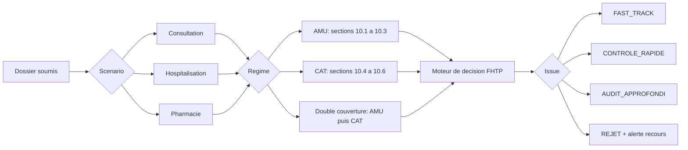

# FHTP-ARC-001 -- Architecture Technique
## FITTER Health Trust Platform

**Version 0.6 -- Document maitre consolide (fusion des addenda 1 a 9)**  
**Date :** 9 juillet 2026  
**Statut :** Version de reference -- integre l'ensemble des addenda valides par Dr Amadou entre le 7 et le 9 juillet 2026  
**Documents de reference :** FHTP-KNO-001 v0.22, FHTP-PRD-001 v1.5, FHTP-PRD-002 v1.5, FHTP-PRD-003 v1.4, FHTP-REF-001 v1.3

---

## Preambule

Ce document decrit l'architecture technique de la FITTER Health Trust Platform (FHTP).
Il ne contient aucune regle metier propre a un scenario particulier -- ces regles vivent dans les PRDs.
Ce document decrit **comment** le systeme fonctionne, pas **quelles** regles il applique.

Deux principes architecturaux fondateurs gouvernent l'ensemble de l'architecture :

1. **FHTP Core est independant de tout payeur.** L'INAM, la CNSS et les assureurs CAT sont des connecteurs interchangeables. Aucune logique propre a l'un d'eux ne penetre dans le coeur du systeme.

2. **FHTP s'integre au terrain existant.** Les logiciels de pharmacie et SIH deja en place sont des connecteurs terrain, pas des systemes a remplacer. Pour les prestataires sans logiciel, FHTP fournit un portail de saisie minimale.

---

## 1. Vue d'ensemble -- Architecture en trois blocs

```
+---------------------------------------------------------------------+
|                         FHTP CORE                                   |
|                                                                     |
|  +--------------+  +-------------------+  +----------------------+ |
|  | Moteur de    |  | Gestionnaire de   |  | Journal de           | |
|  | Regles (6    |  | Dossiers          |  | Conformite           | |
|  | Piliers)     |  | (orchestration)   |  | (audit immuable)     | |
|  +--------------+  +-------------------+  +----------------------+ |
|                                                                     |
|  +--------------+  +-------------------+  +----------------------+ |
|  | Referentiel  |  | Gestionnaire de   |  | Moteur de decision   | |
|  | Medicaments  |  | PEC / Ententes    |  | (Fast-Track, Audit,  | |
|  | & Actes      |  | Prealables        |  | Rejet)               | |
|  +--------------+  +-------------------+  +----------------------+ |
+-----------------------------+---------------------------------------+
                              | Contrat generique des connecteurs
         +--------------------+-----------------------+
         |                    |                       |
         v                    v                       v
+-----------------+  +---------------------+  +---------------------+
| CONNECTEURS     |  | CONNECTEURS         |  | CONNECTEURS         |
| PAYEURS         |  | TERRAIN             |  | AUTRES PAYS (futur) |
|                 |  |                     |  |                     |
| - INAM Conn.    |  | - Connecteur SIH    |  | - Connecteur Niger  |
| - CNSS Conn.    |  | - Connecteur        |  | - Conn. Burkina F.  |
| - CAT Conn.     |  |   Officine          |  | - Conn. Benin...    |
| - (futurs)      |  | - Module de saisie  |  |                     |
|                 |  |   minimale          |  |                     |
+-----------------+  +---------------------+  +---------------------+
```

---

## 2. FHTP Core

FHTP Core est le coeur du systeme. Il ne connait aucun payeur specifique, aucun logiciel terrain specifique. Il raisonne uniquement en termes de contrats d'interfaces abstraits.

### 2.1 Moteur de Regles (Rules Engine)

Le moteur de regles evalue chaque dossier soumis en appliquant sequentiellement les six piliers de confiance. Les regles sont **parametrables et versionnees** : elles sont stockees dans un referentiel de regles (et non codees en dur dans le code applicatif), ce qui permet de mettre a jour la reglementation sans refactoring.

#### Structure d'une Regle

```json
{
  "id": "R-TG-017",
  "version": "1.0",
  "pilier": "COHERENCE_DOCUMENTAIRE",
  "circuit": ["AMU_INAM", "AMU_CNSS", "CAT", "DIRECT"],
  "scenario": ["CONSULTATION", "HOSPITALISATION", "PHARMACIE"],
  "description": "Le code CIM-10 R68 est interdit au remboursement.",
  "condition": "dossier.diagnostic_cim10 == 'R68'",
  "action_si_vrai": "REJET",
  "message": "Code R68 proscrit par l'INAM. Dossier rejete d'office.",
  "source": "Note Circulaire INAM 2023 / FHTP-REF-001 par.4.1"
}
```

#### Les Six Piliers de Confiance

| # | Pilier | Portee |
|---|---|---|
| 1 | **Completude administrative** | Presence de toutes les pieces obligatoires (codes, dates, signatures, recu ticket moderateur, PEC). |
| 2 | **Coherence de regime** | Circuit de remboursement correct (majoration AMU interdite, oral clinique privee, AMU Scolaire). Inclut la verification des exclusions de contrat (`Exclusion_Contrat`, section 6), y compris par categorie de beneficiaire -- corrige une premiere version qui classait cette verification sous le pilier 4 (voir note en section 10). |
| 3 | **Coherence tarifaire** | Tarifs conformes (Presta+, bareme AMU Scolaire, lettre-cle CAT). |
| 4 | **Coherence documentaire** | Diagnostic CIM-10 valide (hors R68), cloture ///, correspondance actes/rapport. |
| 5 | **Coherence prescripteur/acte** | Habilitation du prescripteur, restrictions paramedicals, rattachement a l'etablissement. |
| 6 | **Coherence graphique** | *(Backlog)* Analyse de signatures manuscrites. |

#### Logique de Decision

```
POUR chaque pilier (dans l'ordre 1 -> 6) :
    EVALUER toutes les regles du pilier applicables au circuit et au scenario

    SI une regle retourne REJET         -> statut_pilier = ANOMALIE (fail-fast)
    SINON SI regle retourne ATTENTION   -> statut_pilier = A_VERIFIER
    SINON SI aucune regle active        -> statut_pilier = NON_EVALUE (neutre)
    SINON                               -> statut_pilier = CONFORME

DECISION FINALE :
    Tous les piliers CONFORME ou neutres -> FAST_TRACK (paiement automatique)
    Au moins un A_VERIFIER             -> CONTROLE_RAPIDE (verification documentaire)
    Au moins un ANOMALIE               -> AUDIT_APPROFONDI (convocation ou visite)
    Attestation papier transitoire     -> CONTROLE_RENFORCE (systematique)
```

### 2.2 Gestionnaire de Dossiers

Orchestre le cycle de vie complet d'un dossier, de sa creation a son archivage :

```
SOUMIS -> EN_VALIDATION -> [FAST_TRACK | CONTROLE_RAPIDE | AUDIT_APPROFONDI]
                                |               |                  |
                              PAYE     REGULARISE/REJETE      REJETE/PAYE
                                |               |
                             ARCHIVE         ARCHIVE
```

Chaque transition d'etat est horodatee et enregistree dans le Journal de Conformite.
Tout rejet declenche la generation automatique d'une notification de rejet motivee par ecrit (obligation reglementaire INAM Art. 32 et CAT Art. 15.1), ainsi qu'une **alerte recours**. Cette alerte ne fige pas un delai unique : elle attire l'attention du prestataire sur la necessite d'examiner rapidement les voies de recours ou de regularisation, en tenant compte du regime concerne (AMU, CAT, double couverture) et de la flexibilite observee sur le terrain.

### 2.3 Gestionnaire de PEC / Ententes Prealables

- **Creation :** Le prestataire soumet une demande de PEC (motif, actes envisages, montants, dates).
- **Suivi :** Le systeme enregistre le delai de reponse du payeur (INAM : 48h ouvrables, Art. 22-23).
- **Silence vaut accord :** Pour les prolongations d'hospitalisation, l'absence de reponse INAM dans le delai vaut accord implicite de 2 jours (Convention INAM Art. 19).
- **Urgence :** Les demandes de regularisation d'urgence sont marquees avec un delai de grace de 24h.

### 2.4 Journal de Conformite (Audit Log Immuable)

Tout evenement significatif est enregistre en mode append-only (immuable) :

```json
{
  "timestamp": "2026-07-06T14:32:00Z",
  "dossier_id": "DOS-2026-001234",
  "event_type": "REGLE_APPLIQUEE",
  "regle_id": "R-TG-017",
  "pilier": "COHERENCE_DOCUMENTAIRE",
  "resultat": "ANOMALIE",
  "payload_hash": "sha256:a1b2c3...",
  "operateur_id": "OP-CHR-DAPAONG-01"
}
```

**Propriete de non-repudiation :** Chaque requete vers un payeur et chaque reponse recue est enregistree avec timestamp, identifiant operateur, et hash du payload. Cette tracabilite est indispensable en cas de litige sur un remboursement.

### 2.5 Referentiel Medicaments et Actes

Base de donnees locale versionnee contenant les referentiels de tarification :

| Referentiel | Source | Mode de mise a jour |
|---|---|---|
| Medicaments AMU (Presta+) | Fichiers Excel INAM | Import manuel periodique (Phase 0) |
| Medicaments CAT | Prix public officiel | Import manuel periodique |
| Actes AMU (nomenclature) | Fichiers Excel INAM | Import manuel periodique |
| Actes CAT (lettre-cle + valeur du point) | Convention CAT 2019 + mises a jour | Import manuel periodique |
| AMU Scolaire | Fichiers Excel INAM Scolaire 2024 | Import manuel periodique |

**Regle de versionnage :** Chaque import est versionne avec sa date d'effectivite. La regle INAM Art. 6 s'applique : la derniere liste en possession du prestataire fait foi en cas de defaut de notification par l'INAM.

---

## 3. Contrat generique des Connecteurs

L'interface que tout connecteur (payeur ou terrain) doit implementer est definie une seule fois dans FHTP Core. Aucun composant du Core ne connait les details d'implementation d'un connecteur.

### 3.1 Interface Connecteur Payeur (IConnecteurPayeur)

```
verifier_eligibilite(identifiant_beneficiaire: str, date_soins: date)
    -> StatutEligibilite: ACTIF | SUSPENDU | DROITS_FERMES | INCONNU
       + taux_couverture (ex: 1.0 pour AMU Scolaire, 0.8 pour standard)
       + ticket_moderateur_pct (ex: 0.2)
    Independant de: format de carte, mode de verification (API, portail, base locale)

obtenir_base_remboursement(code_acte_ou_dci: str, date_soins: date)
    -> BaseRemboursement: montant_base, taux, statut (R | E | TPC | NON_COUVERT)
    Independant de: nomenclature propre (R/E/TPC pour AMU, lettre-cle/coeff pour CAT)

    Anticipation retenue (Dr Amadou, 6 juillet 2026) : deux modes de calcul doivent
    etre supportes des la conception, pas seulement le mode a l'acte utilise
    aujourd'hui au Togo :
      - MODE_ACTE : tarif calcule ligne par ligne (nomenclature, lettre-cle/coeff).
        Utilise par les pays francophones (Togo, Senegal, Burkina Faso).
      - MODE_FORFAIT_DIAGNOSTIC : tarif forfaitaire unique par sejour/episode,
        determine par le diagnostic CIM-10 (logique proche du DRG). Utilise par
        les pays anglophones (Ghana). Un basculement futur de pays francophones
        vers ce mode n'est pas exclu (FHTP-KNO-001 section 3.6).
    Chaque connecteur payeur declare son mode ; FHTP Core adapte l'evaluation du
    pilier "coherence tarifaire" en consequence, sans que la logique d'un mode
    ne penetre dans le Core.

soumettre_facture(dossier: DossierFacturation)
    -> ResultatSoumission: statut (ACCEPTE | REJETE | EN_ATTENTE), motifs si rejet
    Independant de: canal de transmission (portail web, API REST, import fichier)
```

### 3.2 Interface Connecteur Terrain (IConnecteurTerrain)

```
obtenir_actes_du_jour(formation_id: str, date: date)
    -> list[ActeRealise]
    Utilise pour le recoupement avec la facture soumise.

envoyer_statut_validation(dossier_id: str, statut: StatutValidation, motifs: list[str])
    -> None
    Notifie le logiciel terrain du resultat de validation FHTP.
```

---

## 4. Connecteurs Payeurs

### 4.1 Connecteur INAM

Implemente IConnecteurPayeur pour le guichet AMU-INAM (fonctionnaires et eleves).

#### Trois niveaux d'integration progressifs

| Niveau | Mode | Statut | Description |
|---|---|---|---|
| **Phase 0** | Import Excel | **Confirme** | Import periodique des fichiers Excel INAM. Base locale mise a jour manuellement. Deployable sans accord INAM. |
| **Phase 1** | Portail en ligne | **Confirme** | Verification des droits via portail web INAM (matricule ou scan code-barre). Resultat saisi manuellement dans FHTP. Requiert internet. |
| **Phase 2** | API directe | **Hypothese plausible** | REST/JSON ou SOAP/XML pour l'eligibilite et la teletransmission. Sous reserve de contact avec la DSI INAM. |

**Regle de resilience :** Si l'API est indisponible, le systeme bascule en Mode Degrade (voir section 7). Les transactions sont validees localement puis marquees A_SYNCHRONISER.

**Regles metier propres au Connecteur INAM** (isolees ici, jamais dans le Core) :
- Codes : R (Remboursable), E (Entente Prealable obligatoire), TPC (Traitement Chronique).
- Taux AMU : variable acte par acte selon le referentiel Presta+ importe (pas de taux fixe unique). Confirme par Dr Amadou a partir de ses propres fichiers Presta+ telecharges.
- Taux AMU Scolaire : 100% INAM / 0% patient.
- Delai de reponse PEC : 48 heures ouvrables.
- Delai de reglement des factures : 30 jours a compter d'un dossier complet.

### 4.2 Connecteur CNSS

Meme logique de couverture que l'INAM (AMU unifiee a deux guichets). Differences :
- Beneficiaires : salaries du secteur prive (pas les fonctionnaires ni les eleves).
- Institution receptrice : CNSS, avec ses propres coordonnees et delais de traitement.

Le Connecteur CNSS est une variation du Connecteur INAM partageant la meme base tarifaire Presta+ mais transmettant les factures a un endpoint different.

### 4.3 Connecteur CAT (Assureurs Prives)

Regles propres isolees dans ce connecteur :
- **Tarification :** Lettre-cle x coefficient (C=8 000 F tarif ONMT / 7 000 F bareme CAT, CS=10 000 F / 8 500 F, K variable -- valeurs exactes verifiees dans FHTP-REF-001 Partie 2.4, convention CAT 2019). Le bareme varie en outre d'un contrat a l'autre ; certains contrats sont en "Frais Reel" (base de remboursement = montant facture, sans tarif de reference).
- **Medicaments :** Prix public officiel comme base de remboursement (pas Presta+).
- **Majorations :** Nuit, dimanche, specialite autorisees (contrairement a l'AMU).
- **Coordination :** Active seulement apres confirmation du remboursement primaire AMU. Recoit en entree le decompte AMU pour calculer le solde a rembourser.

---

## 5. Connecteurs Terrain

### 5.1 Connecteur SIH (Systeme d'Information Hospitalier)

Interfacage avec les SIH existants dans les cliniques et hopitaux :
- **Donnees entrantes (SIH -> FHTP) :** actes realises, medicaments administres, duree de sejour, medecins intervenants.
- **Donnees sortantes (FHTP -> SIH) :** resultat de validation, motifs de rejet, numeros de reference des PEC validees.
- **Formats d'echange :** JSON (REST) ou XML (SOAP) selon les capacites du SIH. Le connecteur assure la traduction vers le modele de donnees FHTP.

### 5.2 Connecteur Officine

Interfacage avec les logiciels de vente pharmaceutique :
- **Donnees entrantes :** medicaments delivres (DCI, nom commercial, quantite, prix), numero PEC si TPC, code pharmacien.
- **Donnees sortantes :** resultat (delivrance autorisee ou bloquee), motif si blocage (ordonnance expiree, molecule proscrite, substitution non conforme).
- **Point de realite terrain :** Presta+ dans les logiciels d'officine est une base locale mise a jour manuellement, pas un flux en temps reel. FHTP s'appuie sur cette realite et ne tente pas de la contourner.

### 5.3 Module de Saisie Minimale

Pour les cabinets medicaux sans logiciel (facturation sur Excel ou a la main) :
- Interface web legere, accessible depuis n'importe quel navigateur (y compris mobile en connexion bas debit).
- Formulaires couvrant les donnees strictement necessaires a la production d'un dossier de facturation valide.
- **Ce module n'est pas un logiciel de gestion.** Il ne gere pas les stocks, la caisse, ni les rendez-vous. Il comble uniquement le vide laisse par l'absence de logiciel.

---

## 6. Modele de donnees consolide

Ce modele est le seul que connait FHTP Core. Les connecteurs payeurs et terrain traduisent leurs donnees proprietaires vers ce modele.

```
Beneficiaire
  id_beneficiaire
  numero_carte_AMU (nullable)
  type_regime: [INAM_STANDARD | INAM_SCOLAIRE | CNSS | PRIVE_SEUL | DIRECT]
  guichet_AMU: [INAM | CNSS | AUCUN]
  numero_assurance_privee (nullable)
  parent_assure_id (nullable -- pour les ayants droit)
  date_affiliation

Prescripteur
  id_prescripteur
  numero_ordre
  code_prescripteur_AMU
  type_prescripteur: [MEDECIN | PARAMEDICAL | DENTISTE | PHARMACIEN]
  specialite_declaree (nullable)
  structures_rattachement: [id_formation_sanitaire...]
  statut: [ACTIF | SUSPENDU | RADIE]

Formation_Sanitaire
  id_formation
  code_formation_sanitaire_AMU
  numero_autorisation_ministere_sante
  type: [USP_I | USP_II | HD | CHR | CLINIQUE_PRIVEE | OFFICINE | CABINET]
  secteur: [PUBLIC | PRIVE]
  date_conventionnement

Dossier
  id_dossier
  type_scenario: [CONSULTATION | HOSPITALISATION | PHARMACIE | ...]
  id_beneficiaire (FK)
  id_formation (FK)
  id_contrat_payeur (FK -- determine le mode de calcul tarifaire applique)
  circuit_remboursement: [AMU_SEUL | AMU_PLUS_PRIVE | PRIVE_SEUL | DIRECT]
  date_soins
  date_soumission
  statut: [SOUMIS | EN_VALIDATION | FAST_TRACK | CONTROLE_RAPIDE | AUDIT | PAYE | REJETE]
  evaluation_piliers: {PILIER_1: CONFORME, PILIER_2: CONFORME, ...}
  decision_finale: [FAST_TRACK | CONTROLE_RAPIDE | AUDIT_APPROFONDI]
  motifs_rejet: [RegleId...]
  alerte_recours: {active: bool, regime: [AMU | CAT | MIXTE], delai_indicatif, action_recommandee}
  origine_creation: [EN_LIGNE | MODE_DEGRADE]
  -- Cf. section 7 : un dossier cree en MODE_DEGRADE ne peut jamais recevoir
  -- le statut FAST_TRACK avant sa reverification en ligne post-synchronisation.

Acte_Realise
  id_acte
  id_dossier (FK)
  id_prescripteur (FK)
  code_acte (nomenclature AMU ou lettre-cle CAT)
  diagnostic_cim10
  date_realisation
  montant_facture
  base_remboursement
  taux_payeur
  part_patient
  pec_id (nullable -- si acte sous entente prealable)
  statut_validation: [CONFORME | A_VERIFIER | ANOMALIE]

Medicament_Prescrit
  id_prescription
  id_dossier (FK)
  dci
  nom_commercial
  voie_administration: [ORALE | PARENTERALE | TOPIQUE | ...]
  dosage
  duree_traitement_jours
  quantite
  prix_unitaire_facture
  prix_reference_presta_plus (nullable)
  enrole_presta_plus: bool
  pec_id (nullable -- si TPC ou duree > 15 jours)
  substituant_dci (nullable -- si substitution generique)
  statut_validation: [CONFORME | A_VERIFIER | ANOMALIE]

PEC_Entente_Prealable
  id_pec
  id_dossier (FK)
  id_payeur_connecteur
  type: [STANDARD | URGENCE | CHRONIQUE_TPC]
  motif
  date_demande
  date_reponse (nullable)
  statut: [EN_ATTENTE | ACCORDE | REFUSE | EXPIRE | SILENCE_VAUT_ACCORD]
  numero_reference_payeur (nullable)

Log_Audit  [append-only, immuable]
  id_log
  timestamp
  id_dossier (FK)
  event_type: [SOUMISSION | REGLE_APPLIQUEE | PEC_DEMANDEE | DECISION | PAIEMENT | REJET | SYNC]
  regle_id (nullable)
  resultat
  payload_hash
  operateur_id

Contrat_Payeur
  id_contrat
  id_payeur_connecteur (FK)
  type_tarification: [MODE_ACTE | MODE_FORFAIT_DIAGNOSTIC]
  type_base_remboursement: [TARIF_FIXE | FRAIS_REEL]
  reference_bareme (nullable -- inapplicable si FRAIS_REEL, cf. R-TG-024)
  date_debut_validite
  date_fin_validite (nullable)
  -- Rattache chaque dossier a un contrat precis plutot que de supposer
  -- un bareme unique par payeur : deux assures du meme payeur CAT peuvent
  -- relever de contrats differents (l'un a bareme fixe, l'autre Frais Reel).

Consentement_Patient
  id_consentement
  id_beneficiaire (FK)
  type: [AFFILIATION_LARGE | NOTIFICATION_ACTE]
  date_signature
  canal_notification: [SMS | EMAIL | AUCUN]
  statut: [ACTIF | REVOQUE]
  -- Cf. FHTP-KNO-001 section 3.3. Un dossier ne peut etre soumis a un
  -- payeur sans consentement ACTIF de type AFFILIATION_LARGE au minimum.

Contestation_Recours
  id_contestation
  id_dossier (FK)
  partie_demandeuse: [BENEFICIAIRE | PRESTATAIRE]
  motif
  date_demande
  expert_designe (nullable)
  decision_initiale_id (FK -- vers l'entree Log_Audit de la decision contestee)
  statut: [EN_ATTENTE | CONTRE_EXPERTISE_EN_COURS | TRANCHEE]
  partie_perdante (nullable): [BENEFICIAIRE | PRESTATAIRE]
  -- Cf. Decret n(deg)2023-100/PR, art. 11 : frais d'expertise a la charge
  -- de la partie perdante. Applicable uniquement aux dossiers relevant
  -- d'un connecteur AMU (INAM/CNSS) ; le mecanisme CAT (charte du
  -- medecin-conseil, FHTP-REF-001 Partie 2.9) suit un circuit distinct
  -- a modeliser separement si necessaire.

Exclusion_Contrat
  id_exclusion
  id_contrat_payeur (FK)
  categorie_beneficiaire (nullable) : [CADRE | EXECUTANT | AUTRE]
    -- vide = s'applique a toute la police ; renseigne = ne s'applique
    -- qu'a cette categorie (ex : exclusion valable seulement au niveau
    -- executant d'un contrat d'entreprise donne).
  type_exclusion : [ACTE | MEDICAMENT | CATEGORIE_ACTE | PATHOLOGIE_PREEXISTANTE]
  code_ou_categorie (code acte/DCI precis, ou categorie large -- ex : "actes esthetiques")
  motif (texte libre)
  date_version
  -- Entite separee plutot qu'un champ sur Contrat_Payeur : un contrat peut
  -- porter plusieurs dizaines d'exclusions a des niveaux differents.
  -- Cf. section 10, note sur le pilier 2 -- une exclusion de police est une
  -- question de couverture contractuelle, pas un probleme documentaire.
  -- Risque R8 associe : FHTP-KNO-001, section 12 (registre des risques).

Cle_Licence
  id_licence
  id_formation (FK)
  type_contrat : [ANNUEL | TRIMESTRIEL]
  modele_tarifaire : [FORFAIT | FORFAIT_PLUS_VOLUME]
  date_debut
  date_expiration
  statut : [ACTIVE | GRACE | DEGRADEE | SUSPENDUE]
  derniere_verification_en_ligne (horodatage du dernier contact externe reussi)
  jeton_signe (jeton signe par FHTP, verifiable localement sans appel reseau)
  -- Cf. section 12.5. Meme mecanisme d'ancrage externe que le Journal de
  -- Conformite (section 8.5), reutilise ici comme anti-triche sur l'horloge.

Referentiel_Libelle
  id_libelle (ex : MSG-R-TG-017-REJET)
  locale : [fr | en | ar | pt | es]
  texte
  version
  -- Separe le texte affiche (par langue) de la logique des regles, qui
  -- continue de raisonner en identifiants (rule_id), jamais en texte.
  -- Cf. section 13.

Lot_Soumission
  id_lot
  id_formation (FK)
  periode_couverte (ex : 2026-06)
  date_soumission
  format_source : [JSON | CSV | EXCEL | XML | PDF]
  canal : [API | PORTAIL_UPLOAD]
  nombre_dossiers_detectes
  statut_lot : [RECU | EN_TRAITEMENT | TRAITE_PARTIEL | TRAITE_COMPLET]
  -- Cf. section 14. Regroupe les dossiers soumis en fin de mois par un
  -- centre qui facture avec son propre logiciel plutot qu'au fil de l'eau.

Profil_Import_Centre
  id_profil
  id_formation (FK)
  format_source : [CSV | EXCEL | PDF]
  mapping_colonnes (association colonne du fichier du centre -> champ du
                     modele generique de Dossier)
  date_configuration
  configure_par : [EQUIPE_FHTP | CENTRE]
  -- Cf. section 14.7. FHTP s'adapte au format deja utilise par le centre,
  -- plutot que d'imposer un format unique -- meme logique que les
  -- connecteurs terrain (FHTP-KNO-001 section 3.5).

Modele_Payeur_Socle
  id_payeur_connecteur (FK, une entree par payeur)
  mentions_communes (en-tete, cachet, signature du medecin-conseil)
  date_version

Modele_Document_Payeur
  id_modele
  id_payeur_connecteur (FK)
  type_acte : [HOSPITALISATION | ANALYSE_BIOLOGIQUE | IMAGERIE | PHARMACIE_TPC | KINESITHERAPIE | LUNETTERIE | AUTRE]
  type_document : [PEC_STANDARD | PEC_URGENCE | TPC | AUTRE]
  mentions_specifiques (propre a ce type d'acte)
  date_version
  source
  variante_centre (nullable, FK vers Formation_Sanitaire -- vide par defaut,
                    ne sert que si une exception reelle est un jour constatee)
  -- Cf. section 15.3. Utilise pour le rapprochement structurel d'un scan de
  -- PEC quand le connecteur payeur est injoignable -- un filtre de
  -- coherence, jamais une preuve cryptographique ni un substitut a la
  -- verification en ligne (cf. F7, section 8.2).
```

**Champs ajoutes sur des entites deja definies ci-dessus :**

| Entite | Champ ajoute | Role |
|---|---|---|
| `Dossier` | `id_lot` (nullable) | Rattache un dossier a un lot s'il a ete soumis en groupe (section 14) |
| `Formation_Sanitaire` | `locale_rapport_preferee` (nullable) | Langue des rapports, independante du payeur (section 13.4) |
| `Beneficiaire` | `categorie_contrat` (nullable) : [CADRE \| EXECUTANT \| AUTRE] | Renseigne uniquement quand le contrat distingue des niveaux de couverture (section 10, pilier 2) |
| `PEC_Entente_Prealable` | `scan_hash` (nullable) | Trace le document scanne fourni en l'absence de connexion payeur (section 15.2) |
| `PEC_Entente_Prealable` | statut, ajout de `EN_ATTENTE_VERIFICATION_SCAN` | Plafonne l'usage d'un scan non encore reconfirme en ligne (section 15.4) |

Un nouveau statut de dossier existe egalement hors de ce tableau : `EN_ATTENTE_CONFIRMATION_OCR` (section 14.8), pour les dossiers issus d'une reconnaissance de PDF scanne en attente de confirmation humaine.

---

## 7. Mode Degrade (Offline First)

Le terrain togolais peut presenter des coupures d'internet (notamment a Dapaong, Sokode). FHTP ne doit jamais bloquer l'activite d'une structure de soins en cas de panne reseau. Mais le mode degrade ouvre une fenetre de risque specifique qui doit etre traitee explicitement, pas seulement la continuite de service.

### 7.1 Fonctionnement de base

```
Reseau disponible   -> Mode Normal  : toutes verifications temps reel actives.

Reseau indisponible -> Mode Degrade :
  1. Eligibilite evaluee sur la derniere donnee locale en cache.
  2. Tarifs calcules depuis le referentiel local (import Excel).
  3. Dossier cree localement, origine_creation = MODE_DEGRADE,
     statut = A_SYNCHRONISER.
  4. A la reconnexion, une Sync Queue soumet les dossiers dans l'ordre
     chronologique de creation (FIFO), jamais par lot desordonne.
  5. Chaque dossier synchronise est systematiquement reevalue en ligne
     avant toute decision finale (voir 7.2).
```

### 7.2 Regle de securite : aucun paiement automatique avant reverification en ligne

**Faille identifiee dans une version anterieure de ce document :** rien n'empechait explicitement qu'un dossier cree hors-ligne recoive directement le statut FAST_TRACK des sa creation locale, avant meme sa synchronisation. Un operateur malveillant ou complice pourrait alors provoquer volontairement une coupure locale (ou en exploiter une reelle) pour faire passer des dossiers fabriques en paiement automatique, sachant que la verification reelle n'interviendrait qu'apres coup.

**Correction retenue :** un dossier avec `origine_creation = MODE_DEGRADE` ne peut **jamais** recevoir le statut `FAST_TRACK` avant d'avoir ete synchronise et reevalue en ligne. Son statut local maximal est `EN_VALIDATION_LOCALE`, un etat distinct qui n'autorise aucun paiement. La decision finale (FAST_TRACK, CONTROLE_RAPIDE, ou AUDIT) n'est prise qu'apres la reconnexion, sur la base des donnees a jour (carte toujours active, PEC toujours valide, etc.). Si la reevaluation en ligne invalide un dossier deja localement juge conforme, il bascule automatiquement en CONTROLE_RAPIDE.

### 7.3 Confidentialite et integrite du cache local

- Le cache local (referentiels, dossiers en attente de synchronisation, PEC) est **chiffre au repos** sur l'appareil (ex. chiffrement de base de donnees locale, pas uniquement le chiffrement natif de l'OS). Un poste ou telephone perdu ou vole ne doit pas exposer de donnees en clair.
- Le referentiel local (import Excel INAM, tarifs CAT) porte une **date de derniere mise a jour visible** ; au-dela d'un seuil a definir avec Dr Amadou (ex. 30 jours sans synchronisation), FHTP affiche un avertissement de fraicheur des donnees et peut restreindre le mode degrade au strict enregistrement, sans validation automatique meme locale.
- Chaque acces au mode degrade requiert une **reauthentification locale de l'operateur** (code PIN ou biometrie selon l'appareil), pas seulement une session ouverte : un appareil partage entre plusieurs caissiers ne doit jamais permettre de soumettre un dossier sous l'identite d'un autre operateur sans reauthentification.

### 7.4 Gestion des conflits de synchronisation

- Si deux operateurs du meme centre ont cree des dossiers hors-ligne concurremment (ex. deux caissiers sur deux postes), la Sync Queue les traite dans l'ordre chronologique de creation, avec detection de doublons potentiels (meme beneficiaire, meme acte, memes dates) signales pour verification manuelle plutot que fusionnes automatiquement.
- Une synchronisation partielle (coupure pendant l'envoi) doit etre reprise de maniere idempotente : renvoyer un dossier deja recu par le serveur ne doit jamais creer de doublon de paiement.

---

## 8. Securite et Confidentialite

Cette section liste les failles identifiees a la relecture, pas seulement les mesures prevues. Chaque vulnerabilite est nommee avant sa mitigation, pour que rien ne reste implicite.

### 8.1 Privacy by Design

- FHTP ne stocke jamais le contenu medical brut (texte des rapports, diagnostics detailles).
- Il enregistre uniquement les metadonnees de facturation et les hash d'integrite des documents.
- Le contenu medical original reste dans le SIH de l'etablissement ou dans l'archive physique.
- Lors d'un controle medical, la demande passe par le canal medecin-conseil -> etablissement. FHTP enregistre la demande, le delai de reponse et le statut, jamais le contenu.
- **Benefice securite direct de ce principe, dans le contexte togolais :** puisque FHTP ne detient jamais le contenu clinique, une compromission de FHTP (piratage, ou pression institutionnelle pour un acces elargi dans un environnement politise, cf. FHTP-PRD-001 section 9.1) n'expose jamais le dossier medical du patient. Le perimetre de ce qui peut fuiter ou etre exige de force est structurellement limite aux metadonnees de facturation.

### 8.2 Table des failles identifiees et mitigations retenues

| # | Faille identifiee | Impact si non traitee | Mitigation retenue |
|---|---|---|---|
| F1 | Le hash d'integrite (8.4) est calcule et stocke par le meme acteur qui detient le document. Un prestataire de mauvaise foi pourrait modifier un document ET recalculer/reenregistrer un nouveau hash, rendant la verification inutile. | Un document falsifie passe pour authentique. | Le hash doit etre calcule et horodate **au moment de la premiere soumission a FHTP Core** (cote serveur, ou via un service d'horodatage tiers), jamais uniquement recalcule localement cote prestataire. Toute recomputation ulterieure est comparee a cette valeur d'ancrage initiale, jamais l'inverse. |
| F2 | Le Log_Audit est decrit comme "immuable" mais rien ne l'empeche techniquement d'etre modifie par un administrateur de base de donnees disposant d'un acces privilegie. | Un incident (fraude, rejet abusif) pourrait etre maquille a posteriori par un initie. | Chainage cryptographique des entrees du Log_Audit (chaque entree contient le hash de la precedente, façon registre en chaine), avec ancrage periodique externe (ex. publication reguliere d'un hash recapitulatif hors du systeme). Une modification retroactive casse la chaine et devient detectable. |
| F3 (cf. section 7.2) | Un dossier cree en mode degrade pouvait recevoir FAST_TRACK avant reverification en ligne, ouvrant une fenetre d'exploitation lors des coupures reseau. | Fraude facilitee par exploitation ou provocation de coupures reseau. | Regle desormais explicite : aucun FAST_TRACK avant synchronisation et reevaluation en ligne (section 7.2). |
| F4 | Absence de controle d'acces par role explicite dans la version precedente : rien ne precisait qui peut consulter quoi. Un caissier ne devrait pas avoir les memes droits qu'un medecin-conseil. | Acces excessif d'un profil a des donnees ou fonctions hors de son role (ex. un operateur de saisie consultant des dossiers d'autres beneficiaires que les siens). | Controle d'acces base sur les roles (RBAC), aligne sur les roles reels du terrain : Operateur_Saisie (creation de dossier, son propre centre uniquement), Prescripteur (creation + signature), Medecin_Conseil (acces en lecture large + declenchement de controle, conformement au Decret n(deg)2023-100/PR art. 6), Administrateur_Centre (gestion des comptes de son centre uniquement, pas des autres centres). |
| F5 | Aucune politique de gestion des secrets (jetons OAuth, cles API des connecteurs) n'etait mentionnee. Des identifiants d'acces stockes en dur dans une application cliente sont extractibles. | Vol de jetons d'acces permettant d'usurper un connecteur entier (ex. se faire passer pour un centre conventionne aupres de l'INAM). | Secrets geres via un coffre-fort dedie (vault), jamais stockes en dur dans le code client. Rotation reguliere des jetons. Chaque credential de connecteur est scope au strict necessaire (un centre ne peut interroger que ses propres dossiers). |
| F6 | Absence de limitation de frequence (rate limiting) sur les appels aux connecteurs externes (INAM, CNSS, CAT). | Un bug ou un abus pourrait saturer les webservices d'un partenaire, avec un risque concret de suspension d'acces pour tout FHTP, pas seulement pour l'auteur du probleme. | Limitation de frequence et disjoncteur (circuit breaker) par connecteur, avec file d'attente plutot que ré-essais en boucle. |
| F7 | Un numero de PEC/entente prealable pourrait etre invente ou reutilise si sa seule verification est un controle de format (cf. l'incident reel du CHR Dapaong ou le document papier manquait). | Facturation validee sur la base d'un numero de PEC plausible mais non reellement accorde. | La validite d'une PEC est **toujours verifiee par requete au connecteur payeur concerne** (existence reelle, statut ACCORDE, non-expiree), jamais par la seule presence d'un numero au bon format. C'est la correction technique directe de l'incident du CHR Dapaong (FHTP-KNO-001 section 6.1). |

### 8.3 Authentification et chiffrement

- **Authentification API :** OAuth 2.0 avec Bearer Token temporaire (hypothese plausible, a confirmer avec DSI INAM).
- **Transport :** HTTPS/TLS obligatoire. VPN IPsec si l'INAM l'exige pour les flux de production.
- **Utilisateurs :** chaque operateur dispose d'un identifiant unique trace dans le Log d'Audit, avec un role explicite (RBAC, voir F4) plutot qu'un acces generique.
- **Postes et appareils :** verrouillage automatique apres inactivite ; reauthentification locale obligatoire en mode degrade (section 7.3).

### 8.4 Integrite des documents

Chaque document numerise (ordonnance, feuille de soins, PEC) est hashe **au moment de sa premiere soumission a FHTP Core** (SHA-256), pas seulement localement chez le prestataire (correction F1). En cas de controle, le hash du document presente est recalcule et compare a cette valeur d'ancrage pour detecter toute modification survenue apres coup.

### 8.5 Decisions retenues (7 juillet 2026)

**Fraicheur du referentiel local (section 7.3) :** seuil differencie selon l'enjeu de l'acte plutot qu'un seuil unique, pour coller a la realite observee (mise a jour manuelle "de temps en temps", pas a date fixe).
- Actes courants (consultation simple, ex. sans PEC) : tolerance de 30 a 45 jours sans synchronisation avant avertissement. Le modele a six piliers rattrape les erreurs grossieres residuelles.
- Actes a enjeu eleve (entente prealable, hospitalisation, TPC chronique) : tolerance courte de 7 a 15 jours, au-dela de laquelle une confirmation en ligne est exigee avant toute validation automatique, meme locale.

**Integrite du Log_Audit (F2) :** chainage cryptographique interne (obligatoire, cout nul) **complete par un ancrage externe periodique via un service de preuve d'existence public et gratuit (type OpenTimestamps)**. Ce choix est retenu specifiquement parce qu'il offre une preuve d'anteriorite verifiable par un tiers exterieur au systeme, sans necessiter d'infrastructure dediee ni de cout recurrent -- un point important pour un projet a ce stade de financement, tout en repondant au risque de pression institutionnelle sur un environnement politise (FHTP-PRD-001 section 9.1).

**Reste a definir techniquement lors du developpement :** frequence exacte de l'ancrage externe (ex. quotidien ou hebdomadaire) et modalites precises de rotation des secrets de connecteurs, une fois les partenariats INAM/CNSS/CAT formalises.

### 8.6 Modele de menace structure (STRIDE)

La table de failles ci-dessus (F1-F7) couvre bien la plupart des categories STRIDE, mais de facon dispersee. Ce tableau les reclasse, et ajoute deux failles qui n'etaient pas encore couvertes explicitement.

| Categorie STRIDE | Couvert par | Nouvelle faille identifiee |
|---|---|---|
| **Spoofing** (usurpation) | F4 (RBAC), F5 (secrets scopes par centre) | **F8** -- rien n'empechait qu'un Agent (section 17.3) falsifie se fasse passer pour l'agent legitime d'un centre. Mitigation retenue : authentification mutuelle (mTLS ou certificat client par agent), pas seulement un jeton applicatif. |
| **Tampering** (alteration) | F1 (hash a l'ancrage), F2 (chainage du Journal de Conformite) | **F9** -- sur le profil Instance Locale (section 17.4), un administrateur local avec acces direct a la base pourrait alterer le cache local des referentiels ou des regles, pas seulement le Journal de Conformite. Mitigation retenue : les referentiels et regles telecharges localement portent aussi une signature verifiee a reception, comme les documents de la section 8.4 -- une modification locale invalide la signature et declenche un retour au mode degrade strict. |
| **Repudiation** (repudiation) | F2 (chainage + ancrage externe) | -- |
| **Information Disclosure** (divulgation) | Privacy by Design (8.1) -- aucun contenu medical stocke | -- |
| **Denial of Service** | F6 (rate limiting, disjoncteur par connecteur) | Renforce par la limitation de frequence differenciee posee pour la soumission groupee (section 12.8) -- un lot anormalement volumineux reste absorbe sans bloquer les autres centres. |
| **Elevation of Privilege** (elevation de privilege) | F4 (RBAC par role reel) | -- |

### 8.7 Politique de retention et de suppression des donnees

FHTP ne stocke jamais le contenu medical brut (8.1) -- la question de retention porte donc sur les metadonnees de facturation, les hash d'integrite, et le Journal de Conformite.

- **Duree de conservation de l'audit :** a confirmer juridiquement avec Dr Amadou -- la duree doit s'aligner sur le delai de prescription applicable aux litiges de remboursement au Togo, pas sur une duree arbitraire. Point explicitement laisse ouvert plutot que de fixer un chiffre sans base reglementaire.
- **Fin de contrat d'un centre :** les metadonnees et rapports du centre lui appartiennent et restent exportables sur demande (coherent avec l'acces en lecture toujours garanti meme en licence suspendue, section 12.6). Les donnees agregees et anonymisees utiles a la detection de schemas de fraude au niveau du projet peuvent etre conservees au-dela -- a condition que l'anonymisation soit reelle, pas seulement declarative.
- **Droit a l'oubli d'un beneficiaire :** FHTP ne detenant pas le contenu medical, l'essentiel de la demande d'un patient renvoie vers l'etablissement qui, lui, detient le dossier -- coherent avec le principe deja pose en 8.1.

### 8.8 Plan de reponse a incident, en cas de compromission reelle

Le Journal de Conformite chaine et ancre (F2) devient l'outil central d'investigation, pas seulement un registre passif :

1. **Detection** : alerte automatique sur rupture de chaine du Journal, echec de signature d'un referentiel local (F9), ou volume anormal detecte par le rate limiting (F6/8.6).
2. **Confinement** : revocation immediate du jeton compromis (scope limite par centre, F5), rotation des secrets du connecteur concerne.
3. **Notification** : centre concerne, puis payeur si des dossiers de ce centre ont transite vers lui pendant la fenetre de compromission suspectee.
4. **Investigation** : reconstruction de la portee exacte a partir du Journal de Conformite chaine -- c'est precisement ce que l'ancrage externe (section 8.5) est cense permettre de prouver de facon opposable.
5. **Remediation et retour d'experience** : nouvelle entree dans le registre des risques (FHTP-KNO-001, section 12), pas seulement une correction technique isolee.

---

## 9. Roadmap d'integration INAM

| Phase | Description | Prerequis |
|---|---|---|
| **Phase 0 -- Autonome** | FHTP fonctionne entierement en local. Tarifs charges depuis fichiers Excel INAM importes manuellement. Verification des droits manuelle (caissier -> portail INAM en parallele). | Aucun accord INAM requis. Deployable immediatement. |
| **Phase 1 -- Portail** | FHTP guide l'operateur vers le portail en ligne de l'INAM. Resultat saisi manuellement dans FHTP. | Acces internet a la structure. |
| **Phase 2 -- API** | Connexion directe aux webservices INAM pour la verification des droits en temps reel et la teletransmission des factures. | Contact DSI INAM -> Sandbox -> Recette -> Agrement. |
| **Phase 3 -- Temps reel** | Synchronisation automatique des referentiels Presta+ et des droits assures. Zero import manuel. | Phase 2 + API stable de l'INAM. |

---


---

## 10. Flux de Validation -- Circuits Complets

Cette section decrit les circuits de validation de bout en bout pour les trois scenarios principaux (Consultation, Hospitalisation, Pharmacie) sous les deux regimes (AMU et CAT). Ces diagrammes constituent la reference de conception pour le Moteur de Regles et le Gestionnaire de Dossiers.

**Legende commune :**
```
[ETAPE]      : Etape de traitement interne FHTP
<DECISION>   : Point de branchement (condition)
(ACTEUR)     : Acteur externe (Prestataire, Payeur, Patient)
==> FINAL    : Etat terminal du dossier
```

### 10.0 Matrice de couverture des flux

| Regime | Consultation | Hospitalisation | Pharmacie | Particularite |
|---|---|---|---|---|
| **AMU (INAM/CNSS)** | 10.1 | 10.2 | 10.3 | Presta+, PEC INAM, AMU Scolaire, interdiction des majorations |
| **CAT (assureurs prives)** | 10.4 | 10.5 | 10.6 | Police, garanties, plafonds, lettre-cle, prix public officiel |
| **AMU + CAT** | 10.4 via 10.1 | 10.5 via 10.2 | 10.6 via 10.3 | AMU traite en premier, CAT intervient sur le solde ou selon police |



**Principe recours :** FHTP travaille en amont pour eviter les rejets. Lorsqu'un rejet survient malgre les controles preventifs, le systeme declenche une alerte recours avec le motif, le regime concerne, les pieces a regulariser et un delai indicatif. Les delais de recours restent contextualises, car les regimes AMU et CAT se chevauchent et la pratique terrain garde une flexibilite au cas par cas.

---

### 10.1 AMU -- Circuit Consultation en Cabinet Liberal

**Acteurs :** Prestataire (cabinet conventionné AMU), FHTP Core, Connecteur INAM/CNSS, Patient

```
(Prestataire)
    |
    | Soumet dossier de consultation
    v
[FHTP -- RECEPTION DOSSIER]
    | Creation du dossier, horodatage, hash des pieces jointes
    v
[PILIER 1 -- COMPLETUDE ADMINISTRATIVE]
    | Verifier : code formation sanitaire AMU present?
    |            code prescripteur AMU present?
    |            date de soins presente?
    |            montant facture present?
    |            recu du ticket moderateur joint?
    |            feuille de soins signee?
    |
    <Toutes pieces presentes?>
    |  Non --> statut = ANOMALIE --> ==> REJET ADMINISTRATIF
    |           (motif : R-CA-001 a R-CA-006 selon piece manquante)
    | Oui
    v
[PILIER 2 -- COHERENCE DE REGIME]
    | Verifier : structure est-elle une clinique privee?
    |            -> si oui : consultation orale uniquement autorisee (pas d'hospit depassant 24h)
    | Verifier : majoration nuit/dimanche/specialite appliquee?
    |            -> si oui : statut = ANOMALIE (majorations interdites en AMU)
    | Verifier : acte sous entente prealable (code E) sans PEC jointe?
    |            -> si oui : statut = ANOMALIE
    | Verifier : patient AMU Scolaire?
    |            -> si oui : taux = 100% (ticket moderateur = 0)
    |
    <Coherence regime OK?>
    |  Non --> statut = ANOMALIE --> ==> REJET
    | Oui
    v
[CONNECTEUR INAM/CNSS -- VERIFICATION ELIGIBILITE]
    | verifier_eligibilite(numero_carte, date_soins)
    |
    <Statut eligibilite?>
    |  INCONNU (Mode Degrade) --> marquer A_VERIFIER, continuer avec cache
    |  SUSPENDU / DROITS_FERMES --> statut = ANOMALIE --> ==> REJET
    |  ACTIF --> continuer
    v
[PILIER 3 -- COHERENCE TARIFAIRE]
    | Pour chaque acte facture :
    |   obtenir_base_remboursement(code_acte, date_soins)
    |   -> comparer montant facture vs base Presta+
    |   -> si montant facture > base : statut = A_VERIFIER (surfacturation probable)
    |   -> si code acte absent de Presta+ : statut = ANOMALIE (acte non couvert)
    | Verifier : ticket moderateur facture conforme au taux de l'acte (variable, cf. Presta+) (ou 0% si Scolaire)?
    |
    <Coherence tarifaire?>
    |  ANOMALIE --> ==> REJET (acte non couvert ou hors nomenclature)
    |  A_VERIFIER --> noter, continuer
    | CONFORME --> continuer
    v
[PILIER 4 -- COHERENCE DOCUMENTAIRE]
    | Verifier : code CIM-10 present et valide?
    | Verifier : diagnostic == R68? --> si oui : ANOMALIE --> ==> REJET IMMEDIAT
    | Verifier : ordonnance medicale close par /// ?
    |            -> si medicaments prescrits sans ///  : A_VERIFIER
    | Verifier : correspondance entre actes factures et diagnostic CIM-10 plausible?
    |
    <Coherence documentaire?>
    |  R68 detecte --> ==> REJET IMMEDIAT (non regularisable sauf erreur de saisie/document)
    |  Autre ANOMALIE --> ==> REJET
    |  A_VERIFIER --> noter, continuer
    | CONFORME --> continuer
    v
[PILIER 5 -- COHERENCE PRESCRIPTEUR / ACTE]
    | Verifier : code prescripteur inscrit dans referentiel INAM?
    | Verifier : actes realises par paramedicaux?
    |            -> si medicaments prescrits par infirmier/sage-femme : ANOMALIE
    |            -> si actes d'imagerie sans prescription medicale : ANOMALIE
    | Verifier : prescripteur rattache a la formation sanitaire du dossier?
    |            -> si non : A_VERIFIER
    |
    <Coherence prescripteur?>
    |  ANOMALIE --> ==> REJET
    |  A_VERIFIER --> noter, continuer
    | CONFORME --> continuer
    v
[PILIER 6 -- COHERENCE GRAPHIQUE (BACKLOG)]
    | Si module active : comparer signature/cachet aux references connues
    | Sinon : statut = NON_EVALUE, sans blocage automatique
    v
[MOTEUR DE DECISION]
    | Evaluer l'ensemble des statuts des piliers 1 a 6
    |
    <Decision finale?>
    |
    +-- Tous CONFORME
    |       --> ==> FAST_TRACK
    |           (dossier accepte pour paiement automatique)
    |           Connecteur INAM : soumettre_facture(dossier)
    |           Delai paiement : 30 jours
    |
    +-- Au moins un A_VERIFIER
    |       --> ==> CONTROLE_RAPIDE
    |           (notification prestataire : documents complementaires sous 5 jours)
    |           Si regularise : retour a FAST_TRACK
    |           Si non regularise dans delai : REJET avec motif ecrit
    |
    +-- Au moins un ANOMALIE
    |       --> ==> AUDIT_APPROFONDI
    |           (convocation prestataire OU visite centre INAM)
    |           Motif de rejet notifie par ecrit (obligation Art. 32)
    |           Alerte recours : verifier regime, motif, pieces et delai indicatif
    |
    +-- Attestation papier transitoire detectee
            --> ==> CONTROLE_RENFORCE (systematique, quel que soit resultat piliers)
```

---

### 10.2 AMU -- Circuit Hospitalisation en Clinique Privee

**Acteurs :** Prestataire (clinique privee conventionnee), FHTP Core, Connecteur INAM/CNSS, Medecin-Conseil (pour PEC)

```
(Prestataire)
    |
    | Admission du patient
    v
<Cas d'urgence?>
    |
    +-- OUI (urgence vitale)
    |       |
    |       | Admission immediate sans PEC prealable
    |       | [NOTIFICATION URGENCE dans 24h]
    |       | Soumission dossier de regularisation dans 72h
    |       | -> Si delai depasse : A_VERIFIER automatique
    |       |
    +-- NON (hospitalisation programmee)
            |
            | [DEMANDE DE PEC PREALABLE]
            | Soumettre : motif, actes envisages, duree prevue, montants
            |
            <Reponse INAM dans 48h ouvrables (Art. 22-23)?>
            |  NON : silence = refus (PEC non accordee d'office)
            |  OUI REFUS : ==> HOSPITALISATION A LA CHARGE DU PATIENT
            |  OUI ACCORD : PEC accordee, numero reference enregistre
            v
[PILIER 1 -- COMPLETUDE ADMINISTRATIVE]
    | Verifier : numero PEC present et reference valide?
    | Verifier : code formation sanitaire AMU?
    | Verifier : bordereau d'entree / bon de prise en charge signe?
    | Verifier : recu ticket moderateur joint pour chaque journee?
    | Verifier : rapport medical de sortie joint?
    |
    <Completude?>
    |  Non --> ANOMALIE --> ==> REJET ADMINISTRATIF
    | Oui
    v
[PILIER 2 -- COHERENCE DE REGIME]
    | Verifier : clinique est-elle autorisee pour hospitalisation AMU?
    |            (conventionnement ministeriel requis)
    | Verifier : type clinique (USP I ou USP II)?
    |            -> tarif journee selon categorie applicable
    | Verifier : majorations nuit/dimanche appliquees?
    |            -> si oui : ANOMALIE (interdites en AMU hospit)
    |
    <Coherence regime?>
    |  Non --> ANOMALIE --> ==> REJET
    | Oui
    v
[CONNECTEUR INAM/CNSS -- VERIFICATION ELIGIBILITE]
    | verifier_eligibilite(numero_carte, date_admission)
    |
    <Statut?>
    |  SUSPENDU / DROITS_FERMES --> ANOMALIE --> ==> REJET
    |  ACTIF --> continuer
    v
[PILIER 3 -- COHERENCE TARIFAIRE]
    | Verifier tarif journee d'hospitalisation :
    |   -> Calcul : nombre_jours = date_sortie - date_admission (jour sortie non facture)
    |   -> Tarif/jour vs bareme AMU selon categorie USP
    | Verifier medicaments injectables :
    |   -> Duree injectable <= 3 jours? (sinon PEC obligatoire)
    |   -> Prix injectable conforme Presta+?
    | Verifier honoraires chirurgicaux/actes :
    |   -> Tarif conforme nomenclature AMU?
    |
    <Coherence tarifaire?>
    |  ANOMALIE --> ==> REJET
    |  A_VERIFIER --> noter, continuer
    | CONFORME --> continuer
    v
[PILIER 4 -- COHERENCE DOCUMENTAIRE]
    | Verifier : diagnostic CIM-10 principal et diagnostics associes valides?
    | Verifier : diagnostic == R68? --> REJET IMMEDIAT
    | Verifier : correspondance rapport medical / actes factures?
    | Verifier : duree de sejour justifiee medicalement dans le rapport?
    |
    <Coherence documentaire?>
    |  R68 --> ==> REJET IMMEDIAT
    |  ANOMALIE --> ==> REJET
    |  A_VERIFIER --> noter, continuer
    | CONFORME --> continuer
    v
[VERIFICATION PEC EN COURS DE SEJOUR]
    <Sejour depasse duree PEC initiale?>
    |  OUI --> [DEMANDE DE PROLONGATION]
    |           INAM doit repondre dans 48h
    |           <Reponse?>
    |             NON dans 48h --> SILENCE VAUT ACCORD de 2 jours supplementaires (Art. 19)
    |             OUI ACCORD --> continuer
    |             OUI REFUS --> patient informe, reste a sa charge
    | NON --> continuer
    v
[PILIER 5 -- COHERENCE PRESCRIPTEUR]
    | Verifier : chirurgien/medecin responsable inscrit INAM et rattache clinique?
    | Verifier : interventions paramedicals autorisees dans ce contexte?
    |
    <Coherence prescripteur?>
    |  ANOMALIE --> ==> REJET
    |  A_VERIFIER --> noter, continuer
    | CONFORME --> continuer
    v
[PILIER 6 -- COHERENCE GRAPHIQUE (BACKLOG)]
    | Si module active : comparer signatures, cachets et mentions manuscrites
    | Sinon : statut = NON_EVALUE, sans blocage automatique
    v
[MOTEUR DE DECISION]
    <Decision finale?>
    |
    +-- Tous CONFORME       --> ==> FAST_TRACK
    +-- Au moins A_VERIFIER --> ==> CONTROLE_RAPIDE
    +-- Au moins ANOMALIE   --> ==> AUDIT_APPROFONDI + alerte recours
    +-- Papier transitoire  --> ==> CONTROLE_RENFORCE
```

---

### 10.3 AMU -- Circuit Delivrance en Officine

**Acteurs :** Patient (apporte ordonnance), Pharmacien, FHTP Core, Connecteur INAM/CNSS

```
(Patient apporte ordonnance au comptoir)
    |
    v
[PILIER 1 -- COMPLETUDE ADMINISTRATIVE]
    | Verifier : code pharmacien AMU present sur feuille de delivrance?
    | Verifier : code prescripteur AMU present sur ordonnance?
    | Verifier : date ordonnance presente?
    | Verifier : signature medecin presente sur ordonnance?
    | Verifier : carte AMU presentee?
    |
    <Completude?>
    |  Non --> ANOMALIE --> ==> REJET (delivrance non remboursee)
    | Oui
    v
[PILIER 2 -- COHERENCE DE REGIME]
    | Verifier : patient est-il AMU Scolaire?
    |            -> si oui : taux = 100%, pas de ticket moderateur
    | Verifier : ordonnance emanant d'un paramedicale (infirmier, SF)?
    |            -> si medications prescrites : verifier liste autorisee
    |            -> si medicament hors liste paramedical : ANOMALIE
    |
    <Coherence regime?>
    |  ANOMALIE --> ==> REJET (ordonnance non conforme)
    | OK --> continuer
    v
[PILIER 3 -- COHERENCE TARIFAIRE ET VALIDITE ORDONNANCE]
    |
    <Ordonnance dans les 7 jours suivant la prescription? (Art. 18)>
    |  NON --> ANOMALIE --> ==> REJET (ordonnance perimee)
    | OUI
    v
    | Pour chaque medicament de l'ordonnance :
    |   obtenir_base_remboursement(dci, date_soins)
    |   <Medicament inscrit dans Presta+?>
    |     NON --> statut_medicament = NON_COUVERT (patient paye integralement)
    |     OUI --> verifier prix facture vs prix Presta+
    |             -> si prix facture > prix Presta+ : A_VERIFIER (surfacturation)
    |             -> si prix conforme : CONFORME
    |
    | Verifier duree de traitement :
    |   <Duree > 15 jours?>
    |     OUI --> <PEC (TPC) jointe?>
    |               NON --> ANOMALIE (traitement long sans accord prealable)
    |               OUI --> CONFORME (TPC valide)
    |     NON --> CONFORME
    |
    v
[PILIER 4 -- COHERENCE DOCUMENTAIRE]
    | Verifier : ordonnance close par /// ?
    |            -> si non et si plusieurs medicaments : A_VERIFIER
    | Verifier : diagnostic CIM-10 sur feuille de delivrance (si exige)?
    | Verifier : aucun medicament de la liste des proscrits INAM 2024?
    |            -> si molecule proscrite : ANOMALIE --> REJET IMMEDIAT
    |
    <Coherence documentaire?>
    |  Molecule proscrite --> ==> REJET IMMEDIAT (non remboursable)
    |  ANOMALIE --> ==> REJET
    |  A_VERIFIER --> noter, continuer
    | CONFORME --> continuer
    v
[PILIER 5 -- COHERENCE PRESCRIPTEUR]
    | Verifier : prescripteur inscrit au referentiel INAM?
    | <Type prescripteur?>
    |   PARAMEDICALE --> verifier liste medicaments autorises
    |                    -> molecule hors liste : ANOMALIE
    |   MEDECIN --> OK
    |
    <Coherence prescripteur?>
    |  ANOMALIE --> ==> REJET
    | CONFORME ou A_VERIFIER --> continuer
    v
[SUBSTITUTION GENERIQUE (optionnel)]
    <Pharmacien propose substitut generique?>
    |  OUI --> <Patient accepte?>
    |            OUI --> enregistrer substituant_dci, prix generique applique
    |            NON --> molecule originale delivree au prix Presta+
    | NON --> molecule originale delivree
    v
[PILIER 6 -- COHERENCE GRAPHIQUE (BACKLOG)]
    | Si module active : detecter discordance signature/cachet sur ordonnance
    | Sinon : statut = NON_EVALUE, sans blocage automatique
    v
[MOTEUR DE DECISION]
    <Decision finale?>
    |
    +-- Tous CONFORME       --> ==> FAST_TRACK
    |                           Part INAM versee au pharmacien (taux variable selon l'acte, ou 100% si Scolaire)
    |                           Patient paye ticket moderateur au comptoir
    |
    +-- Au moins A_VERIFIER --> ==> CONTROLE_RAPIDE
    |                           Delivrance effectuee (patient ne doit pas attendre)
    |                           Pharmacien notifie de regulariser sous 5 jours
    |
    +-- Molecule proscrite   --> ==> REJET IMMEDIAT
    |                           Delivrance bloquee sur ce medicament
    |                           Reste de l'ordonnance traite normalement
    |
    +-- Au moins ANOMALIE   --> ==> REJET + alerte recours
                                Delivrance non remboursee
```

---

**Note de correction (9 juillet 2026) sur les trois circuits CAT ci-dessous (10.4-10.6) :** la verification des exclusions de police, mentionnee dans chacun des piliers 4 de ces circuits, doit en realite etre evaluee au **pilier 2 (coherence de regime)**, via l'entite `Exclusion_Contrat` (section 6), pas au pilier 4 (documentaire). Une exclusion de police est une question de couverture contractuelle -- au meme titre que les majorations interdites en AMU ou les molecules orales exclues en clinique privee, deja classees au pilier 2 -- pas un probleme de piece manquante. La distinction compte : les deux natures de rejet ouvrent des voies de recours differentes. La verification doit croiser le `Contrat_Payeur` du beneficiaire **et**, si elle est renseignee, sa `categorie_beneficiaire` (CADRE/EXECUTANT/AUTRE) -- une exclusion au niveau police s'applique a tous les beneficiaires du contrat, une exclusion au niveau categorie ne s'applique qu'a cette categorie precise. Les diagrammes ci-dessous n'ont pas ete redessines pour eviter d'alourdir le document ; retenir cette correction de placement en les lisant.

### 10.4 CAT -- Circuit Consultation (Assurance Privee)

**Acteurs :** Assure (apporte carte assurance), Prestataire, FHTP Core, Connecteur CAT, Connecteur INAM (coordination si double regime)

> **Principe de coordination :** Si l'assure est egalement beneficiaire AMU (fonctionnaire ou salarie), l'AMU rembourse en premier. Le Connecteur CAT n'est active qu'apres connaissance du decompte AMU. Si l'assure est PRIVE_SEUL (pas d'AMU), le CAT traite directement.

```
(Prestataire soumet dossier consultation)
    |
    v
[FHTP -- DETERMINATION DU CIRCUIT]
    | Lire circuit_remboursement du Beneficiaire
    |
    <Circuit?>
    |
    +-- AMU_PLUS_PRIVE (double regime)
    |       |
    |       | [ETAPE 1 : Traitement AMU en premier]
    |       | --> Executer flux AMU Consultation (voir 10.1)
    |       | --> Obtenir decompte AMU : montant_rembourse_AMU, part_patient_residuelle
    |       |
    |       <AMU accepte?>
    |         NON (rejet AMU) --> Soumettre le motif au Connecteur CAT
    |                             <CAT couvre-t-il malgre rejet AMU?>
    |                               generalement NON (CAT exige remboursement AMU en premier)
    |                               --> ==> REJET TOTAL ou REMBOURSEMENT CAT PARTIEL selon police
    |         OUI --> continuer avec decompte AMU
    |       |
    +-- PRIVE_SEUL (assurance privee uniquement)
            |
            | (pas de verification AMU, pas de Presta+)
            |
    v
[PILIER 1 -- COMPLETUDE ADMINISTRATIVE CAT]
    | Verifier : numero de police ou carte assurance valide?
    | Verifier : code prescripteur present?
    | Verifier : feuille de soins CAT remplie (formulaire propre a l'assureur)?
    | Verifier : recu paiement patient (ticket moderateur ou avance) joint?
    |
    <Completude?>
    |  Non --> ANOMALIE --> ==> REJET ADMINISTRATIF
    | Oui
    v
[CONNECTEUR CAT -- VERIFICATION ELIGIBILITE]
    | verifier_eligibilite(numero_police, date_soins)
    |
    <Statut police?>
    |  EXPIREE / SUSPENDUE --> ANOMALIE --> ==> REJET
    |  ACTIVE --> continuer
    v
[PILIER 2 -- COHERENCE DE REGIME CAT]
    | Verifier : acte couvert par la police?
    |            (garanties souscrites : medecine generale, specialiste, etc.)
    | Verifier : plafond annuel de remboursement non depasse?
    | Verifier : delai de carence respecte? (soins anterieurs a la souscription)
    |
    <Coherence regime CAT?>
    |  Non --> ANOMALIE --> ==> REJET
    | Oui
    v
[PILIER 3 -- COHERENCE TARIFAIRE CAT]
    | Pour chaque acte facture :
    |   obtenir_base_remboursement(code_acte, date_soins)
    |   -> Base CAT = lettre-cle x coefficient x valeur_du_point
    |   -> Valeurs de reference : C=8 000 F / 7 000 F, CS=10 000 F / 8 500 F, K variable (FHTP-REF-001 Partie 2.4) ; base = montant facture si contrat "Frais Reel"
    |   -> Comparer montant facture vs base CAT
    |   -> si montant facture > base CAT : A_VERIFIER (depassement d'honoraires)
    | Verifier majorations :
    |   -> Majoration nuit (20h-8h) : AUTORISEE en CAT (contrairement AMU)
    |   -> Majoration dimanche/ferie : AUTORISEE en CAT
    |   -> Majoration specialiste : AUTORISEE si garantie souscrite
    |
    | Si circuit AMU_PLUS_PRIVE :
    |   -> Base_remboursement_CAT = part_patient_residuelle_apres_AMU
    |   -> CAT rembourse selon son taux sur le solde residuel
    |
    <Coherence tarifaire CAT?>
    |  ANOMALIE --> ==> REJET
    |  A_VERIFIER --> noter, continuer
    | CONFORME --> continuer
    v
[PILIER 4 -- COHERENCE DOCUMENTAIRE CAT]
    | Verifier : diagnostic CIM-10 valide?
    | Verifier : exclusions de la police (maladies pre-existantes, actes exclus)?
    |            -> si acte exclu par police : ANOMALIE
    | Verifier : rapport medical si requis par assureur pour actes couteux?
    |
    <Coherence documentaire?>
    |  ANOMALIE --> ==> REJET
    |  A_VERIFIER --> noter, continuer
    | CONFORME --> continuer
    v
[PILIER 5 -- COHERENCE PRESCRIPTEUR CAT]
    | Verifier : prescripteur habilite (ordre professionnel)?
    | Verifier : specialiste = referencement au generalist si requis par police?
    |
    <Coherence prescripteur?>
    |  ANOMALIE --> ==> REJET
    | OK --> continuer
    v
[PILIER 6 -- COHERENCE GRAPHIQUE (BACKLOG)]
    | Si module active : comparer signature/cachet aux references prestataire
    | Sinon : statut = NON_EVALUE, sans blocage automatique
    v
[MOTEUR DE DECISION CAT]
    <Decision finale?>
    |
    +-- Tous CONFORME       --> ==> FAST_TRACK CAT
    |                           Connecteur CAT : soumettre_facture(dossier)
    |                           Remboursement selon taux police (variable selon garantie et selon contrat, y compris contrats "Frais Reel")
    |
    +-- Au moins A_VERIFIER --> ==> CONTROLE_RAPIDE CAT
    |                           Notification prestataire
    |
    +-- Au moins ANOMALIE   --> ==> AUDIT / REJET CAT
                                Notification motivee par ecrit (obligation CAT Art. 15.1)
                                Alerte recours : verifier police, garantie, motif et delai indicatif
```

---

### 10.5 CAT -- Circuit Hospitalisation

**Acteurs :** Assure, Clinique, FHTP Core, Connecteur CAT, Connecteur INAM/CNSS si double regime, Medecin-conseil assureur

> **Meme logique de sequencement que la consultation CAT** : si double regime, AMU traite en premier.

```
(Prestataire soumet dossier hospitalisation)
    |
    v
[FHTP -- DETERMINATION DU CIRCUIT]
    <Circuit?>
    |
    +-- AMU_PLUS_PRIVE --> Executer flux AMU Hospit (10.2) --> obtenir decompte AMU
    +-- PRIVE_SEUL     --> Aller directement a PILIER 1 CAT
    |
    v
[PILIER 1 -- COMPLETUDE ADMINISTRATIVE CAT]
    | Verifier : accord prealable assureur obtenu? (equivalent PEC pour CAT)
    | Verifier : bulletin d'hospitalisation CAT rempli?
    | Verifier : bordereau d'entree et de sortie?
    | Verifier : rapport medical de sortie (obligatoire pour sejour > 3 jours)?
    |
    <Completude?>
    |  Non --> ANOMALIE --> ==> REJET
    | Oui
    v
[CONNECTEUR CAT -- ELIGIBILITE]
    | verifier_eligibilite(numero_police, date_admission)
    |
    <Statut police?>
    |  Non active --> ==> REJET
    | Active --> continuer
    v
[PILIER 2 -- COHERENCE DE REGIME CAT HOSPIT]
    | Verifier : hospitalisation couverte par la police?
    | Verifier : accord prealable requis et obtenu selon garantie?
    | Verifier : plafond annuel / plafond sejour non depasse?
    | Verifier : exclusion contractuelle ou delai de carence?
    |
    <Coherence regime CAT?>
    |  Non --> ANOMALIE --> ==> REJET
    | Oui
    v
[PILIER 3 -- COHERENCE TARIFAIRE CAT HOSPIT]
    | Verifier tarif journee d'hospitalisation :
    |   -> Base CAT : chambre individuelle / double selon garantie souscrite
    |   -> Forfait journalier hospitalier : deductible selon police
    | Verifier honoraires chirurgicaux :
    |   -> Base = K x valeur_du_point
    |   -> si honoraires > base : depassement a la charge patient (selon garantie)
    | Verifier medicaments administres :
    |   -> Base CAT : prix public officiel (pas Presta+)
    |   -> Injectables : duree <= 3 jours sans accord? si > 3j : accord assureur requis
    | Si AMU_PLUS_PRIVE :
    |   -> Solde = total_facture - montant_rembourse_AMU
    |   -> CAT rembourse selon son taux sur le solde
    |
    <Coherence tarifaire?>
    |  ANOMALIE --> ==> REJET
    |  A_VERIFIER --> noter, continuer
    | CONFORME --> continuer
    v
[PILIER 4 -- COHERENCE DOCUMENTAIRE CAT]
    | Verifier : diagnostic CIM-10 non exclu par police?
    | Verifier : duree de sejour justifiee dans le rapport medical?
    | Verifier : actes chirurgicaux agrees par accord prealable?
    |
    <Coherence documentaire?>
    |  ANOMALIE --> ==> REJET
    |  A_VERIFIER --> noter, continuer
    | CONFORME --> continuer
    v
[PILIER 5 -- COHERENCE PRESCRIPTEUR CAT]
    | Verifier : medecin responsable, chirurgien et anesthesiste habilites?
    | Verifier : acte realise compatible avec qualification declaree?
    | Verifier : avis medecin-conseil present si requis par la police?
    |
    <Coherence prescripteur?>
    |  ANOMALIE --> ==> REJET
    |  A_VERIFIER --> noter, continuer
    | CONFORME --> continuer
    v
[PILIER 6 -- COHERENCE GRAPHIQUE (BACKLOG)]
    | Si module active : comparer signatures/cachets du bulletin et du rapport
    | Sinon : statut = NON_EVALUE, sans blocage automatique
    v
[MOTEUR DE DECISION CAT]
    <Decision finale?>
    |
    +-- Tous CONFORME       --> ==> FAST_TRACK CAT
    +-- Au moins A_VERIFIER --> ==> CONTROLE_RAPIDE CAT
    +-- Au moins ANOMALIE   --> ==> AUDIT / REJET CAT + alerte recours
```

---

### 10.6 CAT -- Circuit Pharmacie

**Acteurs :** Assure, Pharmacien, FHTP Core, Connecteur CAT, Connecteur INAM/CNSS si double regime

> **Difference cle vs AMU :** La base de remboursement est le prix public officiel (et non Presta+). Les majorations ne s'appliquent pas aux medicaments.

```
(Patient apporte ordonnance en officine -- assure CAT)
    |
    v
[FHTP -- DETERMINATION DU CIRCUIT]
    <Circuit?>
    |
    +-- AMU_PLUS_PRIVE --> Executer flux AMU Pharmacie (10.3) --> obtenir decompte AMU
    |                      (Presta+ applique pour la part AMU)
    +-- PRIVE_SEUL     --> Aller directement a PILIER 1 CAT
    |
    v
[PILIER 1 -- COMPLETUDE ADMINISTRATIVE CAT]
    | Verifier : code pharmacien present?
    | Verifier : code prescripteur present?
    | Verifier : date ordonnance presente?
    | Verifier : signature medecin presente?
    | Verifier : carte assurance presentee et valide?
    |
    <Completude?>
    |  Non --> ANOMALIE --> ==> REJET
    | Oui
    v
[CONNECTEUR CAT -- VERIFICATION ELIGIBILITE]
    | verifier_eligibilite(numero_police, date_delivrance)
    |
    <Statut police?>
    |  EXPIREE / SUSPENDUE --> ANOMALIE --> ==> REJET
    |  ACTIVE --> continuer
    v
[PILIER 2 -- COHERENCE DE REGIME CAT PHARMACIE]
    | Verifier : pharmacie/officine acceptee par la police ou le reseau?
    | Verifier : medicaments couverts par la garantie pharmacie?
    | Verifier : plafond pharmacie non depasse?
    | Verifier : delai de carence ou exclusion contractuelle?
    |
    <Coherence regime CAT?>
    |  Non --> ANOMALIE --> ==> REJET
    | Oui
    v
[PILIER 3 -- COHERENCE TARIFAIRE ET VALIDITE CAT]
    |
    <Ordonnance dans les 7 jours? (meme regle que AMU)>
    |  NON --> ANOMALIE --> ==> REJET (ordonnance perimee)
    | OUI
    v
    | Pour chaque medicament de l'ordonnance :
    |   obtenir_base_remboursement(dci, date_soins)
    |   -> Base CAT = prix public officiel (PAS Presta+)
    |   -> Taux remboursement selon police (variable ; certains contrats "Frais Reel" n'ont pas de taux fixe, cf. FHTP-KNO-001 section 6.3)
    |   -> Comparer prix facture vs prix public officiel
    |      si prix facture > prix public : A_VERIFIER
    |
    | Si AMU_PLUS_PRIVE :
    |   -> Part AMU deja remboursee via Presta+
    |   -> CAT rembourse le solde residuel selon son taux
    |   -> Patient paye : prix_facture - part_AMU - part_CAT
    |
    | Verifier duree de traitement :
    |   <Duree > limite police (generalement 30 jours pour CAT)?>
    |     OUI --> accord assureur requis
    |     NON --> CONFORME
    |
    <Coherence tarifaire?>
    |  ANOMALIE --> ==> REJET
    |  A_VERIFIER --> noter, continuer
    | CONFORME --> continuer
    v
[PILIER 4 -- COHERENCE DOCUMENTAIRE CAT]
    | Verifier : aucun medicament exclu par la police?
    |            (ex: produits de confort, vitamines selon contrat)
    | Verifier : ordonnance close par ///?
    |
    <Coherence documentaire?>
    |  ANOMALIE --> ==> REJET
    |  A_VERIFIER --> noter, continuer
    | CONFORME --> continuer
    v
[PILIER 5 -- COHERENCE PRESCRIPTEUR CAT]
    | Verifier : prescripteur habilite (ordre professionnel)?
    | Verifier : si paramedicale : medicaments dans liste autorisee?
    |
    <Coherence prescripteur?>
    |  ANOMALIE --> ==> REJET
    | OK --> continuer
    v
[PILIER 6 -- COHERENCE GRAPHIQUE (BACKLOG)]
    | Si module active : verifier signature/cachet de l'ordonnance
    | Sinon : statut = NON_EVALUE, sans blocage automatique
    v
[MOTEUR DE DECISION CAT]
    <Decision finale?>
    |
    +-- Tous CONFORME       --> ==> FAST_TRACK CAT
    |                           Part CAT versee au pharmacien (selon taux police)
    |                           Patient paye solde au comptoir
    |
    +-- Au moins A_VERIFIER --> ==> CONTROLE_RAPIDE CAT
    |                           Delivrance effectuee
    |                           Regularisation sous 5 jours
    |
    +-- Medicament exclu    --> ==> REJET PARTIEL
    |                           Medicament non couvert : patient paye integralement
    |                           Reste de l'ordonnance traite normalement
    |
    +-- Au moins ANOMALIE   --> ==> REJET CAT + alerte recours
                                Delivrance non remboursee par assureur
```

---

### 10.7 Tableau recapitulatif -- Differences AMU vs CAT

| Critere | AMU (INAM/CNSS) | CAT (Assureurs Prives) |
|---|---|---|
| **Tarif actes** | Nomenclature AMU (Presta+) | Lettre-cle x coeff x valeur du point |
| **Tarif medicaments** | Prix Presta+ | Prix public officiel |
| **Taux de couverture** | Variable par acte (Presta+) / 100% Scolaire | Variable selon police, y compris contrats "Frais Reel" sans taux fixe |
| **Majorations** | Interdites (nuit, dim, specialite) | Autorisees selon garantie |
| **Validite ordonnance** | 7 jours (Art. 18) | 7 jours (meme regle retenue) |
| **Duree traitement max** | 15 jours sans PEC | Selon police (generalement 30j) |
| **Accord prealable** | PEC (48h INAM, silence = refus) | Accord assureur (delai variable) |
| **Prolongation hospit** | Silence INAM 48h = accord 2j | Accord assureur obligatoire |
| **Diagnostic R68** | Rejet immediat | N/A (regle INAM specifique) |
| **Molecule proscrite** | Liste INAM 2024 | Exclusions de la police |
| **Sequencement double** | Premier a rembourser | Second (apres decompte AMU) |
| **Notification rejet** | Obligatoire par ecrit (Art. 32) | Obligatoire par ecrit (Art. 15.1 CAT) |
| **Recours / regularisation** | Alerte recours contextualisee, notamment Art. 32 et pratiques terrain | Alerte recours contextualisee selon police, CAT et arbitrage amiable |


## 11. Questions ouvertes (a valider avant developpement)

| # | Question | Impact | Priorite |
|---|---|---|---|
| Q1 | L'API INAM utilise-t-elle REST/JSON ou SOAP/XML ? Ou les deux selon la fonction ? | Design du Connecteur INAM Phase 2 | Haute |
| Q2 | Quel est le format exact des fichiers Excel INAM telechargeables (colonnes, frequence de mise a jour) ? | Module d'import du Referentiel | Haute |
| Q3 | Le Connecteur CNSS partage-t-il la meme API que l'INAM, ou a-t-il des endpoints distincts ? | Nombre de connecteurs a developper | Moyenne |
| Q4 | Quels logiciels de pharmacie sont les plus presents au Togo ? Proposent-ils des APIs d'integration ? | Design du Connecteur Officine | Moyenne |
| Q5 | ~~Le module de saisie minimale doit-il fonctionner entierement hors-ligne (PWA mobile) ?~~ | Architecture front-end du module | **Tranchee, 9 juillet 2026** -- PWA retenue pour l'ensemble du Profil Portail, y compris mobile (section 16.2). Hors-ligne complet non requis : le mode degrade (section 7) couvre deja la continuite en cas de coupure. |

---

## 12. API FHTP Core -- exposition directe

### 12.1 Ce que cette section couvre, et ce qu'elle ne couvre pas

La section 3 decrit des connecteurs : la facon dont FHTP Core parle aux payeurs (INAM, CNSS, CAT) et au terrain (SIH, officine). Ce sont des interfaces que FHTP initie ou consomme selon un role defini a l'avance.

Cette section decrit l'inverse : comment un systeme externe -- logiciel de facturation d'un cabinet, tableur, portail web du module de saisie minimale -- appelle FHTP Core directement pour lui demander une validation. Ce n'est pas un connecteur au sens de la section 3 : c'est la porte d'entree generale de FHTP Core, celle que tout le monde utilise, y compris un centre qui n'a jamais entendu parler d'un SIH.

### 12.2 Deux modes de consommation

| Mode | Utilise par | Caracteristique |
|---|---|---|
| **Connecteur Terrain integre** (section 3.2/5, deja valide) | SIH, logiciel d'officine, embarque dans le poste de travail existant | Temps reel, dossier par dossier, transparent pour l'utilisateur final |
| **API Directe FHTP Core** (nouvelle, cette section) | N'importe quel logiciel de facturation, y compris un tableur exporte | Un dossier a la fois, ou un lot entier (section 14) ; le centre decide du rythme |

Le deuxieme mode existe precisement parce que tous les centres n'ont pas de SIH, et que ceux qui en ont un n'utilisent pas forcement l'integration en temps reel -- cf. section 14.

### 12.3 Points d'entree principaux (illustratif, a figer avec Dr Amadou)

```
POST   /api/v1/dossiers            Soumettre un dossier unique. Reponse synchrone.
GET    /api/v1/dossiers/{id}       Consulter le statut d'un dossier.
POST   /api/v1/lots                Soumettre un lot de dossiers. Reponse asynchrone (section 14).
GET    /api/v1/lots/{id}           Statut global d'un lot.
GET    /api/v1/lots/{id}/rapport   Rapport detaille du lot, une entree par dossier.
GET    /api/v1/referentiels/{type} Lecture seule des referentiels (tarifs, medicaments, actes).
```

**Reponse d'un dossier unique (`POST /api/v1/dossiers`) :**

```json
{
  "dossier_id": "DOS-2026-004521",
  "decision_finale": "CONTROLE_RAPIDE",
  "piliers": {
    "completude_administrative": "CONFORME",
    "coherence_regime": "CONFORME",
    "coherence_tarifaire": "A_VERIFIER",
    "coherence_documentaire": "CONFORME",
    "coherence_prescripteur": "CONFORME",
    "coherence_graphique": "NON_EVALUE"
  },
  "motifs": ["R-TG-005: montant facture superieur a la base Presta+"],
  "alerte_recours": null,
  "locale": "fr"
}
```

Le format de sortie est identique quel que soit le mode d'entree : dossier saisi a la main via le portail, importe depuis un fichier Excel, ou soumis par API JSON depuis un SIH tiers. Le moteur de regles ne voit jamais le format d'origine -- seulement le modele de donnees consolide (section 6). Meme logique que celle deja retenue pour les connecteurs payeurs : un contrat generique, plusieurs implementations d'entree.

### 12.4 Authentification et portee d'acces

Chaque centre dispose d'un jeton propre (OAuth2 client credentials, cf. section 8.3), scope limite a ses propres dossiers, conformement au principe deja retenu en F5 et F4 (section 8.2). Un centre ne peut jamais interroger ou soumettre au nom d'un autre, meme par erreur d'integration cote client.

### 12.5 Modele de licence et cycle de vie de la cle d'acces

Rappel de Dr Amadou, 9 juillet 2026 : FHTP a vocation a generer un revenu. L'acces a l'API -- soumission unitaire comme soumission groupee -- est donc conditionne a une cle valable pour une duree contractuelle definie, a renouveler a l'echeance. Ce principe s'applique **meme si FHTP est installe localement chez le centre**, pas seulement en usage cloud : ce n'est jamais l'emplacement du serveur qui garantit un acces illimite, c'est le contrat.

Nouvelle entite `Cle_Licence` : voir section 6.

**Principe central : la verification ne depend pas d'un appel reseau a chaque requete.** Chaque appel a l'API presente le jeton signe. FHTP Core -- qu'il tourne dans le cloud ou deploye localement chez un grand centre -- verifie la signature et compare la date d'expiration a son horloge, sans "telephone maison" systematique. Une dependance reseau sur une fonction commerciale n'a pas a fragiliser la disponibilite d'une fonction qui, elle, touche a la validation des soins -- la realite de connectivite deja documentee en section 7 s'applique aussi ici.

**Contre la triche sur l'horloge locale :** un jeton non expire sur une horloge deliberement reculee resterait un probleme. Solution retenue : reutiliser le mecanisme d'ancrage externe deja choisi pour l'integrite du Journal de Conformite (section 8.5, ancrage periodique type OpenTimestamps). Chaque contact externe reussi rafraichit `derniere_verification_en_ligne`. Si ce delai depasse un seuil (a caler sur les memes ordres de grandeur que la fraicheur des referentiels deja retenue en section 8.5), FHTP Core cesse de faire confiance a sa propre horloge pour la licence -- independamment de ce que le jeton affiche -- et bascule directement en statut DEGRADEE (12.6). Une seule mecanique d'ancrage sert donc deux besoins distincts : l'integrite de l'audit, et l'anti-fraude sur la duree de licence.

### 12.6 Degradation progressive plutot que coupure seche

Objectif : ne jamais couper un centre du jour au lendemain pour un simple retard administratif de renouvellement -- realite deja documentee par ailleurs pour les delais de paiement AMU, qui depassent parfois 3 mois -- sans pour autant laisser un acces expire fonctionner indefiniment sans consequence.

| Phase | Declencheur | Comportement |
|---|---|---|
| **Alerte de renouvellement** | J-30, J-15, J-7, J-1 avant expiration | Service inchange. Chaque reponse API porte un indicateur de renouvellement a prevoir. |
| **Grace** | J+0 a J+15 apres expiration | Soumission unitaire inchangee. Soumission groupee toujours active, mais chaque rapport de lot porte un bandeau explicite de licence expiree. |
| **Degradee** | J+15 a J+60 apres expiration | Soumission unitaire toujours active -- un centre ne doit jamais perdre sa capacite de validation courante du jour au lendemain, ce service touche a la relation de confiance avec les payeurs. Soumission groupee suspendue (`POST /api/v1/lots` renvoie 402). Lecture de l'historique et des rapports deja produits toujours garantie. |
| **Suspendue** | Au-dela de J+60 | Toute nouvelle soumission refusee (402), unitaire comme groupee. Lecture de l'historique toujours garantie -- un centre garde l'acces a ses propres donnees d'audit quoi qu'il arrive, c'est sa donnee de conformite, pas un levier de negociation commerciale. |

Ce sequencement protege le revenu sans reproduire, cote FHTP lui-meme, la logique de coupure seche que le projet cherche justement a corriger cote relation prestataire-payeur (FHTP-KNO-001, "le vrai probleme a resoudre : la crise de confiance").

**Valide par Dr Amadou, 9 juillet 2026 :** le seuil de 60 jours avant suspension complete est juge raisonnable, dans la meme logique qu'un preavis de rupture de contrat plutot qu'une coupure immediate -- coherent avec l'esprit d'aide maximale que le projet cherche a porter, y compris dans sa propre relation commerciale avec les centres.

### 12.7 Codes d'erreur

Distinction a poser clairement d'abord : une decision du moteur de regles (REJET, AUDIT_APPROFONDI, CONTROLE_RAPIDE...) n'est **jamais** une erreur API. C'est une reponse HTTP 200 tout a fait normale, avec un `decision_finale` simplement defavorable. Un code d'erreur ne concerne que l'acces a l'API elle-meme -- technique ou contractuel -- jamais le contenu metier du dossier.

| Code | Signification | Cas d'usage |
|---|---|---|
| 401 | Non authentifie | Jeton absent ou signature invalide |
| **402** | Paiement requis | Licence expiree au-dela de la periode de grace (12.6) -- reutilisation volontaire d'un code HTTP existant mais rarement exploite, exactement pour l'usage auquel il est nomme |
| 403 | Acces refuse | Jeton valide mais scope insuffisant (ex : contrat ne couvrant pas la soumission groupee) |
| 422 | Dossier mal forme | Champ obligatoire absent, date invalide -- distinct du `REJET_FORMAT` interne a un lot (section 14.3), qui reste une reponse 200 par dossier |
| 429 | Trop de requetes | Limite de frequence depassee (12.8), avec en-tete `Retry-After` |

### 12.8 Limitation de frequence

Deux echelles, pas la meme logique selon le mode :

- **Soumission unitaire (temps reel)** : quota genereux par minute, pense pour ne jamais gener un flux de consultation normal. Sert surtout a reperer un script ou une integration mal configuree, pas a freiner un usage reel.
- **Soumission groupee (lot)** : quota pense en nombre de lots par periode plutot qu'en requetes brutes, puisque l'usage attendu est d'environ un lot par mois et par centre (section 14.1). Un volume de lots nettement superieur a ce qui est attendu declenche un 429 dont le message distingue deux cas : depassement technique temporaire, ou depassement du volume prevu par le palier tarifaire souscrit -- dans ce second cas, le message oriente vers un palier superieur plutot que de se limiter a un refus sec.

**Cas particulier du mode degrade reseau (section 7) :** un centre qui a accumule plusieurs soumissions hors ligne ne doit jamais etre bloque retroactivement au moment de la reconnexion a cause d'un quota -- les compteurs s'appliquent a la reception, pas a la creation. Un volume anormalement eleve au moment de la resynchronisation est signale pour revue humaine plutot que rejete automatiquement, dans le meme esprit que le reste du dispositif anti-fraude deja retenu (section 8.2).

### 12.9 Remarque commerciale, hors architecture

Une piste de tarification a discuter avec Dr Amadou, au-dela du cadre technique de cette section : un modele hybride plutot qu'un forfait unique -- base fixe modeste (infrastructure, support) plus une part variable liee au volume de dossiers valides, pour qu'un petit cabinet et un CHR paient proportionnellement a leur usage reel plutot qu'un tarif identique. Une option trimestrielle, en plus de l'annuel, reduirait la barriere d'entree pour les structures dont la tresorerie est plus tendue -- coherent avec les delais de paiement deja documentes dans le secteur. Ce point reste une hypothese commerciale a valider, pas une decision d'architecture.

---

## 13. Internationalisation et multilinguisme

### 13.1 Ce qui reste inchange

Le moteur de regles raisonne deja en codes, pas en texte : conditions, identifiants de regles, statuts de pilier sont des valeurs machine (`R-TG-017`, `ANOMALIE`, `CIM-10`). Cette partie-la n'a besoin d'aucune adaptation pour etre multilingue -- c'est un acquis de l'architecture actuelle, pas un chantier.

Ce qui doit changer, c'est uniquement la couche de texte destinee a un humain : le message d'un rejet, le libelle d'un acte, le nom d'un statut affiche a l'ecran.

### 13.2 Referentiel de libelles (nouvelle entite)

Aujourd'hui, une regle porte directement son message en francais dans le champ `message` (section 2.1). Ce champ doit etre remplace par une reference a un identifiant de message, resolu au moment de la reponse selon la langue demandee.

```json
{
  "id": "R-TG-017",
  "condition": "dossier.diagnostic_cim10 == 'R68'",
  "action_si_vrai": "REJET",
  "message_id": "MSG-R-TG-017-REJET"
}
```

Nouvelle entite `Referentiel_Libelle` : voir section 6.

```
MSG-R-TG-017-REJET | fr | "Code R68 proscrit par l'INAM. Dossier rejete d'office."
MSG-R-TG-017-REJET | en | "Code R68 is prohibited by INAM. File automatically rejected."
```

Meme logique de versionnage que le Referentiel de Regles (section 2.5) : un changement de formulation se fait par nouvelle version du libelle, pas par ecrasement, pour garder une trace de ce qui a ete affiche a quelle date.

Les libelles des referentiels medicaments et actes (nomenclature Presta+, lettre-cle CAT) suivent le meme principe : le code reste international et non traduit, seul son intitule affiche change de langue.

### 13.3 Resolution de la langue

Ordre de priorite :
1. Parametre explicite de la requete API (`Accept-Language` ou equivalent).
2. Langue par defaut du connecteur payeur concerne -- un connecteur Togo (INAM/CNSS/CAT) repond en francais par defaut ; un futur connecteur Ghana repondrait en anglais par defaut, sans qu'aucune regle metier n'ait besoin d'etre dupliquee pour autant.
3. Francais, a defaut de tout le reste -- langue de reference actuelle du projet.

### 13.4 Portee retenue

Francais et anglais restent la base : le francais pour le Togo, l'anglais pour le futur connecteur Ghana et pour les lecteurs de rapports cote bailleurs internationaux.

**Ajout du 9 juillet 2026, sur demande de Dr Amadou :** deux langues supplementaires pour la portabilite regionale, plus une troisieme pour un cas d'usage different.

- **Portugais** -- pertinent pour une extension vers la Guinee-Bissau ou le Cap-Vert, meme logique de portabilite deja retenue pour le Niger et le Burkina Faso (FHTP-KNO-001 section 3.4).
- **Espagnol** -- pertinent pour la Guinee equatoriale, seul pays hispanophone de la sous-region.
- **Arabe** -- cas d'usage distinct des deux precedents : il ne s'agit pas d'un pays candidat a un futur connecteur payeur, mais d'un besoin deja present au Togo. Confirme par Dr Amadou : certaines ONG islamiques gerant des orphelinats et des structures de soins associees echangent avec leurs partenaires internationaux en arabe. Ces structures peuvent tres bien soumettre leurs dossiers a l'INAM ou la CNSS en francais (le circuit payeur ne change pas), tout en ayant besoin que leurs propres rapports de suivi soient lisibles en arabe par leurs partenaires.

**Consequence de conception :** la langue d'un rapport ne peut plus dependre uniquement du connecteur payeur par defaut (13.3, priorite 2). Nouveau champ `locale_rapport_preferee` sur `Formation_Sanitaire` (section 6), independant du payeur auquel elle soumet ses dossiers. Un meme dossier peut ainsi etre soumis en francais a l'INAM tout en produisant, a la demande, une copie de rapport en arabe pour l'usage interne de la structure -- sans dupliquer la logique de validation, seule la couche de restitution change.

**Point d'attention technique, arabe uniquement :** l'arabe s'ecrit de droite a gauche. Ca ne concerne pas le Referentiel de Libelles (le stockage de texte ne change pas), mais le moteur de rendu des rapports (section 14.3) doit savoir produire une mise en page RTL correcte, pas seulement traduire les mots. A verifier lors du choix de l'outil de generation PDF.

**Ce qui reste hors perimetre pour l'instant :** les langues togolaises locales (ewe, kabye) -- aucun besoin exprime, personnel de terrain operant en francais.

### 13.5 Ce qui ne se traduit jamais

Le Journal de Conformite (section 2.4) continue d'enregistrer des `rule_id`, pas du texte. C'est deja une bonne propriete de l'architecture actuelle : un audit reste exploitable independamment de la langue d'affichage du moment, et un changement de libelle futur ne reecrit jamais l'historique.

---

## 14. Soumission groupee (batch) -- fin de mois, logiciel de facturation tiers

### 14.1 Constat de terrain

Confirme par Dr Amadou, 7 juillet 2026 : sur le terrain togolais, un centre qui dispose deja de FHTP mais facture avec son propre logiciel (ou un tableur, cf. l'observation deja notee au CHR Dapaong, FHTP-KNO-001 section 6.1) ne soumet en general pas ses dossiers un par un au fil des consultations. Il accumule les factures du mois, puis, a l'approche de l'echeance reglementaire du 5 du mois suivant (R-TG-002), les compile et les transmet toutes ensemble.

FHTP doit traiter ce mode comme un chemin normal, au meme titre que le flux temps reel deja decrit en section 10 -- pas comme un contournement a tolerer.

### 14.2 Nouvelle entite : Lot_Soumission

Voir section 6 pour la structure complete.

**Ajout du 9 juillet 2026, sur demande de Dr Amadou : le format PDF.** Deux cas tres differents se cachent derriere ce meme format, a ne pas confondre :

1. **Export PDF structure** -- un logiciel de facturation produit un PDF qui reste, sous le capot, un tableau (lignes/colonnes identifiables). Extraction directe possible, proche du traitement d'un CSV.
2. **Compilation scannee de feuilles de soins physiques** -- le cas le plus courant pour les cabinets sans logiciel : un lot de feuillets papier scannes en un seul PDF. La, il n'y a pas de tableau a extraire, mais un ensemble de documents a reconnaitre un par un, par OCR, avant de pouvoir les faire entrer dans le modele generique de Dossier.

Le deuxieme cas est nettement plus lourd que l'ajout d'un simple parseur de fichier : il demande un sous-module de reconnaissance de document (decoupage du PDF en dossiers individuels, OCR par feuillet, extraction des champs obligatoires -- code formation, code prescripteur, montants). C'est un chantier a part entiere, pas une variante mineure du CSV/Excel deja prevu. Retenu comme composant a specifier separement, pas encore detaille ici.

Ajout sur `Dossier` (section 6) : un champ `id_lot` (nullable). Un dossier soumis en temps reel n'a pas de lot ; un dossier soumis en fin de mois en a un. Le reste du modele ne change pas.

### 14.3 Deroule

1. Le centre exporte ses factures du mois depuis son propre logiciel, ou les compile manuellement dans un tableur -- c'est la realite deja documentee, FHTP s'y adapte plutot que d'imposer un format neuf.
2. Soumission via `POST /api/v1/lots` (fichier Excel/CSV en piece jointe, ou tableau JSON), ou par glisser-depose sur le portail web pour les centres sans capacite d'integration technique.
3. FHTP Core accuse reception immediatement : `id_lot` et nombre de lignes detectees. Le traitement complet est asynchrone -- personne ne doit rester devant son ecran en attendant que 200 factures soient evaluees une par une.
4. Chaque dossier du lot passe ensuite par le moteur de regles a six piliers exactement comme un dossier temps reel (section 2.1). Aucune regle specifique au mode batch n'existe dans le Core : seul le point d'entree differe, la logique de validation reste unique.
5. Un dossier malforme (champ obligatoire absent, date invalide, code acte inconnu) n'interrompt pas le traitement du lot : il recoit un statut `REJET_FORMAT` propre a lui-meme, avec le motif precis, pendant que les autres dossiers continuent leur evaluation normale.
6. Une fois le lot traite, deux niveaux de restitution :
   - **Rapport de synthese** : repartition des dossiers par decision (FAST_TRACK / CONTROLE_RAPIDE / AUDIT_APPROFONDI / REJET_FORMAT).
   - **Rapport detaille** : une ligne par facture, avec son evaluation complete des six piliers -- exportable en CSV/Excel/PDF, ou consultable via `GET /api/v1/lots/{id}/rapport`.

### 14.4 Traitement en file, pas en transaction unique

Les dossiers d'un lot sont traites en file d'attente (queue), un par un, plutot qu'en une seule grosse transaction. L'echec ou le ralentissement d'un dossier ne doit jamais bloquer les autres. Aucune limite arbitraire de taille n'est fixee a ce stade de conception ; le dimensionnement reel se calibrera une fois un premier volume de test observe.

### 14.5 Idempotence

Un centre peut corriger une facture rejetee et la resoumettre dans un lot ulterieur. Pour eviter tout double traitement ou double paiement potentiel, chaque dossier d'un lot porte une cle de dedoublonnage fournie par le centre lui-meme (numero de facture interne + code formation). Une resoumission avec la meme cle mais un contenu modifie remplace la version precedente dans l'historique du dossier ; elle ne cree jamais un doublon de paiement. Meme preoccupation que celle deja traitee pour la synchronisation du mode degrade (section 7.4) -- la solution se generalise naturellement au batch.

### 14.6 Articulation avec le mode degrade et les PEC

- Un dossier cree hors-ligne pendant le mois (section 7) suit sa Sync Queue habituelle des la reconnexion, puis peut simplement etre rattache au lot mensuel une fois synchronise : le lot est un regroupement de presentation, pas un chemin de traitement parallele a celui deja defini.
- Un numero de PEC present dans un dossier de lot est verifie exactement comme en temps reel, par requete au connecteur payeur concerne -- jamais valide sur la seule presence d'un numero dans le fichier importe. C'est directement la correction retenue pour l'incident du CHR Dapaong (F7, section 8.2) : le batch ne doit pas rouvrir cette faille sous une autre forme.

### 14.7 Format d'import : FHTP s'adapte au centre, pas l'inverse

Confirme par Dr Amadou, 9 juillet 2026 : plutot que d'imposer un format unique de fichier Excel/CSV, il vaut mieux que FHTP s'adapte au format que chaque centre utilise deja -- meme logique que celle deja retenue pour les logiciels terrain (FHTP-KNO-001 section 3.5) : FHTP s'integre a l'existant, il ne remplace pas les habitudes deja en place.

Nouvelle entite `Profil_Import_Centre` : voir section 6.

**Fonctionnement retenu :** a l'onboarding d'un centre (ou lors de sa premiere soumission groupee), un exemple de fichier tel qu'il l'utilise deja est depose une fois ; l'equipe FHTP -- ou le centre lui-meme via un assistant de configuration simple -- associe chaque colonne detectee a un champ du modele generique. Ce mapping est enregistre comme profil et reutilise automatiquement a chaque soumission suivante, sans que le centre ait a reformater son export mensuel habituel. Si le centre change de logiciel ou modifie la structure de son fichier, une nouvelle version du profil est creee -- l'ancienne reste consultable pour l'historique, meme logique de versionnage que le reste des referentiels.

### 14.8 Risque de fiabilite -- reconnaissance des PDF issus de scans de factures

Inquietude soulevee par Dr Amadou, 9 juillet 2026, a propos du deuxieme cas de la section 14.2 (compilation scannee de feuillets papier) : la reconnaissance automatique risque de poser probleme en pratique. Ce n'est pas une inquietude a ecarter -- elle est fondee, et coherente avec ce que le projet a deja documente ailleurs :

- Les feuillets de la convention CAT sont auto-carbones (FHTP-REF-001, Partie 2.7) : la copie la moins bonne d'une liasse a cinq feuillets est structurellement plus pale et moins nette que l'originale.
- Les mentions manuscrites (diagnostic, posologie, signature) varient d'un prescripteur a l'autre et se superposent parfois au cachet -- exactement le type de document qui met en echec un OCR generaliste, pas seulement un cas limite rare.
- Un scan fait au telephone par un operateur presse n'a pas la qualite d'un scanner a plat.

**Decision de conception : ne pas faire reposer la validation automatique sur la seule confiance en l'OCR.** Concretement :

1. L'extraction OCR propose des valeurs de champs, chacune avec un score de confiance.
2. Tout champ en dessous d'un seuil de confiance (a calibrer sur de vrais echantillons, pas fixe arbitrairement ici) est signale comme a verifier, jamais devine silencieusement.
3. Un dossier issu de ce chemin ne peut pas atteindre une evaluation a six piliers avant qu'un operateur humain (au centre ou chez FHTP) ait confirme ou corrige les champs signales. Nouveau statut : `EN_ATTENTE_CONFIRMATION_OCR`.
4. Le scan d'origine reste hashe et archive (meme mecanisme que la section 8.4) independamment des corrections apportees, pour que toute correction reste tracable jusqu'au document source.

**Recommandation de sequencement, dans le meme esprit que celui deja retenu pour le reste du projet (documenter d'abord, construire ensuite) :** plutot que d'investir tout de suite dans un pipeline d'extraction automatique complet, il vaut mieux collecter un premier lot reel de factures scannees, les faire relire manuellement, et calibrer sur cet echantillon ce qui est reellement reconnaissable avant d'engager le developpement du sous-module OCR. En attendant, le chemin principal recommande pour la soumission groupee reste le format structure (CSV/Excel/JSON via le Profil_Import_Centre) ; le PDF scanne est accepte comme piece justificative jointe au dossier, avec une saisie assistee plutot qu'une extraction automatique aveugle.

---

## 15. Verification de PEC en l'absence de connexion payeur -- piece scannee et referentiel des modeles de documents

### 15.1 Rappel du principe deja acte, et de sa limite

La correction F7 (section 8.2) est ferme : la validite d'une PEC est toujours verifiee par requete au connecteur payeur concerne, jamais par la seule presence d'un numero au bon format. C'est la correction directe de l'incident du CHR Dapaong (FHTP-KNO-001 section 6.1).

Cette regle suppose que le connecteur payeur est joignable. Le mode degrade (section 7) couvre deja la coupure reseau generale, avec un plafond clair : un dossier cree hors ligne ne recoit jamais FAST_TRACK avant reconnexion et reevaluation en ligne. Mais rien n'etait prevu de specifique pour le cas d'une PEC precisement, au-dela de ce plafond general. Demande de Dr Amadou, 9 juillet 2026 : durcir ce point particulier plutot que de le laisser dans le seul filet generique du mode degrade.

### 15.2 Piece scannee obligatoire

Quand le connecteur du payeur concerne est injoignable et qu'un acte du dossier depend d'une PEC, FHTP exige le rattachement d'un scan de la PEC accordee avant d'accepter le dossier, meme en statut provisoire. Sans ce scan, le dossier reste bloque en attente de piece -- pas de contournement silencieux.

Ce scan est hashe au moment du depot (meme mecanisme que la section 8.4, ancrage cote serveur) : ce qui a ete fourni a cet instant precis est fige, pour qu'une substitution ulterieure du document soit detectable.

### 15.3 Referentiel des modeles de documents payeurs

Un scan seul ne prouve rien par lui-meme -- n'importe quel document peut etre scanne. Pour donner un minimum de valeur a ce controle en attendant la verification en ligne, FHTP memorise le format officiel connu de chaque type de document delivre par chaque payeur, et compare le scan recu a ce modele de reference.

**Precision de Dr Amadou, 9 juillet 2026 : pour un meme payeur, le format varie selon le type d'acte.** Une PEC d'hospitalisation, une entente pour analyse biologique, une pour imagerie, une pour pharmacie (TPC), une pour kinesitherapie et une pour lunetterie n'ont pas la meme structure -- meme si l'en-tete et le cachet du payeur restent en general identiques d'un type d'acte a l'autre. Le referentiel distingue donc deux niveaux plutot que de dupliquer l'en-tete et le cachet dans six entrees differentes : `Modele_Payeur_Socle` (mentions communes) et `Modele_Document_Payeur` (mentions specifiques par type d'acte) -- voir section 6.

Le rapprochement combine les deux niveaux : mentions communes du socle du payeur, plus mentions specifiques au type d'acte concerne par le dossier. Ca reste un filtre de coherence structurelle (presence des mentions attendues, mise en page reconnaissable), pas une preuve cryptographique -- meme nature de verification que le pilier 4 (coherence documentaire), appliquee ici a un document specifique plutot qu'a l'ordonnance elle-meme.

**Tranche le 9 juillet 2026, sur confirmation de Dr Amadou :** un payeur garde la meme identite visuelle quel que soit le centre ou l'antenne regionale qui delivre le document -- pas de variante a prevoir dans le cas general. Par prudence, une porte de sortie reste neanmoins ouverte plutot que fermee en dur : le champ `variante_centre` (nullable, section 6) ne sert que si une exception reelle est un jour constatee ; tant qu'il reste vide, le rapprochement utilise le modele generique du payeur.

### 15.4 Statuts et issue

`PEC_Entente_Prealable` (section 6) gagne un statut intermediaire : `EN_ATTENTE_VERIFICATION_SCAN`, avec un champ `scan_hash` associe.

- **Scan coherent avec le modele du payeur** -> le dossier peut avancer, mais reste plafonne exactement comme en mode degrade (section 7.2) : jamais FAST_TRACK avant que le numero de PEC ait ete effectivement reconfirme en ligne des la reconnexion. Le rapprochement visuel achete de la continuite de service, pas une validation definitive.
- **Scan incoherent** (mentions manquantes, mise en page qui ne correspond a aucun modele connu) -> statut ANOMALIE sur le pilier documentaire, escalade vers AUDIT_APPROFONDI, avec motif explicite plutot qu'un rejet muet -- le prestataire doit savoir precisement ce qui cloche pour pouvoir regulariser.
- Des la reconnexion, la verification en ligne reprend la priorite sur tout le reste : si le payeur infirme la PEC malgre un scan juge coherent, le dossier bascule en CONTROLE_RAPIDE, comme deja prevu pour toute reevaluation post-synchronisation (section 7.2).

---

## 16. Architecture de deploiement

### 16.1 Trois profils, pas un deploiement unique

Tous les centres n'ont ni la meme infrastructure, ni la meme connectivite, ni le meme volume de dossiers. FHTP retient trois profils de deploiement plutot qu'un modele unique impose partout.

| Profil | Pour qui | Ce qui est installe |
|---|---|---|
| **Portail** | Cabinet sans logiciel, sans personnel technique (module de saisie minimale, section 5.3) | Rien. Acces web pur, y compris en connexion bas debit sur mobile. |
| **Agent** | Centre avec un logiciel existant (SIH, logiciel d'officine, ou simplement un tableur de facturation habituel) | Un agent leger installe aux cotes du logiciel existant, pas a sa place. |
| **Instance Locale** | Grand centre a fort volume et connectivite peu fiable (ex. CHR de reference regionale) | FHTP Core complet, deploye sur site, avec synchronisation periodique plutot que dependance continue. |

Le choix du profil se fait a l'onboarding (section 17.1), pas une fois pour toutes : un centre peut evoluer d'un profil a l'autre si sa situation change (un cabinet qui grandit, un centre qui change de logiciel).

### 16.2 Profil Portail -- y compris sur telephone personnel

Aucune installation. Le centre se connecte au portail web de FHTP (module de saisie minimale, section 5.3), saisit ses dossiers un par un ou depose un fichier pour une soumission groupee (section 14). Toute la logique tourne cote FHTP Core distant. C'est le profil le plus simple a deployer, et celui qui demande le moins de maintenance cote centre -- au prix d'une dependance complete a la connectivite au moment de l'usage.

**Precision de Dr Amadou, 9 juillet 2026 : le centre peut etre sans connexion propre, mais les personnes qui y travaillent ont presque toujours une connexion mobile sur leur telephone personnel.** C'est une realite de terrain distincte de la coupure reseau generale deja couverte par le mode degrade (section 7) : la, on parle d'un centre qui perd sa connexion et se resynchronise plus tard. Ici, il s'agit d'utiliser directement la connexion mobile d'un membre du personnel comme canal, au moment meme ou le centre n'a pas la sienne.

**Decision retenue : une application web progressive (PWA), pas trois applications natives separees.** Le portail doit etre utilisable depuis un navigateur mobile -- Android, Apple (iOS/Safari), et Huawei -- sans passer par un magasin d'applications. Trois raisons a ce choix plutot qu'un developpement natif par plateforme :

- **Contrainte Huawei, a ne pas sous-estimer :** depuis les sanctions americaines de 2019, les telephones Huawei recents n'embarquent plus les Services Mobiles Google (GMS) -- remplaces par les Services Mobiles Huawei (HMS), un ecosysteme different. Une application Android classique qui depend de GMS (notifications push via Firebase, par exemple) ne fonctionne pas forcement correctement sur ces appareils. Une PWA, purement web, contourne entierement ce probleme : elle ne depend ni de GMS ni de HMS.
- **Un seul developpement pour les trois ecosystemes**, plutot que trois applications natives a maintenir en parallele -- realiste pour une equipe FHTP de taille limitee a ce stade.
- **Coherence avec l'existant** : le Profil Portail est deja pense "accessible depuis n'importe quel navigateur, y compris mobile en connexion bas debit" (section 5.3). Ce choix ne fait qu'assumer explicitement ce qui etait deja implicite.

**Limite honnete a ne pas cacher :** le support des PWA sur iOS/Safari reste historiquement plus limite que sur Android (synchronisation en arriere-plan, notifications). Une alerte critique (licence, rejet urgent) ne peut donc pas dependre uniquement d'une notification PWA si une part significative des utilisateurs est sur iPhone. Solution retenue : un canal SMS en complement pour les alertes critiques uniquement (section 16.6), puisque le SMS fonctionne sur n'importe quel telephone, sans application ni meme connexion data.

### 16.3 Profil Agent

**Ce que l'agent fait, et ce qu'il ne fait pas.** L'agent est un petit composant installe sur le poste ou le serveur du centre, a cote du logiciel de facturation ou de vente deja en place. Il ne remplace jamais ce logiciel (principe deja pose en FHTP-KNO-001 section 3.5) : il se contente de faire le pont entre ce que le centre produit et FHTP Core.

**Trois canaux d'ingestion generiques, plutot qu'une integration par editeur de logiciel.** C'est le point qui repond directement a la demande de rester adaptable : au lieu de developper une integration specifique pour chaque logiciel terrain rencontre -- risque reel vu la variabilite deja constatee sur le terrain (FHTP-KNO-001 section 6.1, CHR Dapaong) -- l'agent n'expose que des canaux generiques, reutilisables quel que soit le logiciel en face :

1. **Dossier surveille (file watch)** : le centre exporte regulierement un fichier (Excel, CSV, PDF) dans un dossier local ; l'agent detecte le nouveau fichier et le transmet a FHTP Core via le Profil_Import_Centre deja defini (section 14.7), qui sait deja mapper les colonnes propres a ce centre.
2. **Point d'appel local minimal** : pour les rares logiciels capables d'appeler une API locale, l'agent expose un point d'entree HTTP restreint a `localhost`, qui relaie ensuite vers FHTP Core.
3. **Saisie de secours** : en cas de defaillance des deux canaux precedents, l'agent redirige simplement vers le Profil Portail (16.2), y compris sa variante mobile -- jamais de blocage total faute d'integration technique.

**Cache local et mode degrade.** L'agent embarque une copie locale des referentiels necessaires (tarifs, regles, libelles) selon les seuils de fraicheur deja retenus (section 8.5), et applique le mode degrade deja defini (section 7) en cas de coupure -- aucune logique nouvelle, l'agent est un point d'acces au mecanisme deja concu, pas un systeme parallele.

**Consequence pour la conception a venir :** quand un nouveau logiciel terrain est rencontre, la premiere question n'est pas "faut-il developper un connecteur dedie ?" mais "l'un des trois canaux generiques suffit-il ?". Le developpement d'un connecteur sur mesure (au sens de la section 3) reste possible, mais devient l'exception plutot que la regle par defaut -- cf. workflow 17.5.

### 16.4 Profil Instance Locale

Reserve aux centres ou le volume et la fragilite de la connectivite justifient de faire tourner FHTP Core lui-meme sur place, pas seulement un agent. Le CHR Dapaong, deja cite comme centre de reference regionale avec une connectivite limitee (FHTP-KNO-001 section 6.1), est le candidat naturel a ce profil.

**Fonctionnement :** moteur de regles, gestionnaire de dossiers et cache des referentiels tournent localement. L'instance locale ne depend du reseau que pour :
- la verification en ligne des PEC aupres des connecteurs payeurs (jamais contournable, cf. F7, section 8.2) ;
- la synchronisation periodique des referentiels et des regles (mise a jour, pas dependance continue) ;
- l'ancrage externe deja retenu pour l'integrite du Journal de Conformite et, desormais, pour la licence (section 12.5).

**Securite :** memes exigences que le cache local deja definies section 7.3 (chiffrement au repos, reauthentification locale), renforcees ici par le fait que l'instance heberge davantage de logique, pas seulement des donnees en attente de synchronisation.

### 16.5 Propagation des mises a jour, quel que soit le profil

Referentiels, regles versionnees, libelles (section 13) se propagent selon le meme mecanisme quel que soit le profil : une file de mise a jour, consommee a la reconnexion pour les profils Agent et Instance Locale, immediate pour le profil Portail qui n'a pas de cache local. Une seule mecanique de diffusion, pas une par profil.

### 16.6 Le telephone personnel comme canal, pas comme extension du centre

Deux usages concrets du telephone personnel, a distinguer :

1. **Relais de connectivite** : un membre du personnel active le partage de connexion (hotspot) de son telephone pour donner un acces internet temporaire au poste du centre qui execute l'Agent ou accede au Portail. FHTP ne pilote pas ce choix -- c'est une pratique terrain, pas une fonctionnalite logicielle -- mais l'architecture doit rester indifferente a l'origine de la connexion : une requete HTTPS via un hotspot personnel n'est pas differente d'une requete via la ligne fixe du centre. Aucune logique specifique a ajouter, seulement ne jamais supposer une seule source de connectivite possible.
2. **Acces direct depuis le telephone** : le membre du personnel consulte ou soumet un dossier directement depuis le navigateur de son propre telephone, sans passer par le poste du centre.

**Le deuxieme usage change la donne cote securite.** Un telephone personnel n'est pas un appareil du centre : il peut etre perdu, vole, revendu, prete, avec un niveau de controle bien plus faible qu'un poste fixe. Le principe deja pose pour le cache local (section 7.3 : *"un poste ou telephone perdu ou vole ne doit pas exposer de donnees en clair"*) anticipait deja ce cas -- cette section l'active concretement plutot que de le laisser theorique.

**Consequence de conception : sur telephone personnel, FHTP se comporte en client fin, pas en cache lourd.** Contrairement a l'Agent (16.3), qui conserve une copie locale persistante des referentiels, l'acces via telephone personnel reste transitoire par defaut : authentification a chaque session, aucune conservation prolongee de PEC ou de referentiels sensibles sur l'appareil au-dela de la session en cours. Meme arbitrage que celui deja fait entre Agent et Instance Locale (16.1) : plus l'appareil est personnel et hors du controle du centre, plus FHTP y stocke peu, quitte a demander une nouvelle authentification plus souvent.

### 16.7 Alertes critiques par SMS, en complement du portail

Pour ne pas dependre uniquement d'une notification applicative -- limitation deja notee pour iOS en 16.2 -- les alertes reellement critiques (echeance de licence proche, rejet necessitant une action urgente) sont doublees par SMS vers le numero enregistre de l'operateur responsable. Le SMS ne demande ni application installee, ni meme connexion data active, seulement une couverture reseau mobile -- coherence directe avec le constat de depart de Dr Amadou : la connexion mobile est presque toujours la, meme quand la connexion du centre ne l'est pas.

---

## 17. Workflows operationnels cote equipe FHTP

### 17.1 Onboarding d'un centre

1. **Qualification du profil de deploiement** (16.1) : volumetrie attendue, connectivite reelle du site, presence ou non d'un logiciel existant. Decision documentee, pas supposee.
2. **Configuration** : emission de la Cle_Licence (12.5) avec le palier tarifaire retenu ; si soumission groupee prevue, configuration du Profil_Import_Centre a partir d'un exemple reel du fichier du centre (14.7).
3. **Attribution des roles RBAC** (section 8.2, F4) au personnel du centre.
4. **Test a blanc** : quelques dossiers reels traites avant la bascule en production, pour verifier le mapping et la comprehension des rapports par l'equipe du centre -- pas de mise en production directe sans ce passage.

### 17.2 Support et remontee d'incident

Distinction a maintenir entre deux natures d'incident, orientees vers des traitements differents :
- **Incident technique** (connectivite, agent en panne, fichier mal forme) : traitement rapide, souvent resolu par la relecture du Profil_Import_Centre ou un redemarrage de l'agent.
- **Incident metier** (contestation d'un rejet, question sur l'application d'une regle) : oriente vers la meme logique d'alerte recours deja definie dans les PRD, jamais traite comme un simple bug.

Canal de remontee realiste plutot que theorique : telephone ou message direct dans un premier temps (coherent avec la realite deja documentee des echanges terrain), consolide ensuite dans un suivi structure pour ne pas perdre la trace d'un probleme recurrent.

### 17.3 Boucle terrain -> evolution des regles

Un probleme remonte du terrain (une regle mal comprise, un cas non prevu) ne modifie jamais directement le Referentiel de Regles. Il suit le meme principe de rigueur que le reste du projet : toute modification de regle doit etre motivee et sourcee avant publication d'une nouvelle version (coherent avec la discipline deja appliquee dans le Knowledge Book, section 3.1 -- aucune regle sans source verifiable). L'equipe FHTP centralise ces remontees, les qualifie, et ne pousse une nouvelle version qu'apres validation.

### 17.4 Suivi operationnel de la licence

Le mecanisme technique (12.6) gere la degradation automatique. Cote equipe, un tableau de bord des echeances (J-30, J-15...) doit declencher un contact humain -- appel ou message -- **avant** que la degradation automatique ne s'enclenche. L'automatisation gere le filet de securite commercial ; l'equipe garde la main sur la relation, dans le meme esprit d'aide maximale deja valide pour le mecanisme lui-meme.

### 17.5 Nouvelle integration terrain rencontree -- workflow generique

C'est le workflow qui repond directement a la variabilite du terrain. Plutot que de traiter chaque nouveau logiciel ou format rencontre comme un projet de developpement, la demarche reste volontairement legere et se limite a trois etapes, dans l'ordre :

1. **Observer et documenter** l'existant, comme cela a deja ete fait pour le CHR Dapaong (FHTP-KNO-001 section 6.1) -- jamais supposer un format avant de l'avoir constate.
2. **Configurer avec les mecanismes generiques deja en place** : un des trois canaux de l'agent (16.3), ou un nouveau Profil_Import_Centre. Dans l'immense majorite des cas, ca suffit.
3. **Escalader vers un connecteur sur mesure** (au sens de la section 3) seulement si les mecanismes generiques se revelent reellement insuffisants -- l'exception, pas le reflexe par defaut.

### 17.6 Supervision

Suivi des dossiers restes en attente d'action humaine -- `EN_ATTENTE_CONFIRMATION_OCR` (14.8), `EN_ATTENTE_VERIFICATION_SCAN` (15.4) -- avec un delai de traitement a definir, pour qu'un dossier ne reste jamais bloque indefiniment faute d'attention. Suivi egalement des instances locales (16.4) dont la derniere synchronisation depasse le seuil de fraicheur retenu : alerte vers l'equipe, pas seulement vers le centre, pour anticiper une intervention plutot que la decouvrir a posteriori.

---

## 18. UX/UI (UIX)

### 18.1 Principe directeur

L'interface se concoit d'abord pour un operateur en connexion bas debit sur un telephone, pas pour un poste de bureau confortable -- c'est la realite deja etablie (section 16.2, 16.6). Chaque ecran doit rester utilisable en 2G/3G degradee, sans image lourde ni dependance a un rendu complexe.

### 18.2 Ecrans principaux par role

Les roles RBAC deja definis (section 8.2, F4) determinent ce que chaque ecran expose, pas seulement l'apparence :

| Role | Ecrans principaux |
|---|---|
| **Operateur_Saisie** | Connexion -> Saisie d'un dossier unitaire -> Ecran de decision (six piliers + decision finale) -> Soumission de lot (depot de fichier, suivi de progression) -> Rapport de lot |
| **Prescripteur** | Memes ecrans, avec saisie du diagnostic CIM-10, des actes et prescriptions |
| **Medecin_Conseil** | File des dossiers signales A_VERIFIER/ANOMALIE -> Detail d'un dossier avec motifs -> Declenchement de controle -> Consultation des PEC en attente |
| **Administrateur_Centre** | Gestion des comptes RBAC du centre -> Statut de licence (12.6) -> Configuration du Profil_Import_Centre (14.7) |

### 18.3 Un concept transversal : la file d'actions en attente

Plusieurs statuts deja definis bloquent un dossier en attendant une action humaine : `EN_ATTENTE_CONFIRMATION_OCR` (14.8), `EN_ATTENTE_VERIFICATION_SCAN` (15.4), `CONTROLE_RAPIDE` a regulariser, licence en phase Grace ou Degradee (12.6). Plutot que de multiplier les ecrans dedies a chacun, un seul ecran transversal -- la **file d'actions en attente** -- regroupe tout ce qui demande une intervention humaine, trie par urgence. C'est l'ecran d'accueil naturel de l'Operateur_Saisie et de l'Administrateur_Centre.

### 18.4 Lisibilite du statut des six piliers

Les statuts CONFORME / A_VERIFIER / ANOMALIE ne doivent jamais reposer sur la seule couleur (rouge/orange/vert) pour rester lisibles en cas de daltonisme, frequent, et sur un ecran de qualite inegale en usage terrain. Chaque statut porte systematiquement une icone distincte et son intitule textuel en toutes lettres, resolu selon la langue de l'utilisateur (section 13).

### 18.5 Multilinguisme et RTL en pratique

Le choix de langue (francais, anglais, arabe, portugais, espagnol -- section 13.4) ne se limite pas a traduire le texte : pour l'arabe, la mise en page doit s'inverser correctement (droite a gauche), pas seulement le sens de lecture du texte. Ce point, deja signale comme limite technique en 13.4, doit etre verifie concretement des les premieres maquettes, pas laisse pour la fin du developpement.

### 18.6 Version mobile (PWA)

Reprend les memes ecrans que 18.2, dans une version allegee coherente avec le mode client fin deja retenu pour l'acces personnel (section 16.6) : pas de tableau de bord complet a charger, un acces direct a la tache du moment (saisir un dossier, verifier un statut), et une deconnexion plus frequente puisque l'appareil n'appartient pas au centre.

### 18.7 Premiere maquette produite

Un premier ecran a ete maquette pour valider le concept avant d'aller plus loin : l'ecran de decision d'un dossier, avec les six piliers affiches en grille, chaque statut porte par une icone et un intitule (pas la seule couleur, cf. 18.4), et le motif de rejet ou de verification affiche en clair sous la grille. Les ecrans suivants (file d'actions en attente, saisie de dossier, version mobile) restent a produire dans le meme esprit, de facon incrementale plutot que tous a la fois.

### 18.8 Ce qui reste a faire

Les wireframes des ecrans restants, le systeme de composants graphiques complet, et les tests utilisateurs avec de vrais operateurs de terrain restent a conduire -- etape logique suivante une fois ces principes valides par Dr Amadou.

---

## 19. Strategie de test (TST)

### 19.1 Principe directeur

Les flux de validation deja decrits en detail (section 10, circuits 10.1 a 10.6) sont, de fait, presque des scripts de test : chaque etape, chaque branchement `<Decision>`, chaque issue attendue y est deja ecrite. La strategie de test s'appuie sur cet acquis plutot que d'en repartir de zero.

### 19.2 Niveaux de test

| Niveau | Objet | Exemple |
|---|---|---|
| **Unitaire** | Une regle isolee du moteur de regles | R-TG-017 : un dossier avec diagnostic R68 doit produire ANOMALIE, quel que soit le reste du dossier |
| **Integration connecteur** | Comportement face a un payeur simule (mock), y compris latence et indisponibilite | Connecteur INAM indisponible -> bascule en mode degrade (section 7), jamais de FAST_TRACK direct |
| **Bout en bout par scenario** | Un circuit complet de la section 10, du depot du dossier a la decision finale | Rejouer le circuit 10.1 (consultation AMU) avec un dossier conforme, un dossier avec PEC manquante, un dossier R68 |
| **Non-regression** | Un jeu de dossiers de reference, rejoue a chaque nouvelle version du Referentiel de Regles | Verifier qu'une mise a jour de regle ne change pas le comportement des regles qu'elle ne visait pas a modifier |
| **Charge** | Un lot de plusieurs centaines de dossiers (section 14) | Verifier que le traitement en file (14.4) ne bloque jamais l'ensemble du lot a cause d'un seul dossier malforme |
| **Securite** | RBAC, falsification, integrite | Un operateur d'un centre ne peut jamais lire les dossiers d'un autre centre ; un scan de PEC ne correspondant a aucun modele connu (15.3) est detecte ; une horloge locale reculee est reperee par l'ancrage externe (12.5) |
| **OCR** | Reconnaissance de PDF scannes (14.8) | Mesurer le taux reel de reconnaissance sur un echantillon de vraies factures scannees, avant d'investir davantage dans ce sous-module -- cf. recommandation deja actee de calibrer avant de construire |
| **Acceptation (UAT)** | Un centre pilote, avant generalisation | Reprend le "test a blanc" deja prevu a l'onboarding (17.1), formalise comme jalon de recette explicite |

### 19.3 Donnees de test

Toujours des donnees synthetiques ou anonymisees, jamais de vrais dossiers patients -- coherent avec le principe Privacy by Design deja pose (section 8.1) : FHTP ne stocke jamais le contenu medical brut, un environnement de test n'a pas de raison d'y deroger.

### 19.4 Lien avec le cycle de vie des regles

Chaque nouvelle version d'une regle (section 2.1, versionnage deja prevu) doit etre accompagnee d'un jeu de cas de test associe avant publication -- ce qui donne un mecanisme de retrait rapide (rollback) en cas de regle mal calibree : rejouer le jeu de non-regression suffit a detecter l'ecart avant qu'il n'atteigne la production. Ce point rejoint directement le besoin deja identifie cote workflow operationnel (17.3, boucle terrain -> evolution des regles).

### 19.5 Outillage retenu

**Confirme par Dr Amadou, 9 juillet 2026 : FHTP Core sera ecrit en Python.** L'outillage de test se precise en consequence :

- **Tests de regles pilotes par les donnees.** Chaque regle du Referentiel de Regles (section 2.1) est deja un objet JSON versionne. Les cas de test associes suivent le meme principe -- des fixtures JSON/YAML (dossier d'entree + resultat attendu par pilier), rejouees avec `pytest` et son mecanisme de parametrage (`pytest.mark.parametrize`), pour ajouter un nouveau cas de test sans toucher au code du moteur.
- **Connecteurs payeurs simules.** Un petit serveur de simulation Python (par exemple via `FastAPI` ou `Flask` en mode test), exposant exactement les contrats deja definis (`IConnecteurPayeur`, `IConnecteurTerrain`, section 3.1-3.2), avec des scenarios configurables : latence, indisponibilite, reponse ACCORDE/REFUSE sur une PEC.
- **Tests de charge sur la soumission groupee** (section 14) : `Locust`, qui reste dans l'ecosysteme Python plutot que d'introduire un outil dans un autre langage, pour simuler un lot de plusieurs centaines de dossiers.
- **Volume de depart du jeu de non-regression :** au minimum un cas positif et un cas negatif par regle actuellement recensee dans les trois PRD et les RP24 (de l'ordre de 100 a 150 regles) -- soit un point de depart d'environ 200 a 300 cas, appele a grandir au fil des cas remontes du terrain (19.4 / 17.3).
- **Calendrier de recette :** non-regression rejouee automatiquement a chaque nouvelle version de regle (continu) ; test a blanc a chaque onboarding de centre (17.1) ; recette plus large avec le centre pilote a un rythme trimestriel, realiste pour la taille actuelle de l'equipe.

### 19.6 Ce qui reste a faire

Le choix du framework web precis (FastAPI vs Flask, par exemple) et de l'ORM/base de donnees restent a trancher au moment du developpement -- cette section fixe le langage et la logique de test, pas encore chaque bibliotheque.

---

## 20. Registre des risques -- renvoi

Le registre des risques metier et projet (dependance a un payeur dominant, changement reglementaire non anticipe, resistance a l'adoption terrain, resiliation en serie, dependance a une seule personne, fiabilite de l'OCR, extension regionale prematuree) est documente dans **FHTP-KNO-001, section 12**, et non dans ce document. Decision de placement du 9 juillet 2026 : la majorite de ces risques sont metier et projet, pas techniques -- la table de failles de securite (F1-F9, section 8.2 et 8.6) reste ici, dans ARC-001, qui est le bon endroit pour un risque d'architecture. Le risque R8 (exclusion de contrat mal appliquee par manque de granularite, section 6) est egalement trace dans ce meme registre du Knowledge Book.

---

## 21. Architecture Decision Records (ADR)

Aucune decision nouvelle dans cette section : reprise de choix deja pris et deja traces dans les journaux des versions de FHTP-KNO-001 et FHTP-ARC-001, mis en forme de fiche structuree (contexte / decision / alternatives ecartees / consequences).

### ADR-001 -- FHTP Core independant du payeur

**Contexte :** l'INAM, la CNSS et les assureurs CAT ont des logiques tarifaires structurellement differentes (R/E/TPC contre lettre-cle/coefficient).
**Decision :** FHTP Core ne raisonne qu'en interfaces generiques (`IConnecteurPayeur`) ; chaque payeur est un connecteur interchangeable.
**Alternatives ecartees :** coder la logique de chaque payeur directement dans le moteur de regles -- rejete, rendrait toute extension a un nouveau payeur ou pays couteuse.
**Consequences :** un futur connecteur Ghana ou regional s'ajoute sans toucher au Core. *Source : FHTP-KNO-001 section 3.4.*

### ADR-002 -- FHTP s'integre au terrain, il ne le remplace pas

**Contexte :** les centres utilisent deja des logiciels de vente/SIH, ou parfois seulement Excel.
**Decision :** FHTP se construit comme couche de validation, jamais comme remplacement d'un logiciel de gestion existant.
**Alternatives ecartees :** un logiciel de caisse/gestion integre -- rejete, mettrait FHTP en concurrence inutile avec des editeurs deja en place et alourdirait sa responsabilite operationnelle.
**Consequences :** connecteurs terrain generiques (section 16.3) plutot qu'un produit de gestion. *Source : FHTP-KNO-001 section 3.5.*

### ADR-003 -- Aucun FAST_TRACK avant reevaluation en ligne (mode degrade)

**Contexte :** un dossier cree hors ligne pourrait atteindre le paiement automatique avant toute verification reelle -- faille identifiee a la relecture.
**Decision :** un dossier `MODE_DEGRADE` plafonne a `EN_VALIDATION_LOCALE`, jamais `FAST_TRACK`, avant synchronisation et reevaluation en ligne.
**Alternatives ecartees :** faire confiance au cache local pour les cas juges simples -- rejete, ouvrait une fenetre d'exploitation en cas de coupure provoquee.
**Consequences :** un operateur malveillant ne peut pas exploiter une coupure reseau pour faire valider un dossier fabrique. *Source : section 7.2.*

### ADR-004 -- Une PEC est toujours verifiee par requete au payeur, jamais par le seul format

**Contexte :** incident reel au CHR Dapaong -- une PEC reellement accordee mais absente physiquement a ete traitee comme un rejet, revelant l'inverse aussi vrai : un numero plausible mais jamais accorde pourrait passer.
**Decision :** la validite d'une PEC est verifiee par requete au connecteur payeur, jamais par la seule conformite de format du numero.
**Alternatives ecartees :** valider un numero de PEC sur sa seule forme (regex, longueur) -- rejete, insuffisant contre la fabrication.
**Consequences :** meme en l'absence de connexion, un scan et un referentiel de modeles de documents (section 15) restent un filet provisoire, jamais un substitut definitif. *Source : section 8.2 (F7).*

### ADR-005 -- Ancrage externe (type OpenTimestamps) pour l'integrite de l'audit et de la licence

**Contexte :** un chainage interne du Journal de Conformite reste modifiable par un administrateur privilegie ; une horloge locale peut etre reculee pour prolonger une licence expiree.
**Decision :** un ancrage periodique externe, public et gratuit, complete le chainage interne -- reutilise ensuite pour detecter la triche sur l'horloge de licence.
**Alternatives ecartees :** infrastructure d'ancrage dediee (cout recurrent) -- rejetee a ce stade de financement du projet.
**Consequences :** une seule mecanique sert deux besoins (integrite de l'audit, anti-triche de licence). *Sources : section 8.5 ; section 12.5.*

### ADR-006 -- Jeton de licence signe, verifiable localement

**Contexte :** FHTP doit generer un revenu ; l'acces doit expirer meme si FHTP Core est installe localement chez un centre.
**Decision :** un jeton signe embarquant sa propre date d'expiration, verifie localement sans appel reseau systematique.
**Alternatives ecartees :** verification en ligne a chaque requete -- rejetee, incompatible avec la realite de connectivite deja documentee et creerait une dependance reseau sur une fonction commerciale.
**Consequences :** le mecanisme fonctionne identiquement en cloud ou en Instance Locale. *Source : section 12.5.*

### ADR-007 -- Degradation progressive de licence plutot que coupure seche

**Contexte :** les delais de paiement AMU depassent parfois 3 mois en pratique ; un renouvellement de licence peut prendre du retard pour des raisons administratives, pas de mauvaise foi.
**Decision :** quatre phases (alerte, grace, degradee, suspendue) sur 60 jours, jamais de coupure immediate a l'echeance.
**Alternatives ecartees :** suspension immediate a J+0 -- rejetee, contraire a l'esprit d'aide du projet et validee comme telle par Dr Amadou.
**Consequences :** seuil de 60 jours valide, presente comme un preavis plutot qu'une rupture. *Source : section 12.6, valide le 9 juillet 2026.*

### ADR-008 -- PWA plutot que trois applications natives (revise par ADR-013)

**Contexte :** les telephones doivent couvrir Android, iOS et Huawei ; les Huawei recents n'ont plus les Services Mobiles Google.
**Decision :** une application web progressive unique, sans dependance GMS ni HMS.
**Alternatives ecartees :** trois applications natives separees -- rejetees, cout de maintenance disproportionne pour une equipe de taille limitee, et contournable de toute facon par la contrainte Huawei.
**Consequences :** limite connue sur iOS (notifications en arriere-plan), compensee par un canal SMS pour les alertes critiques. *Source : section 16.2.*
**Statut au 25 aout 2026 : partiellement revise, voir ADR-013 -- le constat Huawei/equipe reduite reste valide, mais la conclusion "PWA partout" est nuancee.**

### ADR-009 -- Canaux d'ingestion generiques plutot qu'un connecteur par logiciel terrain

**Contexte :** le terrain togolais change de logiciel ou de format sans preavis ; developper un connecteur par editeur rencontre n'est pas soutenable.
**Decision :** l'Agent n'expose que trois canaux generiques (dossier surveille, appel local minimal, repli vers le Portail).
**Alternatives ecartees :** un connecteur sur mesure par logiciel rencontre comme reflexe par defaut -- rejete, devient l'exception plutot que la regle (section 17.5).
**Consequences :** une nouvelle integration terrain devient une question de configuration, pas un projet de developpement. *Source : section 16.3.*

### ADR-010 -- Python comme langage de FHTP Core

**Contexte :** un langage devait etre choisi pour construire FHTP Core.
**Decision :** Python, confirme par Dr Amadou.
**Alternatives ecartees :** aucune envisagee formellement -- preference directe de Dr Amadou, coherente avec le principe de stabilite deja retenu (ecosysteme mature, largement eprouve).
**Consequences :** outillage de test verrouille en consequence (pytest, FastAPI/Flask, Locust). *Sources : FHTP-KNO-001 section 3.7 ; section 19.5.*

### ADR-011 -- Sequencement volontaire : quatre scenarios en backlog

**Contexte :** urgences, dentaire, teleconsultation, evacuation sanitaire pourraient etre rediges par anticipation.
**Decision :** rester sur les trois scenarios deja stabilises (consultation, hospitalisation, pharmacie) ; les quatre autres restent en backlog volontaire.
**Alternatives ecartees :** rediger les quatre scenarios par anticipation -- rejete, ce sont pour l'essentiel des variations de mecanismes deja couverts, mieux traitees apres un premier retour de terrain reel.
**Consequences :** effort concentre sur ce qui est deja en usage plutot que disperse sur des scenarios hypothetiques. *Source : FHTP-KNO-001, "Decision de sequencement", 7 juillet 2026.*

### ADR-012 -- Exclusions de contrat classees au pilier 2, pas au pilier 4

**Contexte :** les flux CAT (section 10.4-10.6) placaient la verification des exclusions de police sous le pilier 4 (coherence documentaire), sans entite de donnees dediee ni granularite par categorie de beneficiaire.
**Decision :** nouvelle entite `Exclusion_Contrat` (section 6), avec `categorie_beneficiaire` optionnelle (CADRE/EXECUTANT/AUTRE) ; verification reclassee au pilier 2 (coherence de regime).
**Alternatives ecartees :** laisser la verification au pilier 4 -- rejete, une exclusion de police est une question de couverture contractuelle, pas un probleme de piece manquante, et les deux natures de rejet ouvrent des voies de recours differentes.
**Consequences :** risque R8 ajoute au registre (FHTP-KNO-001, section 12). *Source : section 10, note sur le pilier 2 ; section 6.*

### ADR-013 -- Client applicatif hybride : Flutter (Agent, Instance Locale, roles a interface riche) + web leger (Portail)

**Contexte :** Dr Amadou souhaite une posture plus professionnelle pour l'ambition multiplateforme du projet (Web, Android, iOS, PC), suite a une recherche personnelle sur Flutter. Ce choix vient reinterroger ADR-008 (PWA unique).

**Ce qui reste vrai d'ADR-008 :** le profil Portail (section 16.2) sert des cabinets sans personnel technique, ou l'installation depuis un magasin d'applications est une friction reelle, et ou la connexion reste en 2G/3G degradee -- un chargement web leger, sans installation, y reste superieur a toute alternative.

**Ce qui change :** le raisonnement "PWA partout pour eviter trois codebases" n'est plus le seul chemin. Flutter compile depuis une base de code unique vers Android, iOS **et** desktop (Windows/Linux/macOS) -- le probleme de multiplier les codebases ne se pose donc pas non plus avec Flutter. Le blocage Huawei/GMS identifie en ADR-008 ne vient pas de Flutter lui-meme mais de dependances specifiques (notifications push via Firebase notamment) : contournable en n'utilisant pas ces briques et en gardant le canal SMS deja retenu (section 16.7) comme filet, quel que soit le client.

**Decision :** posture hybride plutot que substitution complete.
- **Profil Portail (section 16.2)** : web leger conserve, installation optionnelle plutot que socle de la strategie -- reste la porte d'entree zero-friction pour un cabinet sans logiciel.
- **Profils Agent et Instance Locale (sections 16.3-16.4), et roles a interface riche** (Medecin_Conseil, Administrateur_Centre, saisie assistee OCR section 14.8, verification de scan de PEC section 15) : application Flutter, une seule base de code pour Android/iOS/desktop. Justifie par un besoin reel d'integration native -- capture photo directe pour l'OCR, reauthentification biometrique locale (section 7.3/16.6) plus naturelle qu'en navigateur, notifications fiables sur iOS (limite explicitement notee en ADR-008).
- **Aucun changement cote backend** : les deux clients consomment la meme API FHTP Core (section 12) ; le choix de client n'a aucune incidence sur le moteur de regles, les connecteurs, ou le modele de donnees.

**Alternatives ecartees :**
- Flutter partout, y compris a la place du Portail -- ecarte, le poids de chargement de Flutter Web et la friction d'un app store contredisent directement le besoin de zero-installation qui a motive le Portail des le depart.
- Conserver PWA partout sans reexamen -- ecarte, la richesse d'interface et l'integration native que Flutter permet (camera, biometrie, notifications) repondent a des besoins deja identifies mais imparfaitement couverts (limite iOS notee en ADR-008).

**Consequences :** deux clients a maintenir au lieu d'un seul, mais chacun sert un besoin distinct plutot que de dupliquer le meme. Point de vigilance pour le developpement : ne pas introduire de dependance GMS-only dans le client Flutter, pour ne pas reintroduire le probleme Huawei qu'ADR-008 avait justement resolu. *Sources : section 16 ; ADR-008.*

---

## 22. Matrice de tracabilite (TRC)

### 22.1 Structure de la matrice

Le lien reglementation -> regle existe deja, regle par regle, dans les trois PRD. Le lien regle -> pilier existe deja dans le moteur de regles (section 2.1, champ `pilier`). Ce qui manquait : une matrice unique qui croise les quatre maillons -- reglementation, regle, pilier, et le test associe (section 19) -- plutot que de devoir recouper plusieurs documents a la main.

Une ligne par regle, quatre colonnes fixes :

| Regle | Source reglementaire | Pilier | Cas de test associe |
|---|---|---|---|
| R-TG-017 | Note Circulaire R68 / RP 24-10 | Coherence documentaire | `test_r68_rejet_immediat` |
| R-TG-014 | RP 24-37 / CAT Art. 14 | Coherence documentaire | `test_ordonnance_validite_7j` |
| R-TG-020 | RP 24-24 | Completude administrative | `test_echo_obstetricale_max3` |
| RG-P07 | RP 24-32 | Coherence tarifaire | `test_substitution_generique_prix` |
| RG-H06 | INAM Art. 31 | Coherence tarifaire | `test_calcul_sejour_jour_sortie_exclu` |
| *(...)* | *(...)* | *(...)* | *(...)* |

*(Extrait illustratif -- la matrice complete couvre l'ensemble des regles des trois PRD et des RP24, de l'ordre de 100 a 150 lignes, cf. section 19.5.)*

### 22.2 Ce que cette matrice permet concretement

- Verifier qu'aucune regle n'est depourvue de test avant une mise en production -- un vide dans la colonne "cas de test" est un signal, pas un detail.
- Retrouver instantanement, en cas de contestation d'un rejet par un centre, le texte reglementaire exact qui justifie la regle appliquee.
- Mesurer la couverture reelle du modele de confiance a six piliers : si un pilier a tres peu de regles rattachees, c'est soit qu'il est reellement moins charge (coherence graphique, backlog), soit qu'une reglementation existante n'a pas encore ete traduite en regle.

### 22.3 Ce qui reste a faire

La matrice complete (toutes les regles, pas cet extrait illustratif) reste a construire ligne par ligne a partir des trois PRD -- travail mecanique une fois la structure validee, pas une nouvelle conception. Le rattachement au composant technique (quel module du Core evalue quelle regle) pourra s'ajouter comme cinquieme colonne une fois le developpement engage, pas avant.

---

## 23. Request for Change (RFC)

### 23.1 Principe

De fait, chaque addendum valide par Dr Amadou dans ce fil de travail a fonctionne comme une RFC informelle : une proposition, une discussion, une decision, une trace datee dans un journal des versions. Cette section formalise ce deroule en gabarit reutilisable, dimensionne pour un projet a un seul decideur aujourd'hui -- pas un processus lourd pense pour une grande equipe qui n'existe pas encore.

### 23.2 Gabarit RFC

```
RFC-XXX -- [titre court]
Date :
Demandeur :
Contexte : pourquoi ce changement est propose
Changement propose : ce qui change concretement
Alternatives envisagees : au moins une, meme ecartee rapidement
Impact : quels documents, quelles regles, quels composants sont touches
Statut : PROPOSE | APPROUVE | REJETE | REPORTE
Decision et date :
```

### 23.3 Statuts et ce qu'ils impliquent

| Statut | Ce qu'il declenche |
|---|---|
| **PROPOSE** | Aucun changement effectif. Discussion en cours. |
| **APPROUVE** | Le changement est integre dans le document concerne, avec une entree dans le journal des versions correspondant. |
| **REJETE** | Conserve dans l'historique des RFC, pour ne pas relancer indefiniment la meme discussion sans nouvelle information. |
| **REPORTE** | Cas deja rencontre dans ce projet -- l'extension regionale ou la recherche reglementaire pour d'autres pays (FHTP-KNO-001, "Decision de sequencement") sont des REPORTE de fait, pas des REJETE : la porte reste ouverte, juste pas maintenant. |

### 23.4 Ce que ce processus n'est pas, a ce stade

Pas de comite de validation, pas de delai formel de traitement -- Dr Amadou reste le seul decideur, et le processus doit rester a sa mesure. Ce gabarit prend tout son sens le jour ou une equipe se forme autour du projet et ou plusieurs personnes peuvent proposer un changement en parallele ; avant ca, il sert surtout a garder une trace uniforme, pas a ralentir la prise de decision.

### 23.5 Application retroactive, a titre d'exemple

```
RFC-000 -- Degradation progressive de licence plutot que coupure seche
Date : 9 juillet 2026
Demandeur : Dr Amadou
Contexte : un acces expire ne doit pas couper un centre du jour au lendemain,
           coherent avec les delais de paiement AMU deja documentes.
Changement propose : quatre phases sur 60 jours (alerte, grace, degradee, suspendue)
                      plutot qu'une suspension immediate a l'echeance.
Alternatives envisagees : suspension immediate -- ecartee, contraire a l'esprit
                           d'aide du projet.
Impact : section 12.6 ; ADR-007.
Statut : APPROUVE
Decision et date : validee par Dr Amadou, 9 juillet 2026.
```

---

## 24. Journal des versions

| Version | Date | Auteur | Changements |
|---|---|---|---|
| 0.1 | 6 juillet 2026 | Dr Amadou / FHTP | Premiere redaction. Architecture en trois blocs. Moteur de regles parametrable. Modele de donnees consolide. Mode degrade. Securite. Roadmap INAM. |
| 0.2 | 6 juillet 2026 | Dr Amadou / Codex | Ajout de la matrice de couverture des flux AMU/CAT, alerte recours contextualisee, pilier 6 dans les circuits, et renforcement des flux CAT hospitalisation/pharmacie. |
| 0.3 | 6 juillet 2026 | Claude (revue croisee) | Correction des tarifs CAT errones (C=1750/CS=2650 remplaces par les valeurs verifiees C=8000-7000/CS=10000-8500, FHTP-REF-001 Partie 2.4). Retrait du taux fixe "80% INAM/20% patient" non source, remplace par la confirmation directe de Dr Amadou : taux variable par acte (AMU) et par contrat (CAT), y compris contrats "Frais Reel" sans tarif de reference. Ajout du mode MODE_FORFAIT_DIAGNOSTIC dans l'interface generique du connecteur, anticipant un possible basculement des pays francophones vers une logique de forfait au diagnostic (type DRG). |
| 0.4 | 7 juillet 2026 | Claude (revue approfondie ciblee) | Modele de donnees : ajout des entites Contrat_Payeur, Consentement_Patient, Contestation_Recours, et du champ origine_creation sur Dossier. Mode degrade : correction d'une faille permettant a un dossier hors-ligne d'atteindre FAST_TRACK avant reverification en ligne ; ajout du chiffrement au repos du cache local, de la reauthentification locale, et de la gestion des conflits de synchronisation. Securite : reecriture complete avec table de 7 failles identifiees et mitigations (ancrage du hash cote serveur, chainage du Log_Audit, RBAC, gestion des secrets, rate limiting, verification systematique des PEC aupres du connecteur plutot que par format). |
| 0.5 | 7 juillet 2026 | Claude (decision, sur demande explicite de Dr Amadou) | Seuil de fraicheur du referentiel local tranche : differencie selon l'enjeu de l'acte (30-45 jours pour les actes courants, 7-15 jours avec confirmation en ligne obligatoire pour les actes a enjeu eleve). Integrite du Log_Audit tranchee : chainage interne obligatoire, complete par un ancrage externe periodique via un service de preuve d'existence public et gratuit (type OpenTimestamps), retenu pour son cout nul et sa resistance a la pression institutionnelle dans un environnement politise. |
| 0.6 | 8 juillet 2026 | Claude (sur demande de Dr Amadou) | Ajout de l'API FHTP Core en exposition directe (section 12), distincte des connecteurs, separee en soumission unitaire synchrone et soumission groupee asynchrone. Ajout du support multilingue (section 13) : referentiel de libelles separe de la logique des regles, resolution de langue par requete/connecteur/defaut francais, portee limitee a francais/anglais pour l'instant. Ajout du mode de soumission groupee (batch, section 14) pour les centres facturant avec un logiciel tiers ou un tableur en fin de mois, avec nouvelle entite Lot_Soumission, traitement en file independant par dossier, idempotence par cle fournie par le centre, et articulation avec le mode degrade et la verification systematique des PEC deja actee. |
| 0.7 | 9 juillet 2026 | Claude (sur demande de Dr Amadou) | Extension de la portee linguistique : portugais et espagnol (portabilite regionale, Guinee-Bissau/Cap-Vert et Guinee equatoriale), et arabe (besoin deja present au Togo : ONG islamiques gerant orphelinats et structures de soins associees, echangeant avec leurs partenaires en arabe) ; ajout d'un attribut de langue de rapport preferee par formation sanitaire, independant du payeur, et note sur le rendu RTL. Ajout du format PDF en soumission groupee, avec distinction entre export structure et compilation scannee de feuillets. Ajout d'une section dediee a la verification de PEC en l'absence de connexion payeur (section 15) : piece scannee obligatoire, hachage a l'ancrage, referentiel des modeles de documents payeurs pour un controle de coherence structurelle, statut intermediaire EN_ATTENTE_VERIFICATION_SCAN plafonne comme le mode degrade. |
| 0.8 | 9 juillet 2026 | Claude (sur demande de Dr Amadou) | Referentiel des modeles de documents payeurs eclate en deux niveaux (Modele_Payeur_Socle pour l'en-tete et le cachet communs, Modele_Document_Payeur par type d'acte) pour refleter le fait qu'un meme payeur utilise un format different selon le type d'acte. Format des factures groupees tranche : nouvelle entite Profil_Import_Centre qui memorise le mapping de colonnes propre a chaque centre, configure une fois puis reutilise automatiquement. |
| 0.9 | 9 juillet 2026 | Claude (sur demande de Dr Amadou) | Confirmation qu'un payeur garde la meme identite documentaire quel que soit le centre ou l'antenne regionale ; ajout du champ optionnel variante_centre par prudence, vide par defaut. Ajout de la section 14.8 sur le risque de fiabilite de la reconnaissance des PDF scannes : nouveau statut EN_ATTENTE_CONFIRMATION_OCR exigeant confirmation humaine avant evaluation par le moteur de regles, et recommandation de calibrer sur un echantillon reel avant d'investir dans un pipeline d'extraction complet. |
| 0.10 | 9 juillet 2026 | Claude | Annexe recapitulative regroupant les nouvelles entites de l'API/i18n/batch/PEC scan, absorbee directement dans la section 6 lors de la fusion. |
| 0.11 | 9 juillet 2026 | Claude (sur demande de Dr Amadou) | Developpement de la section 12 : modele de licence payante (nouvelle entite Cle_Licence, jeton signe verifiable localement sans appel reseau systematique, applicable que FHTP soit heberge centralement ou installe chez le centre), anti-triche sur l'horloge locale en reutilisant l'ancrage externe deja retenu pour le Journal de Conformite (section 8.5), degradation progressive en quatre phases plutot que coupure seche a l'expiration, table de codes d'erreur avec reutilisation du code HTTP 402 pour la licence expiree, et limitation de frequence differenciee entre soumission unitaire et soumission groupee. Ajout d'une remarque commerciale hors architecture sur un modele tarifaire hybride forfait + volume. |
| 0.12 | 9 juillet 2026 | Claude (validation de Dr Amadou) | Seuil de 60 jours avant suspension complete (section 12.6) valide par Dr Amadou, presente comme l'equivalent d'un preavis de rupture de contrat plutot qu'une coupure immediate. |
| 0.13 | 9 juillet 2026 | Claude (sur demande de Dr Amadou) | Premiere redaction de l'architecture de deploiement (section 16 : trois profils -- Portail, Agent, Instance Locale -- avec canaux d'ingestion generiques plutot qu'integration par editeur de logiciel) et des workflows operationnels cote equipe FHTP (section 17 : onboarding, support, boucle terrain -> regles, suivi de licence, workflow generique de nouvelle integration terrain, supervision). Concu volontairement sans specifier de connecteur terrain particulier, sur demande explicite de Dr Amadou, pour rester adaptable a un terrain reconnu comme changeant. |
| 0.14 | 9 juillet 2026 | Claude (sur demande de Dr Amadou) | Consolidation de l'acces mobile (section 16.2 etendue, sections 16.6 et 16.7) : decision d'une PWA plutot que trois applications natives, pour contourner l'absence des Services Mobiles Google sur les telephones Huawei recents et eviter de maintenir trois codebases ; distinction entre le telephone comme simple relais de connectivite (hotspot) et comme acces direct, avec un traitement securite en client fin sur acces direct ; ajout d'un canal SMS de secours pour les alertes critiques. |
| 0.15 | 9 juillet 2026 | Claude (sur demande de Dr Amadou) | Premiere redaction des deux aspects identifies comme non traites lors de l'etat des lieux du 9 juillet 2026 : UX/UI (section 18 -- ecrans par role RBAC, concept transversal de file d'actions en attente, lisibilite des statuts sans dependre de la couleur, RTL en pratique, version mobile allegee) et strategie de test (section 19 -- huit niveaux de test s'appuyant sur les circuits deja decrits en section 10, donnees toujours synthetiques, lien direct avec le cycle de vie des regles pour permettre un rollback rapide). |
| 0.16 | 9 juillet 2026 | Claude (sur demande de Dr Amadou) | Passage aux maquettes et a l'outillage. Premiere maquette produite (ecran de decision d'un dossier, six piliers en grille avec icone et intitule par statut). Outillage de test precise sans presumer du choix de langage de FHTP Core, pas encore arrete a ce stade : tests de regles pilotes par des fixtures de donnees plutot que par du code, connecteurs payeurs simules respectant les contrats deja definis, volume de depart chiffre pour le jeu de non-regression (200 a 300 cas). |
| 0.17 | 9 juillet 2026 | Claude (confirmation de Dr Amadou) | Python confirme comme langage de FHTP Core. Outillage verrouille en consequence : pytest parametre pour les fixtures de regles, simulateur de connecteurs en FastAPI/Flask, Locust pour les tests de charge. |
| 0.18 | 9 juillet 2026 | Claude (sur demande de Dr Amadou) | Complement de la section Securite (8.6-8.8) : modele de menace STRIDE reclassant F1-F7 et ajoutant deux failles (F8 usurpation d'agent, F9 alteration locale du cache sur Instance Locale) ; politique de retention et de suppression des donnees, avec la duree de conservation de l'audit explicitement laissee ouverte faute de base reglementaire confirmee ; plan de reponse a incident en cinq etapes s'appuyant sur le Journal de Conformite chaine comme outil d'investigation central. |
| 0.19 | 9 juillet 2026 | Claude (sur demande de Dr Amadou) | Premiere formalisation de onze decisions deja prises et deja tracees dans les journaux des versions existants, mises en forme de fiche ADR structuree (section 21). Aucune decision nouvelle a ce stade. |
| 0.20 | 9 juillet 2026 | Claude (sur demande de Dr Amadou) | Premiere structure de la matrice de tracabilite (section 22 : regle -> source reglementaire -> pilier -> cas de test), avec extrait illustratif de cinq regles. Construction complete de la matrice laissee comme tache mecanique de suivi. |
| 0.21 | 9 juillet 2026 | Claude (sur demande de Dr Amadou) | Premiere formalisation du processus de changement RFC (section 23) : gabarit, quatre statuts avec leur consequence, portee volontairement legere tant que le projet reste a un seul decideur, et un exemple retroactif construit a partir d'une decision deja prise (ADR-007). |
| 0.22 | 9 juillet 2026 | Claude (sur demande de Dr Amadou) | Correction d'un angle mort identifie par Dr Amadou : les exclusions de contrat n'etaient traitees que generiquement (mention dans les flux CAT, absence de Presta+ cote AMU), sans entite dediee ni granularite par categorie de beneficiaire. Ajout de Exclusion_Contrat (avec categorie_beneficiaire optionnel, section 6), du champ categorie_contrat sur Beneficiaire, correction du pilier concerne (2, coherence de regime, plutot que 4 -- voir note en section 10 et ADR-012), et ajout du risque R8 au registre (FHTP-KNO-001, section 12). |
| 0.23 | 9 juillet 2026 | Claude (sur demande de Dr Amadou) | Registre des risques metier et projet redige (sept risques initiaux), puis tranche comme devant vivre dans FHTP-KNO-001 plutot que dans ce document -- la majorite des risques y sont metier et projet, pas techniques. Ce document ne conserve qu'un renvoi (section 20) ; le contenu complet est dans FHTP-KNO-001 section 12. |
| **0.6 (fusion)** | 9 juillet 2026 | Claude (sur demande de Dr Amadou) | **Fusion complete des neuf addenda ARC-001 (v0.6 a v0.23 ci-dessus, correspondant aux fichiers Addendum 1 a 9 deposes sur le repo) dans ce document maitre.** Renumerotation sequentielle et continue des sections (12 a 24, sans les sauts de numerotation laisses par les addenda individuels) pour une lecture lineaire. Le modele de donnees (section 6), la table des six piliers (section 2.1) et les flux CAT (section 10) integrent desormais directement les entites et corrections des addenda plutot que d'y renvoyer. Le registre des risques technique (F1-F9) reste ici (section 8.6) ; le registre des risques metier/projet (R1-R8) est renvoye vers FHTP-KNO-001 section 12, conformement a la decision de placement du 9 juillet 2026. Ce document et ses addenda sources (dossier `Complement-FHTP/` du repo) peuvent desormais etre consideres comme equivalents ; les fichiers d'addenda restent sur le repo a titre d'historique de decision, mais ce document fait foi pour toute lecture ou modification future. |
| 0.7 | 25 aout 2026 | Claude (sur demande de Dr Amadou) | Renommage du document vers son nom canonique (sans suffixe de version) ; fragments d'addenda et anciennes bases v0.5 supprimes du repo, integralement absorbes ici. Ajout de l'ADR-013 : posture hybride Flutter (profils Agent, Instance Locale, roles a interface riche) + web leger (profil Portail), en reponse a l'ambition multiplateforme professionnelle (Web, Android, iOS, PC) portee par Dr Amadou -- revise partiellement ADR-008 sans l'annuler, le besoin de zero-installation du Portail restant valide. Debut du developpement : squelette du projet Python et modeles de donnees. |
